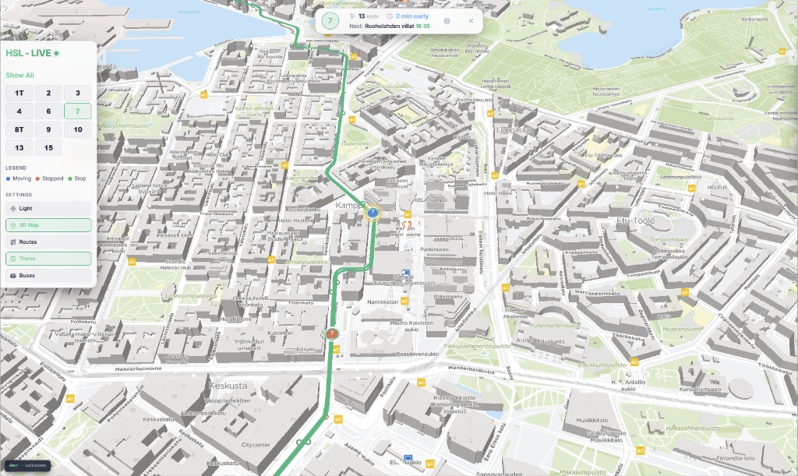

# 🚋 HSL - LIVE — Live Helsinki Tram & Bus Tracker

[](https://ratikka.duckdns.org/)

A premium, high-performance web application mapping **all active Helsinki trams, buses, and City Bike stations** in real-time. Built with stunning glassmorphism aesthetics, fluid 60fps telemetry interpolation, and immersive interactive modes.

👉 **Experience the live dashboard at [ratikka.duckdns.org](https://ratikka.duckdns.org/)**

---

## 📸 Screenshots & UI



---

## ✨ Key Features

* **Real-time 60fps Vehicle Interpolation**: Live MQTT vehicle coordinate updates for both **trams and buses** are mathematically interpolated (lerp) for buttery-smooth vehicle movement.
* **Distinct Vehicle Marker Shapes**: Quick visual recognition with circular markers for trams (`#00985f`) and square markers for buses (`#007ac9` for standard, `#CA4300` for trunk lines).
* **Immersive Chase Mode (Follow Vehicle)**: Lock onto any tram or bus to automatically track it. The camera auto-centers and auto-rotates (bearing) matching the vehicle's live heading.
* **Interactive Route Network & Highlights**: Toggle route networks on the map. Click a stop to see all routes serving it highlighted, or click a vehicle to highlight its specific path.
* **Live City Bike Station Capacity**: Click HSL City Bike POI stops to fetch live availability counts (bikes available vs. empty spaces) directly from Digitransit.
* **Flexible Filtering**: A widened 190px left filter panel featuring a 3-column line button grid layout to easily filter specific routes (supporting 4-character lines) and checkboxes to toggle tram or bus layers independently.
* **Glassmorphic UI Panels**: Premium responsive control cards that adjust seamlessly across mobile and desktop, including inline stop telemetry on the top info card.

---

## Technical Stack

* **Backend**: Go (1.24+), utilizing native HTTP Mux routing (Go 1.22+), `coder/websocket` for streaming, and `eclipse/paho.mqtt.golang` to ingest live telemetry from HSL's public broker (`/hfp/v2/journey/ongoing/vp/tram/#` and `/hfp/v2/journey/ongoing/vp/bus/#`).
* **State Store**: Redis 7 (Alpine), acting as a low-overhead live coordinate cache, tracking unique operator-prefixed vehicle IDs (`{operator}-{vehicle}`).
* **Frontend**: React 19, TypeScript, MapLibre GL JS 5.x, Lucide icons, and Vanilla CSS with custom theme variables.
* **Map Tile Stream**: Digitransit Map API v3 (Vector style style.json + stop POI tiles).
* **Routing API**: Digitransit Routing API v2 (GraphQL proxies protecting API keys, including a fuzzy trip lookup fallback).
* **Reverse Proxy**: Caddy 2 (Alpine) with auto-compression.
* **CI/CD**: GitHub Actions building multi-arch tags (`linux/amd64`, `linux/arm64`) to GitHub Packages.

---

## Project Structure

```
ratikka/
├── backend/                  # Go application source
│   ├── cmd/ratikka/          # main entry point
│   ├── internal/             # internal packages (config, cache, mqtt, ws, api)
│   └── go.mod
├── frontend/                 # React 19 TypeScript client source
│   ├── src/                  # App components, hooks, styles, types
│   └── package.json
├── docs/                     # Detailed architectural documents
│   ├── API_REFERENCE.md      # REST/WS/external endpoints specs
│   ├── LOCAL_DEVELOPMENT.md  # How to run and test locally
│   └── VERIFICATION.md       # Quality gates and validation plans
├── .agents/workflows/        # Custom pair-programming guidelines
│   ├── committing.md         # Commit rules
│   └── versioning.md         # CI/CD version bump rules
├── Caddyfile                 # Caddy reverse proxy rules
├── Dockerfile                # Multi-stage build context
├── docker-compose.yml        # Orchestrated compose definition
└── PLAN.md                   # Feature lists and mermaid architecture
```

---

## Configuration

Set the following environment variables in `.env` or in your environment:

| Variable | Description | Default |
|---|---|---|
| `DIGITRANSIT_API_KEY` | Subscription key for Digitransit GraphQL API | *(Required)* |
| `REDIS_URL` | Redis cache connection string | `redis://ratikka-cache:6379` |
| `MQTT_BROKER` | HSL public MQTT endpoint | `tls://mqtt.hsl.fi:8883` |
| `PORT` | Go backend server port | `8080` |
| `GRAFANA_CLOUD_PROMETHEUS_URL` | Prometheus push URL for Grafana Cloud | *(Optional)* |
| `GRAFANA_CLOUD_PROMETHEUS_USER` | Prometheus username for Grafana Cloud | *(Optional)* |
| `GRAFANA_CLOUD_PROMETHEUS_TOKEN`| Prometheus access token for Grafana Cloud | *(Optional)* |

---

## Local Development Setup

To run a fast development loop locally, see [docs/LOCAL_DEVELOPMENT.md](docs/LOCAL_DEVELOPMENT.md) for full options.

### 1. Run Backend (No Redis needed)

Accepts `--no-redis` to bypass running a local Redis container:
```bash
cd backend
go run ./cmd/ratikka --no-redis
```
*(Server listens on port `:8080`)*

### 2. Run Frontend Dev Server

```bash
cd frontend
npm install
npm run dev
```
*(Vite runs on port `:5173` and automatically proxies `/api` and `/api/v1/stream` WebSocket requests to `:8080`)*

### 3. Run Unit Tests

* **Backend**: `go test -v ./...` (runs parsed MQTT thinning and REST serialization mocks)
* **Frontend**: `npm run test` (runs Vitest linear coordinate interpolation and heading wrap-around maths)

---

## Deployment

### Local Deployment (Docker Compose)

Builds the Node frontend, copies assets, compiles Go, and launches the entire network stack:

```bash
# Set your API Key
export DIGITRANSIT_API_KEY="your-key"   # Linux/macOS
# or $env:DIGITRANSIT_API_KEY="your-key"  # Windows PowerShell

# Build and start services
docker compose up --build -d

# Verify server health
curl http://localhost/api/v1/health
```

Access the map dashboard in your web browser at `http://localhost`.

### Production Deployment (RHEL & Podman)

To deploy the application on a clean RHEL system:

```bash
curl -sSL -O https://raw.githubusercontent.com/Saavuori/ratikka/main/deploy.sh && bash deploy.sh
```

*(The script configures unprivileged port binding, sets the firewall, installs Podman, downloads `docker-compose.yml`, `Caddyfile`, and `config.alloy` from the repository, prompts for API/monitoring keys, and starts the container stack).*


