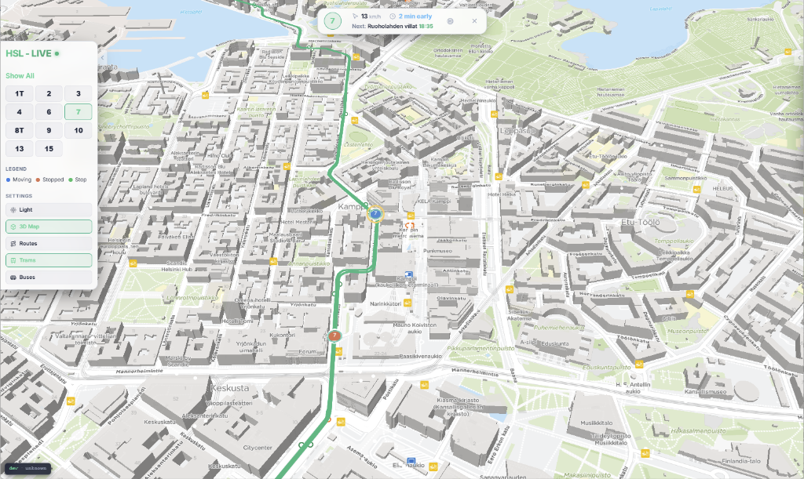

# 🚋 HSL - LIVE — Live Helsinki Tram & Bus Tracker

[](https://hsl-live.duckdns.org/)
[](https://saavuori.github.io/ratikka/)

A premium, high-performance web application mapping **all active Helsinki trams, buses, and City Bike stations** in real-time. Built with stunning glassmorphism aesthetics, fluid 60fps telemetry interpolation, and immersive interactive modes.

👉 **Experience the live dashboard at [hsl-live.duckdns.org](https://hsl-live.duckdns.org/)**

📖 **Check out recent updates and release history on the [Live Changelog](https://saavuori.github.io/ratikka/)**

---

## 📸 Screenshots & UI



---

## ✨ Key Features

### Live Map

* **Destination Journey Search**: A top-center "Where to?" search plans a trip from your current location (used by default) to any searched destination, ranks the routes that get you there, and highlights the exact stops to use — boarding stop in green, final stop in coral, transfers in gold — while drawing each transit and walking leg on the map and fitting the journey into view.
* **Real-time 60fps Vehicle Interpolation**: Live MQTT vehicle coordinate updates for both **trams and buses** are mathematically interpolated (lerp) for buttery-smooth vehicle movement.
* **State-Coded Vehicle Markers**: Every vehicle renders as a labelled circle carrying its line number, coloured by live state — `#0984e3` blue while moving, `#e17055` coral while stopped or with doors open. A separate heading arrow encodes the mode: a round green (`#00985f`) pointer for trams, a rounded-square blue (`#007ac9`) pointer for buses.
* **Immersive Chase Mode (Follow Vehicle)**: Lock onto any tram or bus to automatically track it. The camera auto-centers and auto-rotates (bearing) matching the vehicle's live heading, and releases as soon as you drag the map.
* **Traffic-Sign Stop Symbols**: From zoom 15.5 the map swaps flat stop dots for sign-on-a-pole symbols, colour-coded per mode (tram `#00985f`, bus `#007ac9`, trunk bus `#CA4300`), with gold-bordered variants for the selected and next stop.
* **Interactive Route Network & Highlights**: Toggle the background route network on the map. Click a stop to see all routes serving it highlighted, or click a vehicle to highlight its specific path plus a gold segment running to its next stop.
* **Live City Bike Station Capacity**: City Bike stations render with a live "bikes available" bubble; click one to fetch full availability (bikes available vs. empty spaces) from Digitransit.
* **Light / Dark Themes & 3D Buildings**: Switch between the Digitransit HSL light basemap and a dark basemap, and toggle pitched 3D building extrusions. Both preferences persist in `localStorage`.
* **Self-Location (GPS)**: A geolocate control tracks and centres on your own position, styled to match the glassmorphic theme.

### Telemetry & Diagnostics

* **Three-Tab Vehicle Panel**: Selecting a vehicle opens a `Telemetry` / `Schedule` / `Diagnostics` sidebar sourced from raw HSL HFP v2 fields.
* **Animated 2D Vehicle Schematic**: Mode-accurate vector layouts (3 door pairs for trams, 2 for buses) that open doors live from the `drst` flag, blink boarding indicators, and spin wheels at a rate proportional to velocity. See [docs/ICONS_AND_ANIMATIONS.md](docs/ICONS_AND_ANIMATIONS.md) for a full catalogue of every tram/bus icon and animation with source examples.
* **Arc Speedometer & Acceleration Gauges**: Custom SVG speedometer and schedule-deviation dials plus a bidirectional accelerometer bar showing cruising, acceleration, or active braking.
* **Deep Diagnostics**: Operator registry name, chassis ID, occupancy %, GPS source, odometer, HFP update drift in ms, and the underlying GTFS route/direction/trip identifiers.

### Data & Performance

* **Real-time HSL Service Disruptions**: Active disruptions, detours, and delay alerts are fetched from Digitransit's Routing API and shown in the sidebar. The feed is contextual — it narrows to the selected vehicle, the selected stop and its serving routes, or your active line filters, and falls back to network-wide announcements only when nothing is selected.
* **Request Coalescing & Response Caching**: Go's `singleflight.Group` deduplicates concurrent upstream queries, backed by an in-memory response cache — trip timetables and stop departures (10s TTL), bike capacities (15s), service alerts (60s), and route geometries (1h) — keeping vehicle-selection latency in the low milliseconds.
* **Flexible Filtering**: A 190px left panel with a 2-column line button grid (supporting 4-character line names) plus toggle buttons for the tram and bus layers, the route network, 3D mode, and the map theme.
* **Glassmorphic, Gesture-Driven UI**: Responsive control cards across mobile and desktop. Collapsed sidebars leave a 16px glass edge peeking out and respond to click or swipe, with inline stop telemetry on the top info card.

---

## Technical Stack

* **Backend**: Go 1.26, using native `http.ServeMux` method-and-pattern routing (Go 1.22+), `coder/websocket` for streaming, `eclipse/paho.mqtt.golang` to ingest live telemetry from HSL's public broker, and `golang.org/x/sync/singleflight` for query deduplication.
* **MQTT Ingestion**: Subscribes to `/hfp/v2/journey/ongoing/vp/tram/#` and `/hfp/v2/journey/ongoing/vp/bus/#` on `tls://mqtt.hsl.fi:8883`.
* **State Store**: Redis 8 (Alpine), acting as a low-overhead live coordinate cache with a 64 MB `allkeys-lru` cap, tracking unique operator-prefixed vehicle IDs (`{operator}-{vehicle}`). An in-memory map is used instead when Redis is disabled.
* **Frontend**: React 19, TypeScript, Vite 8, MapLibre GL JS 5.x, Lucide icons, and vanilla CSS with custom theme variables.
* **Map Tile Stream**: Digitransit Map API v3 (vector `style.json`, stop POI tiles, and rental-station tiles).
* **Routing API**: Digitransit Routing API v2 (GraphQL proxied server-side so the API key never reaches the browser, including a fuzzy trip lookup fallback).
* **Observability**: Prometheus metrics on `/metrics`, scraped by a Grafana Alloy sidecar and remote-written to Grafana Cloud.
* **Reverse Proxy**: Caddy 2 (Alpine) with gzip/zstd compression.
* **CI/CD**: GitHub Actions auto-tagging semver releases and building multi-arch images (`linux/amd64`, `linux/arm64`) to GitHub Packages, plus a Pages workflow publishing the changelog. Full pipeline, release rules and runbook: [docs/CICD.md](docs/CICD.md).

---

## HTTP API

All endpoints are served by the Go backend under `/api/v1`. See [docs/API_REFERENCE.md](docs/API_REFERENCE.md) for payload schemas.

| Method | Path | Purpose |
|---|---|---|
| `GET` | `/api/v1/health` | Liveness plus `mqtt_connected`, `redis_connected`, `active_vehicles`, `uptime_seconds` |
| `GET` | `/api/v1/version` | Build `version`, `build_date`, and `git_sha` (injected via ldflags) |
| `GET` | `/api/v1/config` | Digitransit map subscription key for the frontend tile requests |
| `GET` | `/api/v1/alerts` | Active HSL service disruptions |
| `GET` | `/api/v1/trip/{tripId}` | Trip route, headsign, stop timeline, and geometry |
| `GET` | `/api/v1/stop/{stopId}` | Stop details and upcoming departures (`?departures=N`) |
| `GET` | `/api/v1/route/{shortName}` | Route geometry and colour by short name |
| `GET` | `/api/v1/bike-station/{stationId}` | Live City Bike capacity |
| `GET` | `/api/v1/bike-stations` | All City Bike stations with live counts (GeoJSON) |
| `GET` | `/api/v1/geocode` | Destination search (Digitransit geocoding, `?text=&lat=&lon=`) |
| `GET` | `/api/v1/plan` | Journey planning between two points (`?fromLat=&fromLon=&toLat=&toLon=`) |
| `GET` | `/api/v1/stream` | WebSocket stream of live vehicle positions |
| `GET` | `/metrics` | Prometheus exposition format |
| `GET` | `/` | Embedded React SPA (go:embed static fallback) |

---

## Project Structure

```
ratikka/
├── backend/                  # Go application source
│   ├── cmd/ratikka/          # main entry point
│   ├── internal/             # config, cache, mqtt, ws, api packages
│   └── go.mod
├── frontend/                 # React 19 TypeScript client source
│   ├── src/                  # components, hooks, lib, styles, types
│   └── package.json
├── docs/                     # Detailed architectural documents
│   ├── API_REFERENCE.md      # REST/WS/external endpoint specs
│   ├── CICD.md               # Workflows, release rules, deploy path, runbook
│   ├── ICONS_AND_ANIMATIONS.md # Tram/bus marker icons and animation reference
│   ├── LOCAL_DEVELOPMENT.md  # How to run and test locally
│   ├── MONITORING.md         # Metrics pipeline and dashboard import
│   ├── PLAN.md               # Feature lists and mermaid architecture
│   ├── VERIFICATION.md       # Quality gates and validation plans
│   └── screenshots/
├── monitoring/
│   ├── alloy/config.alloy    # Grafana Alloy scrape + remote_write config
│   └── grafana/dashboard.json# Importable APM dashboard
├── scripts/                  # CHANGELOG.md -> dist-changelog/ site generator
├── dist-changelog/           # Generated changelog site (GitHub Pages)
├── .github/workflows/        # Multi-arch image build + Pages deploy
├── .agents/workflows/        # Custom pair-programming guidelines
│   ├── committing.md         # Commit rules
│   ├── map-features.md       # Map layer conventions
│   └── versioning.md         # CI/CD version bump rules
├── Caddyfile                 # Caddy reverse proxy rules
├── Dockerfile                # Multi-stage build context
├── docker-compose.yml        # Orchestrated compose definition
├── deploy.sh                 # One-shot RHEL/Podman provisioning script
└── CHANGELOG.md              # Release history
```

---

## Configuration

Set the following in `.env` or in your environment. The backend auto-loads a `.env` file from the working directory, its parent, or `backend/`; real environment variables always take precedence.

### Backend

| Variable | Description | Default |
|---|---|---|
| `DIGITRANSIT_API_KEY` | Subscription key for the Digitransit GraphQL and Map APIs | *(Required)* |
| `DIGITRANSIT_MAP_API_KEY` | Optional separate key served to browsers for map tiles (`/api/v1/config`). Use a dedicated rate-limited key here so the server-side routing key stays private | Falls back to `DIGITRANSIT_API_KEY` |
| `REDIS_URL` | Redis cache connection string | `redis://ratikka-cache:6379` |
| `MQTT_BROKER` | HSL public MQTT endpoint | `tls://mqtt.hsl.fi:8883` |
| `PORT` | Go backend server port | `8080` |
| `NO_REDIS` | Set to `true` to use an in-memory cache instead of Redis (same as `--no-redis`) | `false` |

### Monitoring sidecar

Consumed by the Grafana Alloy container in `docker-compose.yml`, not by the Go backend. Omit them to run without remote metrics.

| Variable | Description |
|---|---|
| `GRAFANA_CLOUD_PROMETHEUS_URL` | Prometheus remote-write URL |
| `GRAFANA_CLOUD_PROMETHEUS_USER` | Prometheus username / instance ID |
| `GRAFANA_CLOUD_PROMETHEUS_TOKEN` | Prometheus access token |

See [docs/MONITORING.md](docs/MONITORING.md) for the full telemetry pipeline and dashboard import steps.

---

## Local Development Setup

To run a fast development loop locally, see [docs/LOCAL_DEVELOPMENT.md](docs/LOCAL_DEVELOPMENT.md) for full options.

### 1. Run Backend (No Redis needed)

Pass `--no-redis` to skip running a local Redis container:
```bash
cd backend
go run ./cmd/ratikka --no-redis
```
*(Server listens on port `:8080`)*

### 2. Run Frontend Dev Server

```bash
cd frontend
npm install
npm run dev
```
*(Vite runs on port `:5173` and automatically proxies `/api` and the `/api/v1/stream` WebSocket to `:8080`)*

### 3. Run Unit Tests

* **Backend**: `cd backend && go test ./...` — covers MQTT payload parsing/thinning, cache behaviour, config loading, WebSocket hub fan-out, and REST serialization.
* **Frontend**: `cd frontend && npx vitest run` — covers linear coordinate interpolation and heading wrap-around maths.
* **Lint**: `cd frontend && npm run lint`

---

## Deployment

### Local Deployment (Docker Compose)

Builds the Node frontend, embeds the assets into the Go binary, and launches the full stack (Caddy, backend, Redis, Alloy):

```bash
# Set your API Key
export DIGITRANSIT_API_KEY="your-key"   # Linux/macOS
# or $env:DIGITRANSIT_API_KEY="your-key"  # Windows PowerShell

# Build and start services
docker compose up --build -d

# Verify server health
curl http://localhost/api/v1/health
```

Access the map dashboard in your web browser at `http://localhost`.

### Production Deployment (RHEL & Podman)

To deploy the application on a clean RHEL system:

```bash
curl -sSL -O https://raw.githubusercontent.com/Saavuori/ratikka/main/deploy.sh && bash deploy.sh
```

*(The script configures unprivileged port binding, sets the firewall, installs Podman, downloads `docker-compose.yml`, `Caddyfile`, and `config.alloy` from the repository, prompts for API/monitoring keys, and starts the container stack. Images are refreshed by an `update.sh` cron job every 5 minutes rather than Watchtower, which is incompatible with rootless Podman.)*

## 🔄 Dependency updates

Renovate opens one grouped pull request every Monday morning covering every place the repo pins a version — `backend/go.mod`, `frontend/package.json`, the GitHub Actions in `.github/workflows/`, the `Dockerfile` build and runtime stages, and the images in `docker-compose.yml`. Major updates come as their own PR; MapLibre majors are disabled entirely, because they need both map checks run by hand (see `CLAUDE.md`). Config lives in [`renovate.json5`](renovate.json5); the schedule is the cron in [`.github/workflows/renovate.yml`](.github/workflows/renovate.yml).

Each PR writes its own `CHANGELOG.md` entry: Renovate runs [`scripts/changelog-entry.js`](scripts/changelog-entry.js) as a post-upgrade task, which reads the pending diff and lists what moved. Since the top changelog heading *is* the release tag, that entry is what makes a dependency merge ship. The text is factual only — expand it by hand when a bump actually matters.

### Required setup

The workflow runs as a **GitHub App**, and needs two repository secrets: `RENOVATE_APP_ID` and `RENOVATE_APP_PRIVATE_KEY`. The app needs `contents: write`, `pull-requests: write` and `workflows: write` on this repository, and has to be installed on it. The workflow mints a short-lived installation token per run, so nothing long-lived is stored.

It **cannot** run as `GITHUB_TOKEN`: pull requests opened with the built-in token don't trigger `pull_request` workflows, so `ci.yml` would never run on a dependency PR. CI is the only thing that makes these safe to merge on sight, and a merge to `main` deploys itself. App-opened PRs do trigger it. (A classic PAT with `repo` scope works too, but then the token is long-lived and commits are attributed to a human.)

Because an installation token can't call `/user`, Renovate can't infer its own commit identity — the workflow resolves the app's `[bot]` user and passes it as `RENOVATE_GIT_AUTHOR` / `RENOVATE_USERNAME`.

Renovate has to be **self-hosted** from the scheduled workflow rather than run as the Mend-hosted app, because generating the changelog entry means running a command and the hosted app doesn't permit that. Until both secrets are set, the workflow fails with an explicit message rather than running to a silent no-op — no dependency PRs will open at all.
