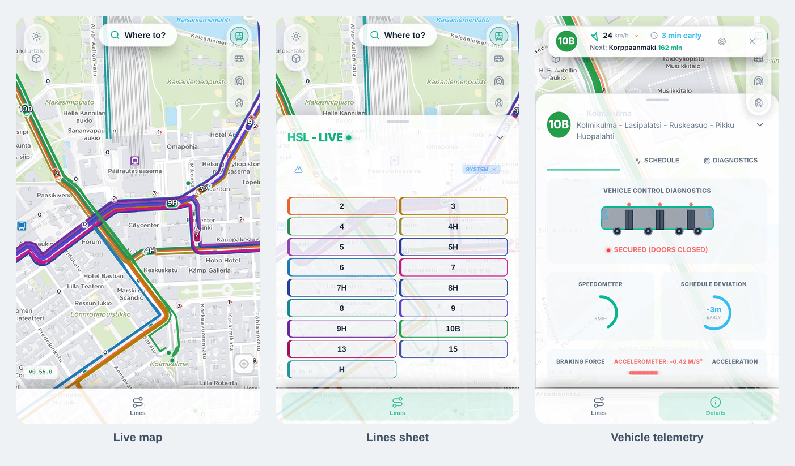

# 🚋 HSL - LIVE — Live Helsinki Tram & Bus Tracker

[](https://hsl-live.duckdns.org/)
[](https://saavuori.github.io/ratikka/)

A premium, high-performance web application mapping **all active Helsinki trams, buses, metro, commuter trains, and City Bike stations** in real-time. Built with stunning glassmorphism aesthetics, fluid 60fps telemetry interpolation, and immersive interactive modes.

👉 **Experience the live dashboard at [hsl-live.duckdns.org](https://hsl-live.duckdns.org/)**

📖 **Check out recent updates and release history on the [Live Changelog](https://saavuori.github.io/ratikka/)**

---

## 📸 Screenshots & UI



*The mobile UI on an iPhone-sized viewport: the live map with its "Where to?" search, mode and view toggles; the **Lines** bottom sheet for filtering the network; and the **Details** sheet with live telemetry for a selected vehicle.*

---

## ✨ Key Features

### Live Map

* **Destination Journey Search**: A top-center "Where to?" search plans a trip from your current location (used by default) to any searched destination, ranks the routes that get you there, and highlights the exact stops to use — boarding stop in green, final stop in coral, transfers in gold — while drawing each transit and walking leg on the map and fitting the journey into view.
* **Live Journey Monitoring**: Choose departure or arrival date/time in **Europe/Helsinki**, then monitor the selected trips without silently switching to a different itinerary. Updated boarding/arrival predictions, platforms, cancellation/stale labels, relevant disruptions and estimated transfer margins remain available when the planner is minimized. Find alternatives explicitly when plans change.
* **Your Journey's Vehicles**: Fresh, unambiguously matched vehicles receive gold map rings and can be selected from the journey panel. Matching requires the operating day and trip identity, never just a line number. The journey temporarily requests its bus/metro/train feeds without changing saved mode preferences; missing telemetry is shown as unavailable.
* **Live Departures & Saved Stops**: The **Departures** panel finds nearby stops after an explicit location request and provides locally saved stops with departure previews. Selected stop boards refresh automatically, show departure countdowns and platforms, and distinguish live predictions, scheduled times, cancellations and stale data. Saved stops stay in this browser; no account is required.
* **Real-time 60fps Vehicle Interpolation**: Live MQTT vehicle coordinate updates for **trams, buses, metro and commuter trains** are mathematically interpolated (lerp) for buttery-smooth vehicle movement.
* **Trams and Metro Trains Ride Their Own Rails**: rail vehicles are drawn on the track geometry of the direction their journey is running in — taken from the HFP `dir` and Digitransit's pattern `directionId` — so a tram sits on its own side of the street instead of between the two tracks the map draws, and follows the rails through curves rather than cutting across them. Where a route passes through the same junction twice, the arm that continues the run the vehicle is already making wins; a vehicle genuinely off its route (diversion, depot run) is left where the feed puts it rather than dragged onto rails it is not using.
* **State-Coded Vehicle Markers**: Every vehicle renders as a labelled circle carrying its line number, coloured by live state — `#0984e3` blue while moving, `#e17055` coral while stopped or with doors open. A separate heading arrow encodes the mode: a round green (`#00985f`) pointer for trams, a rounded-square blue (`#007ac9`) pointer for buses.
* **Immersive Chase Mode (Follow Vehicle)**: Lock onto any tram or bus to automatically track it. The camera auto-centers and auto-rotates (bearing) matching the vehicle's live heading, and releases as soon as you drag the map.
* **Live Traffic Light Priority**: Helsinki's trams do not simply wait for a green — they *ask* for one, and the junction answers. Both halves of that exchange ride the same HFP feed as the positions (`tlr` requests, `tla` answers), so the map shows it as it happens: the junction a tram is asking lights the lens it asked for — amber while the request is open, green when the junction acknowledges it, red when it refuses — and a signal a vehicle deliberately declined to ask is reported as that rather than as silence. The junction is joined by ID, not by proximity: HFP's `sid` is Helsinki's own junction number, which is the same number the open-data junction points carry. A stopped tram's popup therefore says *waiting at* the lights it named, not *probably near* some lights, and the Diagnostics tab carries the whole exchange — request type, priority level, attempt number, signal group and radio protocol.
* **Traffic-Sign Stop Symbols**: From zoom 15.5 the map swaps flat stop dots for sign-on-a-pole symbols, colour-coded per mode (tram `#00985f`, bus `#007ac9`, trunk bus `#CA4300`), with gold-bordered variants for the selected and next stop.
* **Interactive Route Network & Highlights**: Toggle the background route network on the map. Click a stop to see all routes serving it highlighted, or click a vehicle to highlight its specific path plus a gold segment running to its next stop.
* **Live City Bike Station Capacity**: City Bike stations render as a bicycle in a disc, ringed by an availability gauge whose arc and colour show how full the station is — grey empty, red almost gone, amber middling, green plenty — with the bikes-available count beneath it. Click one to fetch full availability (bikes available vs. empty spaces) from Digitransit.
* **3D Traffic Signals**: From zoom 16.4, in 3D view, a junction becomes a signal: a mast at real metre scale with a three-lens head at driver's eye level and a second head on the cantilever arm over the carriageway, standing beside the street rather than in the middle of the crossing. The lens the live request lit is lit here too, and a coloured band on the ground rings the junction — the part still legible from a rooftop camera angle, where the head itself is a few pixels. The flat marker fades out as the mast arrives, so a junction is drawn as a symbol or as a signal, never as both. Pedestrian/cyclist warning lights get their own shorter pole and single amber lamp.
* **3D City Bike Racks**: From zoom 16.2, in 3D view, a station becomes the rack it actually is: an apron, a dock post per dock, a yellow bike standing in every dock that has one, and the payment terminal at the end — all at real metre scale, alongside the 3D vehicles and stop shelters. The flat gauge fades out as the rack arrives, so availability stops being a number and becomes something you can simply see.
* **Light / Dark / Satellite Basemaps & 3D Buildings**: Switch between the Digitransit HSL light basemap, a dark basemap, and the National Land Survey's aerial orthophotos (`MML_API_KEY` required — without it the satellite chip is not shown), and toggle pitched 3D building extrusions. Both preferences persist in `localStorage`.
* **Detailed 3D Vehicles**: Distinct tram, bus, metro and commuter-train bodies have articulated sections, windows, running gear and roof equipment. A vehicle running on rails **bends at its joints**: each rigid section is placed at its own point on the track at the bearing the rails have there, with the gangway stretching between them, so a 27 m tram takes a street corner instead of ploughing its nose through the building outside the curve. Models fade in between zoom 13 and 14 (previously 15–16), retaining real-world dimensions. The vehicle button in the map-view controls enables **Always show 3D vehicles**, including on the flat map, independently of map tilt; this preference persists. Below zoom 13, icons remain visible for readability.
* **Live Doors & Lights**: At close zooms, door leaves slide open and closed from reported `drst` changes, with a locally animated transition. Head/tail lamps mark direction; bus/tram rear lamps brighten while braking, and an amber roof indicator shows inferred braking for every mode. Braking is inferred from acceleration, standstill or open doors—not a directly reported lamp signal. Missing door telemetry leaves doors closed; rail door-side information is unavailable, so both sides are illustrated.
* **Self-Location (GPS)**: A geolocate control tracks and centres on your own position, styled to match the glassmorphic theme.

### Telemetry & Diagnostics

* **Three-Tab Vehicle Panel**: Selecting a vehicle opens a `Telemetry` / `Schedule` / `Diagnostics` sidebar sourced from raw HSL HFP v2 fields.
* **Animated 2D Vehicle Schematic**: Mode-accurate vector layouts (3 door pairs for trams, 2 for buses) that open doors live from the `drst` flag, blink boarding indicators, and spin wheels at a rate proportional to velocity. See [docs/ICONS_AND_ANIMATIONS.md](docs/ICONS_AND_ANIMATIONS.md) for a full catalogue of every tram/bus icon and animation with source examples.
* **Arc Speedometer & Acceleration Gauges**: Custom SVG speedometer and schedule-deviation dials plus a bidirectional accelerometer bar showing cruising, acceleration, or active braking.
* **Deep Diagnostics**: Operator registry name, chassis ID, occupancy %, GPS source, odometer, HFP update drift in ms, and the underlying GTFS route/direction/trip identifiers.

### Data & Performance

* **Real-time HSL Service Disruptions**: Active disruptions, detours, and delay alerts are fetched from Digitransit's Routing API and shown in the sidebar. The feed is contextual — it narrows to the selected vehicle, the selected stop and its serving routes, or your active line filters, and falls back to network-wide announcements only when nothing is selected.
* **Request Coalescing & Response Caching**: Go's `singleflight.Group` deduplicates concurrent upstream queries, backed by an in-memory response cache — trip timetables and stop departures (10s TTL), bike capacities (15s), service alerts (60s), and route geometries (1h) — keeping vehicle-selection latency in the low milliseconds.
* **Flexible Filtering**: A 190px left panel with a 2-column line button grid (supporting 4-character line names) plus toggle buttons for the tram and bus layers, the route network, 3D mode, and the map theme.
* **Glassmorphic, Gesture-Driven UI**: Responsive control cards across mobile and desktop. Collapsed sidebars leave a 16px glass edge peeking out and respond to click or swipe, with inline stop telemetry on the top info card.

---

## Technical Stack

* **Backend**: Go 1.26, using native `http.ServeMux` method-and-pattern routing (Go 1.22+), `coder/websocket` for streaming, `eclipse/paho.mqtt.golang` to ingest live telemetry from HSL's public broker, and `golang.org/x/sync/singleflight` for query deduplication.
* **MQTT Ingestion**: Subscribes to `/hfp/v2/journey/ongoing/vp/tram/#` and `/hfp/v2/journey/ongoing/vp/bus/#` on `tls://mqtt.hsl.fi:8883`.
* **State Store**: Redis 8 (Alpine), acting as a low-overhead live coordinate cache with a 64 MB `allkeys-lru` cap, tracking unique operator-prefixed vehicle IDs (`{operator}-{vehicle}`). An in-memory map is used instead when Redis is disabled.
* **Frontend**: React 19, TypeScript, Vite 8, MapLibre GL JS 5.x, Lucide icons, and vanilla CSS with custom theme variables.
* **Map Tile Stream**: Digitransit Map API v3 (vector `style.json`, stop POI tiles, and rental-station tiles).
* **Routing API**: Digitransit Routing API v2 (GraphQL proxied server-side so the API key never reaches the browser, including a fuzzy trip lookup fallback).
* **Observability**: Prometheus metrics on `/metrics`, scraped by a Grafana Alloy sidecar and remote-written to Grafana Cloud.
* **Reverse Proxy**: Caddy 2 (Alpine) with gzip/zstd compression.
* **CI/CD**: GitHub Actions auto-tagging semver releases and building multi-arch images (`linux/amd64`, `linux/arm64`) to GitHub Packages, plus a Pages workflow publishing the changelog. Full pipeline, release rules and runbook: [docs/CICD.md](docs/CICD.md).

---

## HTTP API

All endpoints are served by the Go backend under `/api/v1`. See [docs/API_REFERENCE.md](docs/API_REFERENCE.md) for payload schemas.

| Method | Path | Purpose |
|---|---|---|
| `GET` | `/api/v1/health` | Liveness plus `mqtt_connected`, `redis_connected`, `active_vehicles`, `uptime_seconds` |
| `GET` | `/api/v1/version` | Build `version`, `build_date`, and `git_sha` (injected via ldflags) |
| `GET` | `/api/v1/config` | Browser-side map keys: the Digitransit map subscription key, and the National Land Survey key for the satellite basemap (empty when unconfigured) |
| `GET` | `/api/v1/alerts` | Active HSL service disruptions |
| `GET` | `/api/v1/trip/{tripId}` | Trip route, headsign, stop timeline, and geometry |
| `GET` | `/api/v1/stop/{stopId}` | Stop details and upcoming departures (`?departures=N`) |
| `GET` | `/api/v1/stops/nearby` | Nearby stops (`?lat=&lon=&radius=`), with distances |
| `GET` | `/api/v1/route/{shortName}` | Route geometry and colour by short name |
| `GET` | `/api/v1/bike-station/{stationId}` | Live City Bike capacity |
| `GET` | `/api/v1/bike-stations` | All City Bike stations with live counts (GeoJSON) |
| `GET` | `/api/v1/geocode` | Destination search (Digitransit geocoding, `?text=&lat=&lon=`) |
| `GET` | `/api/v1/plan` | Journey planning between two points (`?fromLat=&fromLon=&toLat=&toLon=`) |
| `GET` | `/api/v1/journey/monitor` | Refresh selected journey legs (`?legId=...`, repeated per leg) |
| `GET` | `/api/v1/stream` | WebSocket stream of live vehicle positions |
| `GET` | `/metrics` | Prometheus exposition format |
| `GET` | `/` | Embedded React SPA (go:embed static fallback) |

---

## Project Structure

```
ratikka/
├── backend/                  # Go application source
│   ├── cmd/ratikka/          # main entry point
│   ├── internal/             # config, cache, mqtt, ws, api packages
│   └── go.mod
├── frontend/                 # React 19 TypeScript client source
│   ├── src/                  # components, hooks, lib, styles, types
│   └── package.json
├── docs/                     # Detailed architectural documents
│   ├── API_REFERENCE.md      # REST/WS/external endpoint specs
│   ├── CICD.md               # Workflows, release rules, deploy path, runbook
│   ├── ICONS_AND_ANIMATIONS.md # Tram/bus marker icons and animation reference
│   ├── LOCAL_DEVELOPMENT.md  # How to run and test locally
│   ├── MONITORING.md         # Metrics pipeline and dashboard import
│   ├── PLAN.md               # Feature lists and mermaid architecture
│   ├── VERIFICATION.md       # Quality gates and validation plans
│   └── screenshots/
├── monitoring/
│   ├── alloy/config.alloy    # Grafana Alloy scrape + remote_write config
│   └── grafana/dashboard.json# Importable APM dashboard
├── scripts/                  # CHANGELOG.md -> dist-changelog/ site generator
├── dist-changelog/           # Generated changelog site (GitHub Pages)
├── .github/workflows/        # Multi-arch image build + Pages deploy
├── .agents/workflows/        # Custom pair-programming guidelines
│   ├── committing.md         # Commit rules
│   ├── map-features.md       # Map layer conventions
│   └── versioning.md         # CI/CD version bump rules
├── Caddyfile                 # Caddy reverse proxy rules
├── Dockerfile                # Multi-stage build context
├── docker-compose.yml        # Orchestrated compose definition
├── deploy.sh                 # One-shot RHEL/Podman provisioning script
└── CHANGELOG.md              # Release history
```

---

## Configuration

Set the following in `.env` or in your environment. The backend auto-loads a `.env` file from the working directory, its parent, or `backend/`; real environment variables always take precedence.

### Backend

| Variable | Description | Default |
|---|---|---|
| `DIGITRANSIT_API_KEY` | Subscription key for the Digitransit GraphQL and Map APIs | *(Required)* |
| `DIGITRANSIT_MAP_API_KEY` | Optional separate key served to browsers for map tiles (`/api/v1/config`). Use a dedicated rate-limited key here so the server-side routing key stays private | Falls back to `DIGITRANSIT_API_KEY` |
| `MML_API_KEY` | Key for the National Land Survey's open map image service, served to browsers alongside the map key. It signs the orthophoto tiles behind the map's satellite view; without it that view is not offered. Free from [MML's OmaTili](https://www.maanmittauslaitos.fi/rajapinnat/api-avaimen-ohje) | *(Optional)* |
| `REDIS_URL` | Redis cache connection string | `redis://ratikka-cache:6379` |
| `MQTT_BROKER` | HSL public MQTT endpoint | `tls://mqtt.hsl.fi:8883` |
| `PORT` | Go backend server port | `8080` |
| `NO_REDIS` | Set to `true` to use an in-memory cache instead of Redis (same as `--no-redis`) | `false` |

### Monitoring sidecar

Consumed by the Grafana Alloy container in `docker-compose.yml`, not by the Go backend. Omit them to run without remote metrics.

| Variable | Description |
|---|---|
| `GRAFANA_CLOUD_PROMETHEUS_URL` | Prometheus remote-write URL |
| `GRAFANA_CLOUD_PROMETHEUS_USER` | Prometheus username / instance ID |
| `GRAFANA_CLOUD_PROMETHEUS_TOKEN` | Prometheus access token |

See [docs/MONITORING.md](docs/MONITORING.md) for the full telemetry pipeline and dashboard import steps.

---

## Local Development Setup

To run a fast development loop locally, see [docs/LOCAL_DEVELOPMENT.md](docs/LOCAL_DEVELOPMENT.md) for full options.

### 1. Run Backend (No Redis needed)

Pass `--no-redis` to skip running a local Redis container:
```bash
cd backend
go run ./cmd/ratikka --no-redis
```
*(Server listens on port `:8080`)*

### 2. Run Frontend Dev Server

```bash
cd frontend
npm install
npm run dev
```
*(Vite runs on port `:5173` and automatically proxies `/api` and the `/api/v1/stream` WebSocket to `:8080`)*

### 3. Run Unit Tests

* **Backend**: `cd backend && go test ./...` — covers MQTT payload parsing/thinning, cache behaviour, config loading, WebSocket hub fan-out, and REST serialization.
* **Frontend**: `cd frontend && npx vitest run` — covers linear coordinate interpolation and heading wrap-around maths.
* **Lint**: `cd frontend && npm run lint`

---

## Deployment

### Local Deployment (Docker Compose)

Builds the Node frontend, embeds the assets into the Go binary, and launches the full stack (Caddy, backend, Redis, Alloy):

```bash
# Set your API Key
export DIGITRANSIT_API_KEY="your-key"   # Linux/macOS
# or $env:DIGITRANSIT_API_KEY="your-key"  # Windows PowerShell

# Build and start services
docker compose up --build -d

# Verify server health
curl http://localhost/api/v1/health
```

Access the map dashboard in your web browser at `http://localhost`.

### Production Deployment (RHEL & Podman)

To deploy the application on a clean RHEL system:

```bash
curl -sSL -O https://raw.githubusercontent.com/Saavuori/ratikka/main/deploy.sh && bash deploy.sh
```

*(The script configures unprivileged port binding, sets the firewall, installs Podman, downloads `docker-compose.yml`, `Caddyfile`, and `config.alloy` from the repository, prompts for API/monitoring keys, and starts the container stack. Images are refreshed by an `update.sh` cron job every 5 minutes rather than Watchtower, which is incompatible with rootless Podman.)*

## 🔄 Dependency updates

**Dependabot** opens one grouped minor/patch pull request per ecosystem every Monday morning, covering every place the repo pins a version — `backend/go.mod`, `frontend/package.json`, the GitHub Actions in `.github/workflows/`, the `Dockerfile` build and runtime stages, and the images in `docker-compose.yml`. Major updates come as their own PR; MapLibre majors are ignored entirely, because they need all three map checks run by hand (see `.github/copilot-instructions.md`). Config lives in [`.github/dependabot.yml`](.github/dependabot.yml).

Dependabot needs no secrets, no GitHub App and no scheduled workflow of its own — GitHub runs it. That is the whole reason it replaced the self-hosted Renovate setup. Renovate was self-hosted only because it had to run a post-upgrade command to write a `CHANGELOG.md` entry, and that entry was required because the top changelog heading *was* the release tag. The version now comes from the commit messages instead, so nothing has to be written for a dependency merge to ship, and the App could go away.

Dependency PRs use the `chore(deps)` / `chore(deps-dev)` commit prefix, which keeps them out of the `feat:` pattern — a batch of them cuts a patch release, not a minor. They write no changelog entry; fold them into the next hand-written one, and expand it when a bump actually matters.

The full flow — grouping rules, majors, hand sweeps, and what to do when a Monday passes with no PR — is [docs/CICD.md §7](docs/CICD.md#7-dependency-updates).
