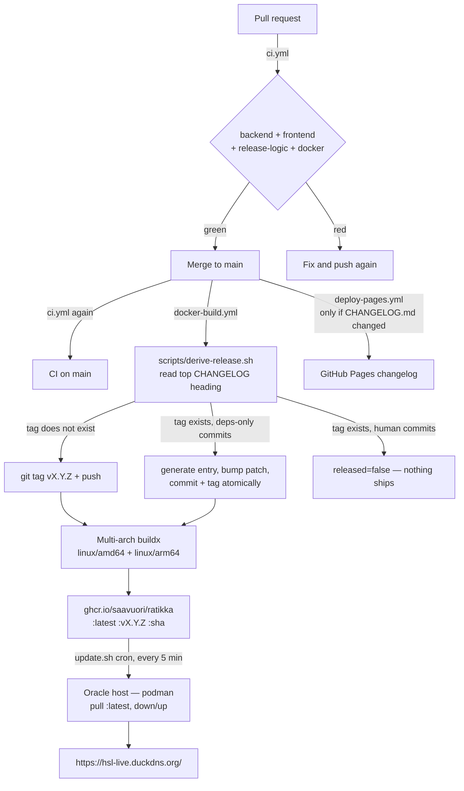

# CI/CD Pipeline

How a commit becomes the running production site, what gates it passes on the
way, and what to do when nothing ships.

The short version: **`CHANGELOG.md` is the single source of truth for the
version.** The release tag is whatever the top `## [vX.Y.Z]` heading says. Bump
the heading to release; leave it alone and nothing is built. There is no
automatic bump computation and no manual tagging.

---

## Pipeline at a glance



Three workflows, each with a distinct trigger:

| Workflow | File | Triggers on | Does |
|---|---|---|---|
| CI | [`ci.yml`](../.github/workflows/ci.yml) | every PR, every push to `main` | test/lint/build gate |
| CI/CD Build and Release | [`docker-build.yml`](../.github/workflows/docker-build.yml) | push to `main` (with `paths-ignore`) | tag + multi-arch image to GHCR |
| Deploy Changelog to Pages | [`deploy-pages.yml`](../.github/workflows/deploy-pages.yml) | push to `main` touching `CHANGELOG.md` or the generator | publishes the changelog site |

---

## 1. CI — the only gate

[`ci.yml`](../.github/workflows/ci.yml) runs on every pull request and on every
push to `main`. A merge to `main` builds an image that the host pulls into
production within five minutes, so this is the **only** thing standing between a
PR and the live site. Keep it green.

Four jobs, all on `ubuntu-latest`, all in parallel:

| Job | Steps |
|---|---|
| **Backend (go test)** | `go mod tidy` + `git diff --exit-code` on `go.mod`/`go.sum`, then `go vet ./...`, then `go test ./...` (working dir `backend/`) |
| **Frontend (lint, build, test)** | `npm ci`, `npm run lint`, `npm run build`, `npm test` (working dir `frontend/`, Node 24) |
| **Release logic** | `./scripts/derive-release.test.sh` — see [§3](#3-release-logic) |
| **Docker image builds** | amd64-only `docker/build-push-action` with `push: false` |

Notes on why each is shaped the way it is:

- **The tidy check** fails the build if `go mod tidy` would change anything, so a
  Dependabot bump that leaves `go.sum` inconsistent is caught at PR time rather
  than at image-build time.
- **`go test ./...` works on a clean checkout** because
  `backend/internal/api/dist/index.html` is tracked — the `//go:embed all:dist`
  pattern needs at least one file to exist or the package will not compile.
- **The Docker job does not push.** It builds amd64 only, purely to catch a
  broken `Dockerfile` before it reaches `main`; the real multi-arch build lives
  in the release workflow. Both use `type=gha` buildx cache.
- Go version comes from `backend/go.mod` (`go-version-file`), so bumping the
  language version is a one-line change in one place.

---

## 2. Release — the CHANGELOG is the version

**To cut a release, bump the top `## [vX.Y.Z]` heading in `CHANGELOG.md`.** That
is the entire trigger.

[`docker-build.yml`](../.github/workflows/docker-build.yml) runs on every push to
`main` except doc/infra-only paths (`README.md`, `docs/**`, `monitoring/**`,
`deploy.sh`, `.gitignore` are in `paths-ignore`). Its `tag` job runs
[`scripts/derive-release.sh`](../scripts/derive-release.sh), which emits
`tag=` and `released=` to `$GITHUB_OUTPUT`. The `build-and-push` job is gated on
`needs.tag.outputs.released == 'true'`.

Because the tag is derived from the heading rather than computed, **the deployed
version and the changelog cannot drift** — the running app always equals the
changelog's top entry.

The flip side: **a merge to `main` that forgets the changelog bump ships nothing,
silently.** CI is green, the workflow runs, the build is skipped because the tag
already exists. This has bitten before — v0.44.9 had to be re-cut as v0.44.10 for
exactly this reason. If you merged and the site did not change, check the
heading first.

### Choosing the number

Semantically, guided by the conventional-commit prefix of the change:

| Change | Bump | Example |
|---|---|---|
| `fix:` | patch | v0.47.0 → v0.47.1 |
| `feat:` | minor | v0.47.1 → v0.48.0 |
| `feat!:` / `BREAKING CHANGE:` | major | v0.48.0 → v1.0.0 |

The prefix guides the number you write, but the **heading is authoritative** —
the tag matches it verbatim. Commit messages no longer drive the version at all;
they are how the changelog gets written.

### Do not

- **Do not create tags manually.** CI owns tag creation.
- **Do not hardcode version strings.** They are injected via build args.
- **Do not write a heading whose number doesn't match the intended bump** — you
  will get a tag that says `patch` for a breaking change.

---

## 3. Release logic

The decision lives in [`scripts/derive-release.sh`](../scripts/derive-release.sh)
rather than inline YAML specifically so it can be tested outside CI —
[`scripts/derive-release.test.sh`](../scripts/derive-release.test.sh) builds
throwaway git repos with real bare remotes and exercises every path. It runs as
its own CI job. Release logic that silently ships nothing is exactly the kind of
bug that hides for weeks, so it gets tests.

The script greps the version with:

```
^##\s*\[\s*v?\K[0-9]+\.[0-9]+\.[0-9]+
```

`scripts/bump-changelog-for-deps.mjs` uses the same pattern deliberately, so the
two cannot disagree about what "the current version" is.

### Decision table

| State of `main` | Result | `released` |
|---|---|---|
| Top heading names a tag that does **not** exist | tag it, build it | `true` |
| Tag exists, **no** new non-merge commits since it | nothing to do | `false` |
| Tag exists, every new commit is `chore(deps):` / `chore(deps-dev):` | generate entry, bump patch, commit + tag, build | `true` |
| Tag exists, **any** human commit in the batch | skip — a human should write the entry | `false` |
| No `## [vX.Y.Z]` heading found at all | `::error::` and exit 1 | — |

### The dependency exception

Dependabot cannot write a changelog entry, so without a fallback its merges would
land on `main` and never ship — skipped precisely because the heading did not
move. So: when *every* new non-merge commit since the current tag is prefixed
`chore(deps)` or `chore(deps-dev)`,
[`scripts/bump-changelog-for-deps.mjs`](../scripts/bump-changelog-for-deps.mjs)
inserts a `### Changed` entry above the current top entry, bumps the **patch**,
and the script commits and tags it.

A single human commit in the batch disables this — the heading stays put and
nothing ships until a human writes an entry, exactly as before.

Two details worth knowing:

- **The push is atomic.** `git push --atomic origin HEAD:main refs/tags/vX.Y.Z`
  lands the commit and its tag together, so the workflow run triggered by that
  push always sees the tag already present and skips, instead of racing the
  current run to build the same thing twice.
- **`build-and-push` checks out the tag, not `github.sha`.** On an automatic
  dependency release the tag points at the CHANGELOG-bump commit, which is one
  commit ahead of the SHA that triggered the run. Building `github.sha` would
  publish an image whose embedded version does not match the tag it is published
  under. For a normal release the tag *is* `github.sha` and this is a no-op.

This is also why [`.github/dependabot.yml`](../.github/dependabot.yml) must keep
the `chore(deps)` commit prefix on **every** ecosystem, including
`github-actions` — the release keys off that exact string. A generic `ci:` prefix
would make action bumps look like human commits and silently skip the release.

---

## 4. Image build and version injection

The `build-and-push` job builds [`Dockerfile`](../Dockerfile) for
`linux/amd64,linux/arm64` (QEMU + Buildx) and pushes to GHCR under three tags:

```
ghcr.io/saavuori/ratikka:latest
ghcr.io/saavuori/ratikka:vX.Y.Z
ghcr.io/saavuori/ratikka:<sha of the tagged commit>
```

The repository name is lowercased in a `meta` step (`${GITHUB_REPOSITORY,,}`)
because `Saavuori/ratikka` is not a valid image reference. Images are public, so
the host pulls without auth.

Three build args are threaded into the Go binary via `-ldflags`:

| Build arg | Value | Lands in |
|---|---|---|
| `VERSION` | the release tag | `ratikka/internal/api.Version` |
| `BUILD_DATE` | `date -u +'%Y-%m-%dT%H:%M:%SZ'` at build time | `.BuildDate` |
| `GIT_SHA` | `git rev-parse HEAD` of the checked-out tag | `.GitCommit` |

Defaults are `dev` / `unknown` / `unknown` for local builds. They are declared in
[`backend/internal/api/handlers.go:20`](../backend/internal/api/handlers.go#L20)
and surfaced at `GET /api/v1/version`, which the frontend `VersionBadge` renders.
That endpoint is the quickest way to confirm what is actually running:

```bash
curl -s https://hsl-live.duckdns.org/api/v1/version
```

The image is a three-stage build: Node builds the frontend → the assets are
copied into `internal/api/dist/` → Go compiles a static binary that embeds them →
the binary alone is copied onto `alpine`. One container serves both.

---

## 5. Deployment to production

There is no deploy step in GitHub Actions. Publishing the image *is* the deploy.

The Oracle host (`opc@130.61.233.86`, RHEL 9 aarch64, rootless Podman) runs a
`*/5 * * * *` cron executing `~/ratikka/update.sh`, which pulls
`ghcr.io/saavuori/ratikka:latest` and brings the stack down and back up. So a
merge to `main` with a bumped changelog deploys itself within about five minutes.

**Watchtower is not used in production**, despite still being present in
[`deploy.sh`](../deploy.sh) and referenced in a stale comment at the top of
`ci.yml` — it is incompatible with rootless Podman on RHEL. The repo's
[`docker-compose.yml`](../docker-compose.yml) reflects reality (no Watchtower
service, with a comment saying why); `deploy.sh` is the odd one out and is only
correct for a Docker host.

The host also runs sibling apps (tieliikenne, bensa, railway) behind the single
Caddy container owned by the ratikka stack. See memory
`oracle-host-multi-app-deploy` for the layout, and [MONITORING.md](MONITORING.md)
for the Alloy → Grafana Cloud metrics path.

---

## 6. Changelog site

[`deploy-pages.yml`](../.github/workflows/deploy-pages.yml) runs on pushes to
`main` that touch `CHANGELOG.md`, `scripts/build-changelog.js`,
`scripts/changelog-template.html`, or the workflow itself. It compiles the
markdown into `dist-changelog/` and publishes to GitHub Pages at
<https://saavuori.github.io/ratikka/>. Concurrency group `pages` with
`cancel-in-progress: true`, so rapid merges don't queue up deploys.

This is independent of the release workflow — a changelog edit that doesn't move
the top heading still republishes the site without cutting a release.

---

## 7. Dependency updates

### 7.1 How updates arrive

[`.github/dependabot.yml`](../.github/dependabot.yml) opens **weekly** PRs across
four ecosystems. Grouping is per-ecosystem, and it decides how many PRs you get:

| Ecosystem | Directory | Grouped | Individual PRs for | Prefix |
|---|---|---|---|---|
| `gomod` | `/backend` | `go-minor-patch` (minor + patch) | **majors** | `chore(deps)` |
| `npm` | `/frontend` | `npm-minor-patch` (minor + patch) | **majors** (except `maplibre-gl`, ignored) | `chore(deps)` / `chore(deps-dev)` |
| `github-actions` | `/` | `actions` (`*` — all update types, majors included) | — | `chore(deps)` |
| `docker` | `/` | none | every image bump | `chore(deps)` |

The consequence worth internalising: **the groups only cover minor and patch, so
majors arrive as their own PRs.** A typical week looks like the batch that landed
before v0.47.0 — one grouped npm PR (#39), one grouped Go PR (#36), one grouped
actions PR (#38), plus two standalone majors (`@types/node` 24 → 26 in #40, the
`node:24-alpine` → `node:26-alpine` base image in #37). That is by design: the
grouped PRs are the mergeable-on-sight ones, and anything that shows up alone is
telling you it wants a look.

`open-pull-requests-limit: 5` on gomod and npm caps the backlog — if five are
already open, no new ones appear until you clear some.

Grouped rather than one-per-dependency because this stack has few direct deps and
ungrouped updates would be mostly noise. CI gates every one of them, which is
what makes them safe to merge on sight.

### 7.2 The routine flow

For the ordinary weekly batch:

1. **Dependabot opens the PRs** (weekly). [`ci.yml`](../.github/workflows/ci.yml)
   runs on each: `go vet` + `go test` + the tidy check, `npm ci`/lint/build/test,
   the release-logic tests, and an amd64 Docker build.
2. **Read the PR body.** Dependabot includes the release notes and changelog for
   each bump plus a compatibility score. For a grouped minor/patch PR with green
   CI this is usually a ten-second skim; for a major, read it properly.
3. **Merge.** This repo uses merge commits (`Merge pull request #39 from
   Saavuori/dependabot/...`), which is the safest option here — see the caution in
   §7.3.
4. **Merge the rest of the batch.** Nothing ships per-PR; only the final state of
   `main` matters.
5. **The last merge cuts the release automatically.** Once every non-merge commit
   since the current tag is `chore(deps)`/`chore(deps-dev)`,
   [`derive-release.sh`](../scripts/derive-release.sh) generates a `### Changed`
   entry listing the bumps, bumps the **patch**, commits, tags, and the image
   builds. See [§3](#3-release-logic).
6. **The host picks it up** within ~5 minutes. Confirm with
   `curl -s https://hsl-live.duckdns.org/api/v1/version`.

So the normal case is: merge the PRs, write nothing, and a patch release ships
itself with a changelog entry recording exactly what went in.

### 7.3 What breaks the automatic release

The auto-release only fires when **every** non-merge commit since the current tag
is dependency-prefixed. Two ways to lose it:

- **A human commit lands in the same window.** Merge one bugfix between the
  dependency merges and the whole batch stops shipping until someone writes a
  changelog entry. This is deliberate — it means the human's change never ships
  under an auto-generated "dependency updates" heading. If it happens, just write
  a normal entry covering both and bump the heading yourself.
- **The commit subject loses its prefix.** The check is a literal
  `^chore\(deps(-dev)?\):` match. Merge commits are exempt (the script uses
  `git log --no-merges`), so a merge-commit merge is always safe. **Squash-merging
  is only safe if you leave the squash title alone** — GitHub seeds it from the PR
  title, which carries the prefix; editing it to "bump deps" silently converts the
  batch into a human commit.

This is also why the `chore(deps)` prefix must stay on **every** ecosystem in
`dependabot.yml`, including `github-actions`. It briefly used a generic `ci:`
prefix, which made action bumps look like human commits — commit
[`8a69be6`](https://github.com/Saavuori/ratikka/commit/8a69be6) `ci: bump the
actions group with 10 updates` is exactly that, and it was part of the batch of
five dependency merges that sat on `main` shipping nothing and prompted the
auto-release in the first place.

### 7.4 When CI fails on a Dependabot PR

| Symptom | Cause | Fix |
|---|---|---|
| `go.mod/go.sum are not tidy` | the bump left an inconsistent module graph | `cd backend && go mod tidy`, commit onto the Dependabot branch |
| `npm ci` fails on lockfile mismatch | `package.json` and `package-lock.json` disagree | `@dependabot recreate` |
| Lint/type errors after a major | genuine API change | fix it on the branch, or drop the major and `@dependabot ignore this major version` |
| Conflicts with `main` | another dep PR merged first | `@dependabot rebase` |
| Docker build fails | new base image moved something | pin back and investigate separately |

You can push commits directly onto a Dependabot branch; Dependabot stops force-
pushing over a branch once you do. Useful comment commands:

```
@dependabot rebase                      # rebase on main
@dependabot recreate                    # rebuild the PR from scratch
@dependabot merge                       # merge once CI is green
@dependabot ignore this major version   # stop offering this major
```

### 7.5 Major versions

Majors arrive alone, so treat them one at a time:

1. Read the upstream migration notes linked in the PR body.
2. Check CI, then check what CI *can't* see — for anything touching the frontend
   bundle or the map, run the two verification scripts in
   [§8](#8-what-ci-does-not-cover). The v0.46.0 blank map shipped with green CI.
3. If it needs code changes, push them onto the Dependabot branch rather than
   opening a parallel PR.
4. If it needs more than a small fix, close the PR, `@dependabot ignore this
   major version`, and do it on a branch of your own with a hand-written
   changelog entry — a major that needs a code change should not ship under an
   auto-generated "dependency updates" heading.

**`maplibre-gl` majors are ignored outright** in `dependabot.yml`: they change map
rendering behaviour and need a visual pass over `Map.tsx`. Minor and patch bumps
still flow through the `npm-minor-patch` group. The v5 → v6 attempt is the case
study — it passed `tsc`, the unit tests, and the layer-spec check, and still
shipped a completely blank map (v0.46.0), was reverted (v0.46.1), and only landed
once `verify-map-renders.mjs` existed to prove pixels appeared (v0.47.0). See
[TECH_STACK_UPGRADE_PLAN.md §4](TECH_STACK_UPGRADE_PLAN.md).

The Grafana Alloy image is pinned to a concrete tag rather than `:latest` for the
same class of reason: the host restarts containers unattended every five minutes,
so a floating tag could pull a new major and break metrics collection with no
change on our side. Dependabot's `docker` ecosystem proposes those bumps instead.

### 7.6 Updating dependencies by hand

Dependabot covers drift, not intent. Sweep manually when you want everything
current at once, when chasing a specific advisory, or when a major needs code
changes alongside it.

```bash
# backend/
go get -u ./...                 # or name specific modules
go get golang.org/x/net@latest  # indirect deps need naming; tidy won't raise them
go mod tidy                     # required — CI fails if this would change anything
go vet ./... && go test ./...
```

```bash
# frontend/
npm outdated                    # what's behind
npm update                      # in-range bumps
npm install <pkg>@latest        # a specific major
npm audit fix
npm run lint && npm run build && npm test
```

Then, if the frontend bundle or map changed:

```bash
node scripts/verify-map-layers.mjs
DIGITRANSIT_API_KEY=... node scripts/verify-map-renders.mjs
```

A hand-made sweep is a **human commit**, so it does not auto-release: write a
`CHANGELOG.md` entry and bump the heading, or it ships nothing. Prefix the commit
`chore(deps):` for consistency if you like — but be aware that doing so on a
branch that also carries real code changes lets the batch auto-release under a
generated heading, which is usually not what you want. Keep sweeps separate from
feature work.

### 7.7 Changing the Dependabot config

- **Never change a `commit-message.prefix` away from `chore(deps)` /
  `chore(deps-dev)`.** The release keys off those exact strings.
- Adding an ecosystem: copy an existing block, set the prefix, and decide whether
  to group. No-group means one PR per bump.
- Adding an `ignore` rule: say *why* in a comment next to it, as the `maplibre-gl`
  entry does. An ignore with no rationale becomes permanent by accident.
- After editing, `./scripts/derive-release.test.sh` still covers the release side;
  the config itself is only validated by GitHub when Dependabot next runs.

---

## 8. What CI does *not* cover

**The map.** Nothing about map rendering is checked by `tsc`, the unit tests, or
any workflow. There are two independent failure modes and a script for each —
run **both** before shipping map changes; passing one proves nothing about the
other.

```bash
cd frontend && npm run build && cd ..
npx playwright@latest install chromium    # once
npm i --no-save playwright                # from the repo root, once per checkout

node scripts/verify-map-layers.mjs        # 1. are the layer specs valid?
DIGITRANSIT_API_KEY=... node scripts/verify-map-renders.mjs   # 2. does it draw?
```

1. **`verify-map-layers.mjs`** stubs every external asset and checks that
   MapLibre accepts the layer specs. Most layers anchor to `trams-circles` via
   `beforeId`, so one bad expression silently takes the stops, route path and
   journey overlay with it (v0.44.7).
2. **`verify-map-renders.mjs`** hits the real Digitransit basemap with a real
   subscription key and asserts vector tiles came back and `isStyleLoaded()` is
   true. This exists because v0.46.0 passed the spec check and still shipped a
   completely blank map: with the tile worker dead, no tile was ever parsed, so
   nothing downstream of it was exercised.

Neither runs in CI because the render check needs a real Digitransit key as a
secret. Get it from the deploy host's `.env`.

See [VERIFICATION.md](VERIFICATION.md) for the wider quality-gate plan.

---

## 9. Runbook

**"I merged to `main` and the site didn't change."**
Check the top heading in `CHANGELOG.md` against the existing tags. If the tag
already exists, the build was skipped by design — that is the single most common
cause. Bump the heading and push; the `docker-build.yml` run log says exactly
which branch of the decision it took.

**"The workflow didn't even run."**
Check `paths-ignore` in `docker-build.yml`. A push touching only `docs/**`,
`README.md`, `monitoring/**`, `deploy.sh`, or `.gitignore` does not trigger it.

**"Dependabot PRs merged but nothing shipped."**
There is a non-dependency commit in the batch since the last tag — the
auto-release deliberately stands down. Look at
`git log --no-merges --format=%s vX.Y.Z..HEAD`; anything not prefixed
`chore(deps)` / `chore(deps-dev)` disables it. Either a human commit landed in
the same window, or a squash-merge title was edited and lost its prefix — see
[§7.3](#73-what-breaks-the-automatic-release). Write a changelog entry to ship
the batch.

**"`/api/v1/version` shows an older version than the tag."**
The host cron runs every five minutes; wait, then re-check. If it persists, the
pull or the container restart failed on the host — see memory
`oracle-host-multi-app-deploy` for how to inspect it.

**"The tag exists but no image was published."**
The `tag` job succeeded and `build-and-push` failed. Multi-arch arm64 builds go
through QEMU and are the slowest, most failure-prone step. Re-running the
workflow is safe: `derive-release.sh` sees the existing tag, and if there are no
new commits it reports `released=false` — so **re-running will not rebuild**.
Delete the tag and re-push it, or bump to the next patch.

**"I need to verify the release logic before changing it."**

```bash
./scripts/derive-release.test.sh
```

Runs against throwaway repos; touches nothing real.

---

## Key files

| Path | Role |
|---|---|
| [`.github/workflows/ci.yml`](../.github/workflows/ci.yml) | the PR gate |
| [`.github/workflows/docker-build.yml`](../.github/workflows/docker-build.yml) | tag → multi-arch build → GHCR |
| [`.github/workflows/deploy-pages.yml`](../.github/workflows/deploy-pages.yml) | changelog site |
| [`.github/dependabot.yml`](../.github/dependabot.yml) | weekly grouped updates |
| [`scripts/derive-release.sh`](../scripts/derive-release.sh) | the release decision |
| [`scripts/derive-release.test.sh`](../scripts/derive-release.test.sh) | its tests (a CI job) |
| [`scripts/bump-changelog-for-deps.mjs`](../scripts/bump-changelog-for-deps.mjs) | generates the dependency entry |
| [`scripts/build-changelog.js`](../scripts/build-changelog.js) | `CHANGELOG.md` → `dist-changelog/` |
| [`CHANGELOG.md`](../CHANGELOG.md) | **the version** |
| [`Dockerfile`](../Dockerfile) | 3-stage build, accepts the version build args |
| [`docker-compose.yml`](../docker-compose.yml) | the production stack shape |
