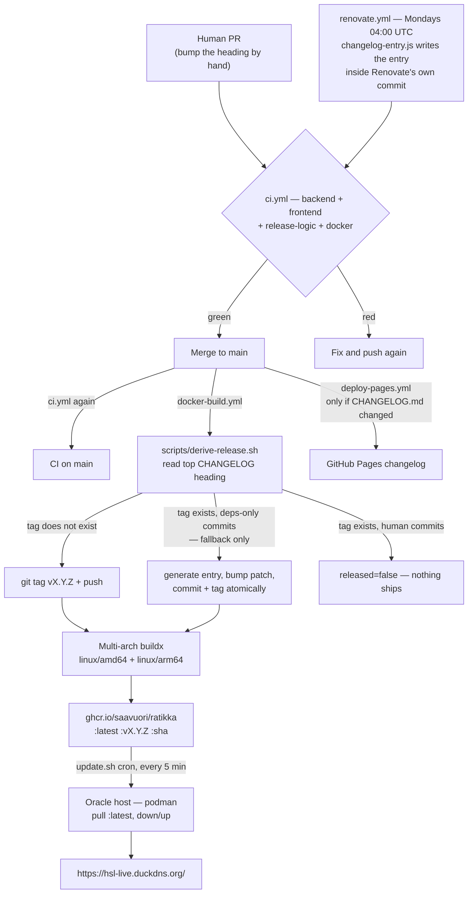

# CI/CD Pipeline

How a commit becomes the running production site, what gates it passes on the
way, and what to do when nothing ships.

The short version: **`CHANGELOG.md` is the single source of truth for the
version.** The release tag is whatever the top `## [vX.Y.Z]` heading says. Bump
the heading to release; leave it alone and nothing is built. There is no
automatic bump computation and no manual tagging.

---

## Pipeline at a glance



Note where the dependency path enters: **a Renovate PR already carries its
changelog entry**, so it goes through the same front door as a human PR and
releases through the ordinary path. The dependency branch inside
`derive-release.sh` is a safety net, not the mechanism — see [§3](#3-release-logic).

Four workflows, each with a distinct trigger:

| Workflow | File | Triggers on | Does |
|---|---|---|---|
| CI | [`ci.yml`](../.github/workflows/ci.yml) | every PR, every push to `main` | test/lint/build gate |
| CI/CD Build and Release | [`docker-build.yml`](../.github/workflows/docker-build.yml) | push to `main` (with `paths-ignore`) | tag + multi-arch image to GHCR |
| Deploy Changelog to Pages | [`deploy-pages.yml`](../.github/workflows/deploy-pages.yml) | push to `main` touching `CHANGELOG.md` or the generator | publishes the changelog site |
| Renovate | [`renovate.yml`](../.github/workflows/renovate.yml) | cron, Mondays 04:00 UTC + `workflow_dispatch` | opens the weekly dependency PR |

---

## 1. CI — the only gate

[`ci.yml`](../.github/workflows/ci.yml) runs on every pull request and on every
push to `main`. A merge to `main` builds an image that the host pulls into
production within five minutes, so this is the **only** thing standing between a
PR and the live site. Keep it green.

Four jobs, all on `ubuntu-latest`, all in parallel:

| Job | Steps |
|---|---|
| **Backend (go test)** | `go mod tidy` + `git diff --exit-code` on `go.mod`/`go.sum`, then `go vet ./...`, then `go test ./...` (working dir `backend/`) |
| **Frontend (lint, build, test)** | `npm ci`, `npm run lint`, `npm run build`, `npm test` (working dir `frontend/`, Node 24) |
| **Release logic** | `./scripts/derive-release.test.sh` (the release decision) then `./scripts/changelog-entry.test.sh` (the entry Renovate writes) — see [§3](#3-release-logic) |
| **Docker image builds** | amd64-only `docker/build-push-action` with `push: false` |

Notes on why each is shaped the way it is:

- **The tidy check** fails the build if `go mod tidy` would change anything, so a
  dependency bump that leaves `go.sum` inconsistent is caught at PR time rather
  than at image-build time.
- **`go test ./...` works on a clean checkout** because
  `backend/internal/api/dist/index.html` is tracked — the `//go:embed all:dist`
  pattern needs at least one file to exist or the package will not compile.
- **The Docker job does not push.** It builds amd64 only, purely to catch a
  broken `Dockerfile` before it reaches `main`; the real multi-arch build lives
  in the release workflow. Both use `type=gha` buildx cache.
- Go version comes from `backend/go.mod` (`go-version-file`), so bumping the
  language version is a one-line change in one place.

---

## 2. Release — the CHANGELOG is the version

**To cut a release, bump the top `## [vX.Y.Z]` heading in `CHANGELOG.md`.** That
is the entire trigger.

[`docker-build.yml`](../.github/workflows/docker-build.yml) runs on every push to
`main` except doc/infra-only paths (`README.md`, `docs/**`, `monitoring/**`,
`deploy.sh`, `.gitignore` are in `paths-ignore`). Its `tag` job runs
[`scripts/derive-release.sh`](../scripts/derive-release.sh), which emits
`tag=` and `released=` to `$GITHUB_OUTPUT`. The `build-and-push` job is gated on
`needs.tag.outputs.released == 'true'`.

Because the tag is derived from the heading rather than computed, **the deployed
version and the changelog cannot drift** — the running app always equals the
changelog's top entry.

The flip side: **a merge to `main` that forgets the changelog bump ships nothing,
silently.** CI is green, the workflow runs, the build is skipped because the tag
already exists. This has bitten before — v0.44.9 had to be re-cut as v0.44.10 for
exactly this reason. If you merged and the site did not change, check the
heading first.

### Choosing the number

Semantically, guided by the conventional-commit prefix of the change:

| Change | Bump | Example |
|---|---|---|
| `fix:` | patch | v0.47.0 → v0.47.1 |
| `feat:` | minor | v0.47.1 → v0.48.0 |
| `feat!:` / `BREAKING CHANGE:` | major | v0.48.0 → v1.0.0 |

The prefix guides the number you write, but the **heading is authoritative** —
the tag matches it verbatim. Commit messages no longer drive the version at all;
they are how the changelog gets written.

### Do not

- **Do not create tags manually.** CI owns tag creation.
- **Do not hardcode version strings.** They are injected via build args.
- **Do not write a heading whose number doesn't match the intended bump** — you
  will get a tag that says `patch` for a breaking change.

---

## 3. Release logic

The decision lives in [`scripts/derive-release.sh`](../scripts/derive-release.sh)
rather than inline YAML specifically so it can be tested outside CI —
[`scripts/derive-release.test.sh`](../scripts/derive-release.test.sh) builds
throwaway git repos with real bare remotes and exercises every path. It runs as
its own CI job. Release logic that silently ships nothing is exactly the kind of
bug that hides for weeks, so it gets tests.

The script greps the version with:

```
^##\s*\[\s*v?\K[0-9]+\.[0-9]+\.[0-9]+
```

`scripts/changelog-entry.js` and `scripts/bump-changelog-for-deps.mjs` use the
same pattern deliberately, so none of the three can disagree about what "the
current version" is.

### Decision table

| State of `main` | Result | `released` |
|---|---|---|
| Top heading names a tag that does **not** exist | tag it, build it | `true` |
| Tag exists, **no** new non-merge commits since it | nothing to do | `false` |
| Tag exists, every new commit is `chore(deps):` / `chore(deps-dev):` | *(fallback)* generate entry, bump patch, commit + tag, build | `true` |
| Tag exists, **any** human commit in the batch | skip — a human should write the entry | `false` |
| No `## [vX.Y.Z]` heading found at all | `::error::` and exit 1 | — |

Since Renovate writes the entry on the branch, a dependency PR normally hits the
**first** row, exactly like a human PR. The third row is the safety net below.

### The dependency fallback

**This is no longer the mechanism — it is the backstop.** It was written for
Dependabot, which could not author a changelog entry, so its merges would land on
`main` and never ship, skipped precisely because the heading did not move. That
fix generated the entry *after* the merge and committed it straight to `main`,
which meant the only description of what shipped lived behind the merge where
nobody reviews it. Renovate writes the entry in the PR instead — see
[§7](#7-dependency-updates).

The fallback stays for the branch that arrives with its heading unmoved: the
post-upgrade task failed, someone hand-wrote a dependency commit, or the bot got
swapped out again. When *every* new non-merge commit since the current tag is
prefixed `chore(deps)` or `chore(deps-dev)`,
[`scripts/bump-changelog-for-deps.mjs`](../scripts/bump-changelog-for-deps.mjs)
inserts a `### Changed` entry above the current top entry, bumps the **patch**,
and the script commits and tags it.

A single human commit in the batch disables this — the heading stays put and
nothing ships until a human writes an entry.

Two details worth knowing:

- **The push is atomic.** `git push --atomic origin HEAD:main refs/tags/vX.Y.Z`
  lands the commit and its tag together, so the workflow run triggered by that
  push always sees the tag already present and skips, instead of racing the
  current run to build the same thing twice.
- **`build-and-push` checks out the tag, not `github.sha`.** On an automatic
  dependency release the tag points at the CHANGELOG-bump commit, which is one
  commit ahead of the SHA that triggered the run. Building `github.sha` would
  publish an image whose embedded version does not match the tag it is published
  under. For a normal release the tag *is* `github.sha` and this is a no-op.

This is also why [`renovate.json5`](../renovate.json5) must keep the
`chore(deps)` commit prefix on **every** manager, including `github-actions` —
the fallback keys off that exact string. A prettier `ci(deps)` for action bumps
would make them look like human commits and silently disable it. Under
Dependabot that was not hypothetical: the config briefly used a `ci:` prefix for
actions, and commit
[`8a69be6`](https://github.com/Saavuori/ratikka/commit/8a69be6) `ci: bump the
actions group with 10 updates` was part of the batch of five dependency merges
that sat on `main` shipping nothing.

---

## 4. Image build and version injection

The `build-and-push` job builds [`Dockerfile`](../Dockerfile) for
`linux/amd64,linux/arm64` (QEMU + Buildx) and pushes to GHCR under three tags:

```
ghcr.io/saavuori/ratikka:latest
ghcr.io/saavuori/ratikka:vX.Y.Z
ghcr.io/saavuori/ratikka:<sha of the tagged commit>
```

The repository name is lowercased in a `meta` step (`${GITHUB_REPOSITORY,,}`)
because `Saavuori/ratikka` is not a valid image reference. Images are public, so
the host pulls without auth.

Three build args are threaded into the Go binary via `-ldflags`:

| Build arg | Value | Lands in |
|---|---|---|
| `VERSION` | the release tag | `ratikka/internal/api.Version` |
| `BUILD_DATE` | `date -u +'%Y-%m-%dT%H:%M:%SZ'` at build time | `.BuildDate` |
| `GIT_SHA` | `git rev-parse HEAD` of the checked-out tag | `.GitCommit` |

Defaults are `dev` / `unknown` / `unknown` for local builds. They are declared in
[`backend/internal/api/handlers.go:20`](../backend/internal/api/handlers.go#L20)
and surfaced at `GET /api/v1/version`, which the frontend `VersionBadge` renders.
That endpoint is the quickest way to confirm what is actually running:

```bash
curl -s https://hsl-live.duckdns.org/api/v1/version
```

The image is a three-stage build: Node builds the frontend → the assets are
copied into `internal/api/dist/` → Go compiles a static binary that embeds them →
the binary alone is copied onto `alpine`. One container serves both.

---

## 5. Deployment to production

There is no deploy step in GitHub Actions. Publishing the image *is* the deploy.

The Oracle host (`opc@130.61.233.86`, RHEL 9 aarch64, rootless Podman) runs a
`*/5 * * * *` cron executing `~/ratikka/update.sh`, which pulls
`ghcr.io/saavuori/ratikka:latest` and brings the stack down and back up. So a
merge to `main` with a bumped changelog deploys itself within about five minutes.

**Watchtower is not used in production**, despite still being present in
[`deploy.sh`](../deploy.sh) and referenced in a stale comment at the top of
`ci.yml` — it is incompatible with rootless Podman on RHEL. The repo's
[`docker-compose.yml`](../docker-compose.yml) reflects reality (no Watchtower
service, with a comment saying why); `deploy.sh` is the odd one out and is only
correct for a Docker host.

The host also runs sibling apps (tieliikenne, bensa, railway) behind the single
Caddy container owned by the ratikka stack. See memory
`oracle-host-multi-app-deploy` for the layout, and [MONITORING.md](MONITORING.md)
for the Alloy → Grafana Cloud metrics path.

---

## 6. Changelog site

[`deploy-pages.yml`](../.github/workflows/deploy-pages.yml) runs on pushes to
`main` that touch `CHANGELOG.md`, `scripts/build-changelog.js`,
`scripts/changelog-template.html`, or the workflow itself. It compiles the
markdown into `dist-changelog/` and publishes to GitHub Pages at
<https://saavuori.github.io/ratikka/>. Concurrency group `pages` with
`cancel-in-progress: true`, so rapid merges don't queue up deploys.

This is independent of the release workflow — a changelog edit that doesn't move
the top heading still republishes the site without cutting a release.

---

## 7. Dependency updates

Renovate opens **one grouped pull request every Monday**, and that PR arrives
with its own `CHANGELOG.md` entry already written. Merging it releases a patch
through the ordinary path — no special case, no post-merge commit to `main`.

Two files define it:

- [`renovate.json5`](../renovate.json5) — what gets updated, how it is grouped,
  and the post-upgrade task that writes the entry.
- [`.github/workflows/renovate.yml`](../.github/workflows/renovate.yml) — when it
  runs and under what identity.

JSON5 rather than `renovate.json` so the config can carry comments: Renovate
rejects unknown keys, so `_comment` fields would raise config warnings.

### 7.1 Why self-hosted, and why it replaced Dependabot

`CHANGELOG.md` is the release trigger, and **Dependabot could not write an
entry.** The workaround (v0.46.1) generated the entry *after* the merge, from
`derive-release.sh`, committing it straight to `main`. It worked, but the only
description of what shipped landed behind the merge where nobody reviews it, and
CI needed push access to `main` to do it.

Renovate runs [`scripts/changelog-entry.js`](../scripts/changelog-entry.js) as a
**`postUpgradeTask`** — after the manifests are updated but *before* the commit —
so the entry is part of Renovate's own commit. By the time the PR opens, the
heading has already moved. The entry is reviewable in the diff, and a dependency
merge ships through the same path as any other PR.

`postUpgradeTasks` runs arbitrary commands, which the Mend-hosted app does not
allow (`allowedCommands` is self-hosted only). That is the whole reason this runs
as a workflow rather than as the hosted GitHub App.

The switch also brought three things Dependabot did not have here: a single PR
across all managers instead of one per ecosystem, coverage of the
`docker-compose.yml` images, and `minimumReleaseAge`.

### 7.2 What gets updated

Every place the repo pins a version:

| Manager | Files |
|---|---|
| `gomod` | `backend/go.mod` |
| `npm` | `frontend/package.json` |
| `github-actions` | `.github/workflows/*.yml` |
| `dockerfile` | `Dockerfile` (build + runtime stages) |
| `docker-compose` | `docker-compose.yml`, `docker-compose.override.yml` |

Grouping and exclusions, all in `packageRules`:

- **`minor`, `patch` and `digest` updates are one group** — `all non-major
  dependencies`, branch slug `all-minor-patch`. One PR means one predicted
  version heading, so sibling PRs cannot claim the same number.
- **Majors are split out** (Renovate's default). Each gets its own PR, because
  each needs a real look.
- **`maplibre-gl` majors are disabled entirely** — `enabled: false`. They change
  map rendering behaviour and need both map checks run by hand; v0.46.0 shipped a
  blank map through green CI. Minor and patch still flow through the group.
- **`ghcr.io/saavuori/ratikka` is disabled** — our own image, pinned to `:latest`
  by design, because the host's `update.sh` cron is what pulls it. Without this
  rule Renovate would keep trying to pin our own deploy tag.

Two global settings shape the flow as much as the rules do:

- **`minimumReleaseAge: '3 days'`** — a release is not proposed until it has
  survived three days in the wild, so a version yanked shortly after publishing
  never reaches a PR. Dependabot had no equivalent; the only defence was noticing
  by hand.
- **`prConcurrentLimit: 5`** — the backlog cap. If five dependency PRs are
  already open, nothing new appears until some are cleared.

The schedule lives **only** in the workflow cron. `renovate.json5` deliberately
sets no `schedule` — two schedules would have to intersect for anything to
happen, which is a confusing way to get silence.

### 7.3 The routine flow

1. **Monday 04:00 UTC** (07:00 Helsinki in summer, 06:00 in winter) the cron in
   `renovate.yml` runs. `workflow_dispatch` triggers it manually, with `dryRun`
   and `logLevel` inputs.
2. **Renovate updates the manifests**, runs `changelog-entry.js`, commits both
   together as `chore(deps): ...`, and opens one PR labelled `dependencies`.
3. **CI runs on the PR** — this is why the workflow authenticates as a GitHub App
   rather than `GITHUB_TOKEN`; see [§7.5](#75-the-github-app-requirement).
4. **Review the diff**, including the changelog entry. The generated text is
   factual — what moved, between which versions. Expand it by hand when a bump
   actually matters; that is the only part a script cannot know.
5. **Merge.** The heading has already moved, so `derive-release.sh` takes its
   normal first-row path: tag, build, push.
6. **The host picks it up** within ~5 minutes. Confirm with
   `curl -s https://hsl-live.duckdns.org/api/v1/version`.

### 7.4 The generated changelog entry

[`changelog-entry.js`](../scripts/changelog-entry.js) reads the **pending git
diff** rather than Renovate's template data. That keeps it runnable and testable
outside Renovate, and it survives changing or dropping the bot — at the cost of
per-manifest patterns that need extending when a new kind of pinned version
enters the repo. It recognises five manifest shapes: `backend/go.mod`,
`frontend/package.json`, `uses:` lines in workflows, `FROM` lines in the
`Dockerfile`, and `image:` lines in the compose files.

Details that matter when reading or debugging it:

- **A name must appear on both sides at different versions** to count as an
  upgrade. That drops reordering noise and added-then-removed lines.
- **The list is capped at 8 per group**, with `and N more` — a long tail buries
  the bumps worth reading.
- **The version is a prediction**: the base branch's top heading, patch + 1.
  Renovate regenerates it on every rebase, so it corrects itself when a sibling
  PR merges first and takes that number.
- **It reads the heading from `origin/main`**, not the working copy — a rerun
  would otherwise bump off its own previous entry and climb a version each time.
- **It is idempotent**: a rerun replaces the section it wrote last time instead of
  stacking a second copy.
- **It no-ops loudly**: no pending changes, or no recognised version movement, and
  it leaves `CHANGELOG.md` alone and says so.

Those no-op paths are exactly why
[`scripts/changelog-entry.test.sh`](../scripts/changelog-entry.test.sh) exists and
runs in CI: inside Renovate, a silent no-op is indistinguishable from "nothing to
report", and the failure mode is a PR that merges and ships nothing. Its 14
assertions cover the predicted version, all five manifest kinds, the rerun
behaviour, the leave-it-alone cases, and finally that `derive-release.sh`
actually ships the heading it produced.

### 7.5 The GitHub App requirement

The workflow needs two repository secrets:

| Secret | What |
|---|---|
| `RENOVATE_APP_ID` | the GitHub App's numeric ID |
| `RENOVATE_APP_PRIVATE_KEY` | its private key (PEM) |

The app needs `contents: write`, `pull-requests: write` and `workflows: write` on
this repository, and must be installed on it. Each run mints a short-lived
installation token via `actions/create-github-app-token`, so nothing long-lived is
stored. The first step of the workflow fails loudly if either secret is missing,
because a run that looks green and silently does nothing is worse.

**Why not `GITHUB_TOKEN`:** pull requests opened with the built-in token do not
trigger `pull_request` workflows, so `ci.yml` would never run on a dependency PR.
CI is the only thing that makes these safe to merge on sight, and a merge to
`main` deploys itself — an unverified dependency PR is the one thing this flow
cannot afford. An App installation token does trigger them.

Two further wrinkles the config already handles:

- **Commit identity has to be handed to Renovate.** An installation token cannot
  call `/user`, so the workflow resolves the bot's numeric id via `gh api` and
  sets `RENOVATE_USERNAME` / `RENOVATE_GIT_AUTHOR`. The numeric id is what makes
  GitHub attribute the commits to the app rather than to a ghost account.
- **Renovate's own commit statuses are turned off** (`statusCheckNames` set to
  `null`). The app has no `statuses: write`, and a 403 there is not a soft
  failure: Renovate reads it as the repo changing underneath it and aborts the run
  *after* pushing the branch but *before* opening the PR. Disabling the
  informational statuses is cheaper than widening the app's permissions.

`RENOVATE_ALLOWED_COMMANDS` in the workflow is the real security boundary for the
post-upgrade task — Renovate runs nothing unless the fully resolved command
matches an entry. It is anchored and exact
(`^node scripts/changelog-entry\.js$`) and must be kept in sync with
`postUpgradeTasks.commands` in `renovate.json5`; the config block alone does not
grant permission to run anything.

The `renovatebot/github-action` version is pinned to a full semver tag because
that action publishes no floating major tag — `@v46` fails to resolve before the
job even starts. Renovate's own `github-actions` manager keeps the line current.

### 7.6 When something goes wrong

| Symptom | Likely cause | Fix |
|---|---|---|
| No PR on Monday | run failed, or nothing passed `minimumReleaseAge` | check the Renovate run log; re-run with `workflow_dispatch` |
| Workflow fails on the first step | `RENOVATE_APP_ID` / `RENOVATE_APP_PRIVATE_KEY` missing | add the secrets ([§7.5](#75-the-github-app-requirement)) |
| Branch pushed but no PR opened | the 403-on-statuses abort | confirm `statusCheckNames` are still `null` in `renovate.json5` |
| PR has no changelog entry | post-upgrade task did not run or found nothing | check `RENOVATE_ALLOWED_COMMANDS` matches the command exactly; the fallback in [§3](#3-release-logic) will still ship it |
| Entry predicts a version that already exists | a sibling PR merged first | rebase the PR — the entry regenerates |
| `go.mod/go.sum are not tidy` in CI | the bump left an inconsistent module graph | `cd backend && go mod tidy`, push onto the branch |
| Lint/type errors after a major | genuine API change | fix on the branch, or disable that major in `renovate.json5` |

To debug without side effects, dispatch the workflow with `dryRun: true` and
`logLevel: debug` — it resolves everything and opens nothing.

You can also drive Renovate from the PR itself: tick the rebase checkbox in the
PR body, or add the `dependencies` PR to the Dependency Dashboard issue's
checkboxes if one is enabled.

### 7.7 Major versions

Majors arrive alone, so treat them one at a time:

1. Read the upstream migration notes linked in the PR body.
2. Check CI, then check what CI *can't* see — for anything touching the frontend
   bundle or the map, run the two verification scripts in
   [§8](#8-what-ci-does-not-cover). The v0.46.0 blank map shipped with green CI.
3. If it needs code changes, push them onto the Renovate branch. Renovate will
   still rebase the branch (the changelog edit is its own commit, not a foreign
   push) — so keep an eye on it, or take the branch over entirely.
4. If it needs real work, close the PR, disable that update in `renovate.json5`
   with a comment saying why, and do it on your own branch with a hand-written
   entry. A major that needs a code change should not ship under a generated
   "dependency updates" heading.

`maplibre-gl` is the standing example: v5 → v6 passed `tsc`, the unit tests and
the layer-spec check, shipped a completely blank map (v0.46.0), was reverted
(v0.46.1), and only landed once `verify-map-renders.mjs` existed to prove pixels
appeared (v0.47.0). See
[TECH_STACK_UPGRADE_PLAN.md §4](TECH_STACK_UPGRADE_PLAN.md).

The Grafana Alloy image is pinned to a concrete tag for the same class of reason:
the host restarts containers unattended every five minutes, so a floating tag
could pull a new major and break metrics collection with no change on our side.
Renovate's `docker-compose` manager proposes those bumps instead.

### 7.8 Updating dependencies by hand

Renovate covers drift, not intent. Sweep manually when you want everything
current at once, when chasing a specific advisory, or when a major needs code
changes alongside it.

```bash
# backend/
go get -u ./...                 # or name specific modules
go get golang.org/x/net@latest  # indirect deps need naming; tidy won't raise them
go mod tidy                     # required — CI fails if this would change anything
go vet ./... && go test ./...
```

```bash
# frontend/
npm outdated                    # what's behind
npm update                      # in-range bumps
npm install <pkg>@latest        # a specific major
npm audit fix
npm run lint && npm run build && npm test
```

Then, if the frontend bundle or map changed:

```bash
node scripts/verify-map-layers.mjs
DIGITRANSIT_API_KEY=... node scripts/verify-map-renders.mjs
```

You can generate the changelog entry the same way Renovate does, from the pending
diff, before committing:

```bash
node scripts/changelog-entry.js
```

Otherwise write the entry by hand and bump the heading — a hand-made sweep that
moves no heading ships nothing. Keep sweeps separate from feature work: a branch
carrying both, committed under `chore(deps):`, can trip the fallback in
[§3](#3-release-logic) and ship your code under a generated dependency heading.

### 7.9 Changing the Renovate config

- **Never change `semanticCommitType` / `semanticCommitScope` away from
  `chore` / `deps`.** The fallback in `derive-release.sh` greps for exactly
  `^chore\(deps(-dev)?\):`.
- **Keep `postUpgradeTasks.commands` and `RENOVATE_ALLOWED_COMMANDS` in sync.**
  They are two separate gates and the allow-list is the one that decides.
- **Comment every `enabled: false`** the way the `maplibre-gl` and
  `ghcr.io/saavuori/ratikka` rules do. An exclusion with no rationale becomes
  permanent by accident.
- **Validate before merging a config change** — dispatch the workflow with
  `dryRun: true`, and run `./scripts/changelog-entry.test.sh` plus
  `./scripts/derive-release.test.sh` if you touched anything the release reads.

---

## 8. What CI does *not* cover

**The map.** Nothing about map rendering is checked by `tsc`, the unit tests, or
any workflow. There are two independent failure modes and a script for each —
run **both** before shipping map changes; passing one proves nothing about the
other.

```bash
cd frontend && npm run build && cd ..
npx playwright@latest install chromium    # once
npm i --no-save playwright                # from the repo root, once per checkout

node scripts/verify-map-layers.mjs        # 1. are the layer specs valid?
DIGITRANSIT_API_KEY=... node scripts/verify-map-renders.mjs   # 2. does it draw?
```

1. **`verify-map-layers.mjs`** stubs every external asset and checks that
   MapLibre accepts the layer specs. Most layers anchor to `trams-circles` via
   `beforeId`, so one bad expression silently takes the stops, route path and
   journey overlay with it (v0.44.7).
2. **`verify-map-renders.mjs`** hits the real Digitransit basemap with a real
   subscription key and asserts vector tiles came back and `isStyleLoaded()` is
   true. This exists because v0.46.0 passed the spec check and still shipped a
   completely blank map: with the tile worker dead, no tile was ever parsed, so
   nothing downstream of it was exercised.

Neither runs in CI because the render check needs a real Digitransit key as a
secret. Get it from the deploy host's `.env`.

See [VERIFICATION.md](VERIFICATION.md) for the wider quality-gate plan.

---

## 9. Runbook

**"I merged to `main` and the site didn't change."**
Check the top heading in `CHANGELOG.md` against the existing tags. If the tag
already exists, the build was skipped by design — that is the single most common
cause. Bump the heading and push; the `docker-build.yml` run log says exactly
which branch of the decision it took.

**"The workflow didn't even run."**
Check `paths-ignore` in `docker-build.yml`. A push touching only `docs/**`,
`README.md`, `monitoring/**`, `deploy.sh`, or `.gitignore` does not trigger it.

**"The Renovate PR merged but nothing shipped."**
Its changelog entry is missing, so the heading never moved. Check whether the PR
diff actually contained a `CHANGELOG.md` change — if not, the post-upgrade task
did not run (see [§7.6](#76-when-something-goes-wrong)). The fallback should have
caught it, so also check whether a human commit landed in the same window:
`git log --no-merges --format=%s vX.Y.Z..HEAD`, where anything not prefixed
`chore(deps)` / `chore(deps-dev)` disables it. Either way, writing an entry by
hand and bumping the heading ships the batch.

**"The Renovate PR wants a version that already exists."**
A sibling PR merged first and claimed that number. Rebase the Renovate branch —
`changelog-entry.js` reads the heading from `origin/main` and regenerates the
prediction, so it corrects itself.

**"`/api/v1/version` shows an older version than the tag."**
The host cron runs every five minutes; wait, then re-check. If it persists, the
pull or the container restart failed on the host — see memory
`oracle-host-multi-app-deploy` for how to inspect it.

**"The tag exists but no image was published."**
The `tag` job succeeded and `build-and-push` failed. Multi-arch arm64 builds go
through QEMU and are the slowest, most failure-prone step. Re-running the
workflow is safe: `derive-release.sh` sees the existing tag, and if there are no
new commits it reports `released=false` — so **re-running will not rebuild**.
Delete the tag and re-push it, or bump to the next patch.

**"I need to verify the release logic before changing it."**

```bash
./scripts/derive-release.test.sh
```

```bash
./scripts/changelog-entry.test.sh
```

Both run against throwaway repos; they touch nothing real. For the Renovate
config itself, dispatch `renovate.yml` with `dryRun: true`.

---

## Key files

| Path | Role |
|---|---|
| [`.github/workflows/ci.yml`](../.github/workflows/ci.yml) | the PR gate |
| [`.github/workflows/docker-build.yml`](../.github/workflows/docker-build.yml) | tag → multi-arch build → GHCR |
| [`.github/workflows/deploy-pages.yml`](../.github/workflows/deploy-pages.yml) | changelog site |
| [`.github/workflows/renovate.yml`](../.github/workflows/renovate.yml) | when Renovate runs, and as whom |
| [`renovate.json5`](../renovate.json5) | what it updates, grouping, the post-upgrade task |
| [`scripts/changelog-entry.js`](../scripts/changelog-entry.js) | writes the entry **in the PR** (post-upgrade task) |
| [`scripts/changelog-entry.test.sh`](../scripts/changelog-entry.test.sh) | its tests (a CI job) |
| [`scripts/derive-release.sh`](../scripts/derive-release.sh) | the release decision |
| [`scripts/derive-release.test.sh`](../scripts/derive-release.test.sh) | its tests (a CI job) |
| [`scripts/bump-changelog-for-deps.mjs`](../scripts/bump-changelog-for-deps.mjs) | the after-the-merge fallback entry |
| [`scripts/build-changelog.js`](../scripts/build-changelog.js) | `CHANGELOG.md` → `dist-changelog/` |
| [`CHANGELOG.md`](../CHANGELOG.md) | **the version** |
| [`Dockerfile`](../Dockerfile) | 3-stage build, accepts the version build args |
| [`docker-compose.yml`](../docker-compose.yml) | the production stack shape |
