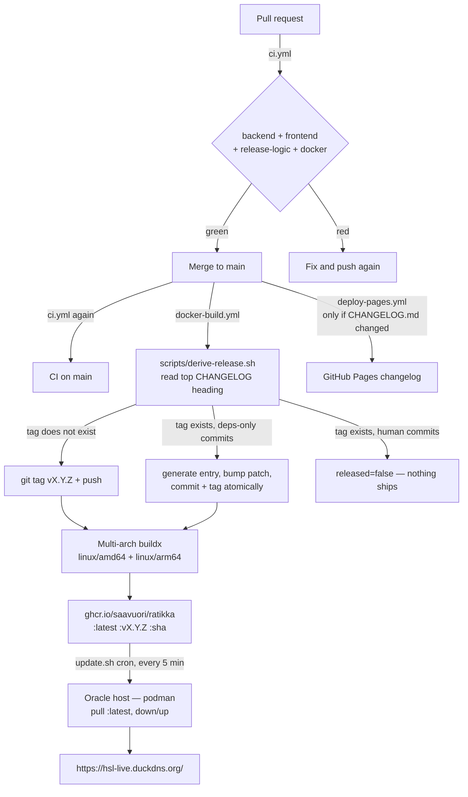

# CI/CD Pipeline

How a commit becomes the running production site, what gates it passes on the
way, and what to do when nothing ships.

The short version: **`CHANGELOG.md` is the single source of truth for the
version.** The release tag is whatever the top `## [vX.Y.Z]` heading says. Bump
the heading to release; leave it alone and nothing is built. There is no
automatic bump computation and no manual tagging.

---

## Pipeline at a glance



Three workflows, each with a distinct trigger:

| Workflow | File | Triggers on | Does |
|---|---|---|---|
| CI | [`ci.yml`](../.github/workflows/ci.yml) | every PR, every push to `main` | test/lint/build gate |
| CI/CD Build and Release | [`docker-build.yml`](../.github/workflows/docker-build.yml) | push to `main` (with `paths-ignore`) | tag + multi-arch image to GHCR |
| Deploy Changelog to Pages | [`deploy-pages.yml`](../.github/workflows/deploy-pages.yml) | push to `main` touching `CHANGELOG.md` or the generator | publishes the changelog site |

---

## 1. CI — the only gate

[`ci.yml`](../.github/workflows/ci.yml) runs on every pull request and on every
push to `main`. A merge to `main` builds an image that the host pulls into
production within five minutes, so this is the **only** thing standing between a
PR and the live site. Keep it green.

Four jobs, all on `ubuntu-latest`, all in parallel:

| Job | Steps |
|---|---|
| **Backend (go test)** | `go mod tidy` + `git diff --exit-code` on `go.mod`/`go.sum`, then `go vet ./...`, then `go test ./...` (working dir `backend/`) |
| **Frontend (lint, build, test)** | `npm ci`, `npm run lint`, `npm run build`, `npm test` (working dir `frontend/`, Node 24) |
| **Release logic** | `./scripts/derive-release.test.sh` — see [§3](#3-release-logic) |
| **Docker image builds** | amd64-only `docker/build-push-action` with `push: false` |

Notes on why each is shaped the way it is:

- **The tidy check** fails the build if `go mod tidy` would change anything, so a
  Dependabot bump that leaves `go.sum` inconsistent is caught at PR time rather
  than at image-build time.
- **`go test ./...` works on a clean checkout** because
  `backend/internal/api/dist/index.html` is tracked — the `//go:embed all:dist`
  pattern needs at least one file to exist or the package will not compile.
- **The Docker job does not push.** It builds amd64 only, purely to catch a
  broken `Dockerfile` before it reaches `main`; the real multi-arch build lives
  in the release workflow. Both use `type=gha` buildx cache.
- Go version comes from `backend/go.mod` (`go-version-file`), so bumping the
  language version is a one-line change in one place.

---

## 2. Release — the CHANGELOG is the version

**To cut a release, bump the top `## [vX.Y.Z]` heading in `CHANGELOG.md`.** That
is the entire trigger.

[`docker-build.yml`](../.github/workflows/docker-build.yml) runs on every push to
`main` except doc/infra-only paths (`README.md`, `docs/**`, `monitoring/**`,
`deploy.sh`, `.gitignore` are in `paths-ignore`). Its `tag` job runs
[`scripts/derive-release.sh`](../scripts/derive-release.sh), which emits
`tag=` and `released=` to `$GITHUB_OUTPUT`. The `build-and-push` job is gated on
`needs.tag.outputs.released == 'true'`.

Because the tag is derived from the heading rather than computed, **the deployed
version and the changelog cannot drift** — the running app always equals the
changelog's top entry.

The flip side: **a merge to `main` that forgets the changelog bump ships nothing,
silently.** CI is green, the workflow runs, the build is skipped because the tag
already exists. This has bitten before — v0.44.9 had to be re-cut as v0.44.10 for
exactly this reason. If you merged and the site did not change, check the
heading first.

### Choosing the number

Semantically, guided by the conventional-commit prefix of the change:

| Change | Bump | Example |
|---|---|---|
| `fix:` | patch | v0.47.0 → v0.47.1 |
| `feat:` | minor | v0.47.1 → v0.48.0 |
| `feat!:` / `BREAKING CHANGE:` | major | v0.48.0 → v1.0.0 |

The prefix guides the number you write, but the **heading is authoritative** —
the tag matches it verbatim. Commit messages no longer drive the version at all;
they are how the changelog gets written.

### Do not

- **Do not create tags manually.** CI owns tag creation.
- **Do not hardcode version strings.** They are injected via build args.
- **Do not write a heading whose number doesn't match the intended bump** — you
  will get a tag that says `patch` for a breaking change.

---

## 3. Release logic

The decision lives in [`scripts/derive-release.sh`](../scripts/derive-release.sh)
rather than inline YAML specifically so it can be tested outside CI —
[`scripts/derive-release.test.sh`](../scripts/derive-release.test.sh) builds
throwaway git repos with real bare remotes and exercises every path. It runs as
its own CI job. Release logic that silently ships nothing is exactly the kind of
bug that hides for weeks, so it gets tests.

The script greps the version with:

```
^##\s*\[\s*v?\K[0-9]+\.[0-9]+\.[0-9]+
```

`scripts/bump-changelog-for-deps.mjs` uses the same pattern deliberately, so the
two cannot disagree about what "the current version" is.

### Decision table

| State of `main` | Result | `released` |
|---|---|---|
| Top heading names a tag that does **not** exist | tag it, build it | `true` |
| Tag exists, **no** new non-merge commits since it | nothing to do | `false` |
| Tag exists, every new commit is `chore(deps):` / `chore(deps-dev):` | generate entry, bump patch, commit + tag, build | `true` |
| Tag exists, **any** human commit in the batch | skip — a human should write the entry | `false` |
| No `## [vX.Y.Z]` heading found at all | `::error::` and exit 1 | — |

### The dependency exception

Dependabot cannot write a changelog entry, so without a fallback its merges would
land on `main` and never ship — skipped precisely because the heading did not
move. So: when *every* new non-merge commit since the current tag is prefixed
`chore(deps)` or `chore(deps-dev)`,
[`scripts/bump-changelog-for-deps.mjs`](../scripts/bump-changelog-for-deps.mjs)
inserts a `### Changed` entry above the current top entry, bumps the **patch**,
and the script commits and tags it.

A single human commit in the batch disables this — the heading stays put and
nothing ships until a human writes an entry, exactly as before.

Two details worth knowing:

- **The push is atomic.** `git push --atomic origin HEAD:main refs/tags/vX.Y.Z`
  lands the commit and its tag together, so the workflow run triggered by that
  push always sees the tag already present and skips, instead of racing the
  current run to build the same thing twice.
- **`build-and-push` checks out the tag, not `github.sha`.** On an automatic
  dependency release the tag points at the CHANGELOG-bump commit, which is one
  commit ahead of the SHA that triggered the run. Building `github.sha` would
  publish an image whose embedded version does not match the tag it is published
  under. For a normal release the tag *is* `github.sha` and this is a no-op.

This is also why [`.github/dependabot.yml`](../.github/dependabot.yml) must keep
the `chore(deps)` commit prefix on **every** ecosystem, including
`github-actions` — the release keys off that exact string. A generic `ci:` prefix
would make action bumps look like human commits and silently skip the release.

---

## 4. Image build and version injection

The `build-and-push` job builds [`Dockerfile`](../Dockerfile) for
`linux/amd64,linux/arm64` (QEMU + Buildx) and pushes to GHCR under three tags:

```
ghcr.io/saavuori/ratikka:latest
ghcr.io/saavuori/ratikka:vX.Y.Z
ghcr.io/saavuori/ratikka:<sha of the tagged commit>
```

The repository name is lowercased in a `meta` step (`${GITHUB_REPOSITORY,,}`)
because `Saavuori/ratikka` is not a valid image reference. Images are public, so
the host pulls without auth.

Three build args are threaded into the Go binary via `-ldflags`:

| Build arg | Value | Lands in |
|---|---|---|
| `VERSION` | the release tag | `ratikka/internal/api.Version` |
| `BUILD_DATE` | `date -u +'%Y-%m-%dT%H:%M:%SZ'` at build time | `.BuildDate` |
| `GIT_SHA` | `git rev-parse HEAD` of the checked-out tag | `.GitCommit` |

Defaults are `dev` / `unknown` / `unknown` for local builds. They are declared in
[`backend/internal/api/handlers.go:20`](../backend/internal/api/handlers.go#L20)
and surfaced at `GET /api/v1/version`, which the frontend `VersionBadge` renders.
That endpoint is the quickest way to confirm what is actually running:

```bash
curl -s https://hsl-live.duckdns.org/api/v1/version
```

The image is a three-stage build: Node builds the frontend → the assets are
copied into `internal/api/dist/` → Go compiles a static binary that embeds them →
the binary alone is copied onto `alpine`. One container serves both.

---

## 5. Deployment to production

There is no deploy step in GitHub Actions. Publishing the image *is* the deploy.

The Oracle host (`opc@130.61.233.86`, RHEL 9 aarch64, rootless Podman) runs a
`*/5 * * * *` cron executing `~/ratikka/update.sh`, which pulls
`ghcr.io/saavuori/ratikka:latest` and brings the stack down and back up. So a
merge to `main` with a bumped changelog deploys itself within about five minutes.

**Watchtower is not used in production**, despite still being present in
[`deploy.sh`](../deploy.sh) and referenced in a stale comment at the top of
`ci.yml` — it is incompatible with rootless Podman on RHEL. The repo's
[`docker-compose.yml`](../docker-compose.yml) reflects reality (no Watchtower
service, with a comment saying why); `deploy.sh` is the odd one out and is only
correct for a Docker host.

The host also runs sibling apps (tieliikenne, bensa, railway) behind the single
Caddy container owned by the ratikka stack. See memory
`oracle-host-multi-app-deploy` for the layout, and [MONITORING.md](MONITORING.md)
for the Alloy → Grafana Cloud metrics path.

---

## 6. Changelog site

[`deploy-pages.yml`](../.github/workflows/deploy-pages.yml) runs on pushes to
`main` that touch `CHANGELOG.md`, `scripts/build-changelog.js`,
`scripts/changelog-template.html`, or the workflow itself. It compiles the
markdown into `dist-changelog/` and publishes to GitHub Pages at
<https://saavuori.github.io/ratikka/>. Concurrency group `pages` with
`cancel-in-progress: true`, so rapid merges don't queue up deploys.

This is independent of the release workflow — a changelog edit that doesn't move
the top heading still republishes the site without cutting a release.

---

## 7. Dependency updates

[`.github/dependabot.yml`](../.github/dependabot.yml) opens **grouped weekly**
PRs across four ecosystems. Grouped rather than one-per-dependency because this
stack has few direct deps and ungrouped updates would be mostly noise; CI gates
every one, which is what makes them safe to merge on sight.

| Ecosystem | Directory | Group | Notes |
|---|---|---|---|
| `gomod` | `/backend` | minor + patch | limit 5 open PRs |
| `npm` | `/frontend` | minor + patch | MapLibre **majors excluded** |
| `github-actions` | `/` | all patterns | prefix must stay `chore(deps)` |
| `docker` | `/` | — | e.g. the pinned Grafana Alloy image |

MapLibre majors are deliberately ignored: they change map rendering behaviour and
need a visual pass over `Map.tsx`. See
[TECH_STACK_UPGRADE_PLAN.md](TECH_STACK_UPGRADE_PLAN.md). Minor and patch bumps
still flow through the group.

The Alloy image is pinned rather than tracking `:latest` because an unattended
restart could otherwise pull a new major and break metrics collection with no
change on our side.

---

## 8. What CI does *not* cover

**The map.** Nothing about map rendering is checked by `tsc`, the unit tests, or
any workflow. There are two independent failure modes and a script for each —
run **both** before shipping map changes; passing one proves nothing about the
other.

```bash
cd frontend && npm run build && cd ..
npx playwright@latest install chromium    # once
npm i --no-save playwright                # from the repo root, once per checkout

node scripts/verify-map-layers.mjs        # 1. are the layer specs valid?
DIGITRANSIT_API_KEY=... node scripts/verify-map-renders.mjs   # 2. does it draw?
```

1. **`verify-map-layers.mjs`** stubs every external asset and checks that
   MapLibre accepts the layer specs. Most layers anchor to `trams-circles` via
   `beforeId`, so one bad expression silently takes the stops, route path and
   journey overlay with it (v0.44.7).
2. **`verify-map-renders.mjs`** hits the real Digitransit basemap with a real
   subscription key and asserts vector tiles came back and `isStyleLoaded()` is
   true. This exists because v0.46.0 passed the spec check and still shipped a
   completely blank map: with the tile worker dead, no tile was ever parsed, so
   nothing downstream of it was exercised.

Neither runs in CI because the render check needs a real Digitransit key as a
secret. Get it from the deploy host's `.env`.

See [VERIFICATION.md](VERIFICATION.md) for the wider quality-gate plan.

---

## 9. Runbook

**"I merged to `main` and the site didn't change."**
Check the top heading in `CHANGELOG.md` against the existing tags. If the tag
already exists, the build was skipped by design — that is the single most common
cause. Bump the heading and push; the `docker-build.yml` run log says exactly
which branch of the decision it took.

**"The workflow didn't even run."**
Check `paths-ignore` in `docker-build.yml`. A push touching only `docs/**`,
`README.md`, `monitoring/**`, `deploy.sh`, or `.gitignore` does not trigger it.

**"Dependabot PRs merged but nothing shipped."**
There is a human commit in the batch since the last tag — the auto-release
deliberately stands down. Look at `git log --no-merges --format=%s vX.Y.Z..HEAD`;
anything not prefixed `chore(deps)` / `chore(deps-dev)` disables it. Write a
changelog entry to ship the batch.

**"`/api/v1/version` shows an older version than the tag."**
The host cron runs every five minutes; wait, then re-check. If it persists, the
pull or the container restart failed on the host — see memory
`oracle-host-multi-app-deploy` for how to inspect it.

**"The tag exists but no image was published."**
The `tag` job succeeded and `build-and-push` failed. Multi-arch arm64 builds go
through QEMU and are the slowest, most failure-prone step. Re-running the
workflow is safe: `derive-release.sh` sees the existing tag, and if there are no
new commits it reports `released=false` — so **re-running will not rebuild**.
Delete the tag and re-push it, or bump to the next patch.

**"I need to verify the release logic before changing it."**

```bash
./scripts/derive-release.test.sh
```

Runs against throwaway repos; touches nothing real.

---

## Key files

| Path | Role |
|---|---|
| [`.github/workflows/ci.yml`](../.github/workflows/ci.yml) | the PR gate |
| [`.github/workflows/docker-build.yml`](../.github/workflows/docker-build.yml) | tag → multi-arch build → GHCR |
| [`.github/workflows/deploy-pages.yml`](../.github/workflows/deploy-pages.yml) | changelog site |
| [`.github/dependabot.yml`](../.github/dependabot.yml) | weekly grouped updates |
| [`scripts/derive-release.sh`](../scripts/derive-release.sh) | the release decision |
| [`scripts/derive-release.test.sh`](../scripts/derive-release.test.sh) | its tests (a CI job) |
| [`scripts/bump-changelog-for-deps.mjs`](../scripts/bump-changelog-for-deps.mjs) | generates the dependency entry |
| [`scripts/build-changelog.js`](../scripts/build-changelog.js) | `CHANGELOG.md` → `dist-changelog/` |
| [`CHANGELOG.md`](../CHANGELOG.md) | **the version** |
| [`Dockerfile`](../Dockerfile) | 3-stage build, accepts the version build args |
| [`docker-compose.yml`](../docker-compose.yml) | the production stack shape |
