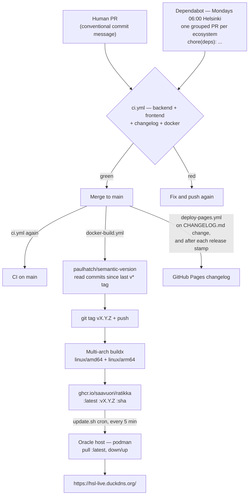

# CI/CD Pipeline

How a commit becomes the running production site, what gates it passes on the
way, and what to do when nothing ships.

The short version: **the commit messages are the version.** On a push to `main`,
`paulhatch/semantic-version` reads everything since the last `v*` tag and picks
the bump — `feat:` minor, `!:`/`BREAKING CHANGE:` major, anything else patch —
then tags, builds and publishes. Nothing has to be predicted, nothing has to be
tagged by hand, and no file has to be edited for a merge to ship.

---

## Pipeline at a glance



Note that the dependency path is not a special case any more. A Dependabot PR
goes through the same front door as a human one and releases through the same
single path — there is no fallback branch, because there is nothing for a
dependency PR to forget to write.

Three workflows, each with a distinct trigger:

| Workflow | File | Triggers on | Does |
|---|---|---|---|
| CI | [`ci.yml`](../.github/workflows/ci.yml) | every PR, every push to `main` | test/lint/build gate |
| CI/CD Build and Release | [`docker-build.yml`](../.github/workflows/docker-build.yml) | push to `main` (with `paths-ignore`) | tag + multi-arch image to GHCR |
| Deploy Changelog to Pages | [`deploy-pages.yml`](../.github/workflows/deploy-pages.yml) | push to `main` touching `CHANGELOG.md` or the generator, **and** after every release run | publishes the changelog site |

Dependabot is not a workflow — GitHub runs it from
[`.github/dependabot.yml`](../.github/dependabot.yml). See [§7](#7-dependency-updates).

---

## 1. CI — the only gate

[`ci.yml`](../.github/workflows/ci.yml) runs on every pull request and on every
push to `main`. A merge to `main` builds an image that the host pulls into
production within five minutes, so this is the **only** thing standing between a
PR and the live site. Keep it green.

Four jobs, all on `ubuntu-latest`, all in parallel:

| Job | Steps |
|---|---|
| **Backend (go test)** | `go mod tidy` + `git diff --exit-code` on `go.mod`/`go.sum`, then `go vet ./...`, then `go test ./...` (working dir `backend/`) |
| **Frontend (lint, build, test)** | `npm ci`, `npm run lint`, `npm run build`, `npm test` (working dir `frontend/`, Node 24) |
| **Changelog (renders, no invented versions)** | rejects a `## [vX.Y.Z]` heading the branch adds for a tag that does not exist, rejects an `[Unreleased]` heading that is not the topmost entry, then runs `scripts/build-changelog.js` |
| **Docker image builds** | amd64-only `docker/build-push-action` with `push: false` |

Notes on why each is shaped the way it is:

- **The tidy check** fails the build if `go mod tidy` would change anything, so a
  dependency bump that leaves `go.sum` inconsistent is caught at PR time rather
  than at image-build time.
- **`go test ./...` works on a clean checkout** because
  `backend/internal/api/dist/index.html` is tracked — the `//go:embed all:dist`
  pattern needs at least one file to exist or the package will not compile.
- **The changelog job no longer guards a release**, because the changelog no
  longer decides one. It guards the *published site* against being wrong about
  which release carried what. A branch cannot know its own version — it is
  chosen at merge time — so writing one by hand is a guess, and the job rejects
  guesses. `[Unreleased]` is now the correct thing to write, and is only an
  error when it is stranded below a released entry, meaning a stamp was missed.
- **The Docker job does not push.** It builds amd64 only, purely to catch a
  broken `Dockerfile` before it reaches `main`; the real multi-arch build lives
  in the release workflow. Both use `type=gha` buildx cache.
- Go version comes from `backend/go.mod` (`go-version-file`), so bumping the
  language version is a one-line change in one place.

---

## 2. Release — the commit messages are the version

**To cut a release, merge to `main`.** That is the entire trigger. Every merge
that touches something shippable releases; the commit prefixes decide how big a
release it is.

[`docker-build.yml`](../.github/workflows/docker-build.yml) runs on every push to
`main` except doc/infra-only paths (`README.md`, `CLAUDE.md`, `CHANGELOG.md`,
`docs/**`, `monitoring/**`, `scripts/**`, `.claude/**`, `deploy.sh`, `.gitignore`
are in `paths-ignore`). Its `tag` job runs
[`paulhatch/semantic-version`](https://github.com/PaulHatch/semantic-version)
against the full history (`fetch-depth: 0` is required — a shallow clone cannot
see the last tag), then pushes the tag it computed. `build-and-push` follows
unconditionally.

### Choosing the number

You don't. You choose the **prefix**, and the prefix chooses the number:

| Commit contains | Bump | Example |
|---|---|---|
| `!:` or `BREAKING CHANGE:` | major | v0.48.0 → v1.0.0 |
| `feat:` / `feat(scope):` | minor | v0.47.1 → v0.48.0 |
| anything else, incl. `chore(deps):` | patch | v0.47.0 → v0.47.1 |

The patterns are configured on the action as `major_pattern` and `minor_pattern`;
the highest match across all commits in the batch wins. This makes Conventional
Commits **load-bearing** rather than decorative — a `feat:` that should have been
a `fix:` cuts a minor, and there is no second place to catch it.

### Do not

- **Do not create tags manually.** CI owns tag creation, and a hand-made tag
  changes what the next release computes from.
- **Do not hardcode version strings.** They are injected via build args.
- **Do not squash a `feat:` and a `fix:` into a commit titled `chore:`** — the
  release will under-report.

---

## 3. Why this replaced the CHANGELOG-driven release

Until v0.50.4 the release tag was whatever the top `## [vX.Y.Z]` heading in
`CHANGELOG.md` said, resolved by `scripts/derive-release.sh`. The appeal was
real — the deployed version and the changelog could not drift, because they were
the same string. But coupling them made the version a *shared mutable resource*,
and that produced two failure modes that both actually happened:

**A merge that forgot the bump shipped nothing, silently.** CI green, workflow
ran, build skipped because the tag already existed. v0.44.9 had to be re-cut as
v0.44.10 for exactly this.

**Every open PR had to predict the next number, so PRs collided.** Two branches
in flight both wrote the same heading and conflicted in `CHANGELOG.md` by
construction — not because they touched the same feature, but because they
touched the same counter. PR #59 hit this against #60. The conflict was not a
merge accident; it was the design working as specified.

A stack of machinery existed to paper over the second problem:
`scripts/changelog-entry.js` (a Renovate post-upgrade task that wrote the entry
inside the bot's own commit), a dependency-only fallback inside
`derive-release.sh` that bumped the patch when every commit in the batch was
`chore(deps)`, `scripts/bump-changelog-for-deps.mjs`, and a `release-logic` CI
job testing all of it. That was a lot of tested, working code in service of a
number that did not need to live in a file. Deriving the version from the commit
messages removes the shared resource, and with it every one of those pieces —
`renovate.json5` and the self-hosted Renovate workflow included, since the only
reason Renovate had to be self-hosted was running that post-upgrade command.

What was lost initially: the changelog heading and the tag could drift, and
nothing enforced that an entry existed at all. That was judged a documentation
defect rather than a shipping defect — the release is correct either way — and
the cheaper of the two failure modes by a wide margin. That judgement held, but
the drift was not hypothetical. By v0.51.9 the newest heading read `v0.51.1`,
labelling v0.51.4's and v0.51.9's work, with six releases unrecorded.

The fix keeps the decoupling and removes the guess. Contributors write
`## [Unreleased]`; the `tag` job stamps the tag it just cut onto that heading
and commits it back to `main`, because that job is the first place the version
is known. CI rejects any version heading a branch invents. The changelog still
does not gate or choose a release — a release with no pending entry simply
ships unannotated, as before.

---

## 4. Image build and version injection

The `build-and-push` job builds [`Dockerfile`](../Dockerfile) for
`linux/amd64,linux/arm64` (QEMU + Buildx) and pushes to GHCR under three tags:

```
ghcr.io/saavuori/ratikka:latest
ghcr.io/saavuori/ratikka:vX.Y.Z
ghcr.io/saavuori/ratikka:<merge commit sha>
```

The repository name is lowercased in a `meta` step (`${GITHUB_REPOSITORY,,}`)
because `Saavuori/ratikka` is not a valid image reference. Images are public, so
the host pulls without auth.

Three build args are threaded into the Go binary via `-ldflags`:

| Build arg | Value | Lands in |
|---|---|---|
| `VERSION` | the release tag | `ratikka/internal/api.Version` |
| `BUILD_DATE` | `date -u +'%Y-%m-%dT%H:%M:%SZ'` at build time | `.BuildDate` |
| `GIT_SHA` | `github.sha`, the merge commit the tag points at | `.GitCommit` |

Defaults are `dev` / `unknown` / `unknown` for local builds. They are declared in
[`backend/internal/api/handlers.go:20`](../backend/internal/api/handlers.go#L20)
and surfaced at `GET /api/v1/version`, which the frontend `VersionBadge` renders.
That endpoint is the quickest way to confirm what is actually running:

```bash
curl -s https://hsl-live.duckdns.org/api/v1/version
```

The image is a three-stage build: Node builds the frontend → the assets are
copied into `internal/api/dist/` → Go compiles a static binary that embeds them →
the binary alone is copied onto `alpine`. One container serves both.

---

## 5. Deployment to production

There is no deploy step in GitHub Actions. Publishing the image *is* the deploy.

The Oracle host (`opc@130.61.233.86`, RHEL 9 aarch64, rootless Podman) runs a
`*/5 * * * *` cron executing `~/ratikka/update.sh`, which pulls
`ghcr.io/saavuori/ratikka:latest` and brings the stack down and back up. So a
merge to `main` with a bumped changelog deploys itself within about five minutes.

**Watchtower is not used in production**, despite still being present in
[`deploy.sh`](../deploy.sh) and referenced in a stale comment at the top of
`ci.yml` — it is incompatible with rootless Podman on RHEL. The repo's
[`docker-compose.yml`](../docker-compose.yml) reflects reality (no Watchtower
service, with a comment saying why); `deploy.sh` is the odd one out and is only
correct for a Docker host.

The host also runs sibling apps (tieliikenne, bensa, railway) behind the single
Caddy container owned by the ratikka stack. See memory
`oracle-host-multi-app-deploy` for the layout, and [MONITORING.md](MONITORING.md)
for the Alloy → Grafana Cloud metrics path.

---

## 6. Changelog site

[`deploy-pages.yml`](../.github/workflows/deploy-pages.yml) runs on pushes to
`main` that touch `CHANGELOG.md`, `scripts/build-changelog.js`,
`scripts/changelog-template.html`, or the workflow itself. It compiles the
markdown into `dist-changelog/` and publishes to GitHub Pages at
<https://saavuori.github.io/ratikka/>. Concurrency group `pages` with
`cancel-in-progress: true`, so rapid merges don't queue up deploys.

A changelog edit still republishes the site without cutting a release, since
`CHANGELOG.md` is in the release workflow's `paths-ignore`.

It also runs on `workflow_run` after **CI/CD Build and Release** completes. That
is not redundant: the stamping commit is pushed with `GITHUB_TOKEN`, and GitHub
deliberately does not raise `push` events for those, so a stamped entry would
otherwise sit on `main` unpublished. Republishing after a release that changed
nothing here is harmless — the render is deterministic and the `pages`
concurrency group serialises it.

---

## 7. Dependency updates

**Dependabot** opens grouped pull requests every Monday, one per ecosystem,
configured entirely in [`.github/dependabot.yml`](../.github/dependabot.yml).
Merging one releases a patch through the ordinary path — no special case, no
post-merge commit to `main`, no generated changelog entry.

### 7.1 Why it replaced self-hosted Renovate

Renovate was chosen originally because it could run a command after updating the
manifests, and that command — `scripts/changelog-entry.js` — wrote the
`CHANGELOG.md` entry that a dependency PR needed in order to ship at all. The
Mend-hosted app will not run post-upgrade commands, so the bot had to be
self-hosted from a scheduled workflow, authenticating as a GitHub App with two
repository secrets (`RENOVATE_APP_ID`, `RENOVATE_APP_PRIVATE_KEY`).

All of that existed to satisfy one requirement: *a dependency merge must move
the changelog heading, or it ships nothing.* Once the version came from commit
messages that requirement disappeared, and with it the case for the whole
apparatus. Dependabot needs no secrets, no App installation and no workflow —
GitHub runs it — and the one thing it cannot do stopped mattering.

Two things genuinely got worse, and they are worth naming:

- **No `minimumReleaseAge`.** Renovate held a release for three days before
  proposing it, so a version yanked shortly after publishing never reached a PR.
  Dependabot has no equivalent; the defence is now noticing by hand.
- **No changelog entry.** Dependency bumps arrive unannotated. Fold them into
  the next hand-written entry.

### 7.2 What gets updated

Every place the repo pins a version, one `updates:` block each:

| Ecosystem | Directory | Files |
|---|---|---|
| `gomod` | `/backend` | `backend/go.mod` |
| `npm` | `/frontend` | `frontend/package.json` |
| `github-actions` | `/` | `.github/workflows/*.yml` |
| `docker` | `/` | `Dockerfile` (build + runtime stages) |
| `docker-compose` | `/` | `docker-compose.yml`, `docker-compose.override.yml` |

Grouping and exclusions:

- **Minor and patch updates are grouped per ecosystem** (`groups:` with
  `update-types: [minor, patch]`). Dependabot cannot group across ecosystems the
  way Renovate could, so expect up to five PRs on a busy Monday rather than one.
  That is now harmless: they no longer compete for a version number.
- **Majors come as their own PR**, one per dependency, because each needs a real
  look.
- **`maplibre-gl` majors are ignored entirely** — a `version-update:semver-major`
  ignore rule. They change map rendering behaviour and need all three map checks
  run by hand; v0.46.0 shipped a blank map through green CI. Minor and patch
  still flow through the group.
- **`open-pull-requests-limit: 5`** per ecosystem is the backlog cap.

Every ecosystem sets `commit-message.prefix: "chore(deps)"` (and
`prefix-development: "chore(deps-dev)"` where the distinction exists). This no
longer decides whether a release happens, but it keeps dependency commits out of
the `feat:` pattern, so a batch of them cuts a **patch**, not a minor.

Our own image `ghcr.io/saavuori/ratikka` is pinned to `:latest` by design in
`docker-compose.yml` — the host's `update.sh` cron is what pulls it. Dependabot's
docker-compose ecosystem does not propose bumps for a floating tag, so unlike
Renovate it needs no explicit rule to leave it alone.

### 7.3 The routine flow

1. **Monday 06:00 Helsinki** Dependabot runs and opens the week's PRs.
2. **CI runs on each one.** Dependabot PRs trigger `pull_request` workflows
   normally — this was the other reason Renovate needed an App rather than
   `GITHUB_TOKEN`, and it is not a concern here.
3. **Review the diff.** For a frontend PR, check what CI cannot see: if the
   bundle or the map moved, run the checks in [§8](#8-what-ci-does-not-cover).
4. **Merge.** The `chore(deps):` commits cut a patch; the tag, build and deploy
   follow automatically.
5. **The host picks it up** within ~5 minutes. Confirm with
   `curl -s https://hsl-live.duckdns.org/api/v1/version`.
6. **Note it in `CHANGELOG.md`** with the next hand-written entry, if the bump
   is worth a reader knowing about.

### 7.4 Major versions

Majors arrive alone, so treat them one at a time:

1. Read the upstream migration notes linked in the PR body.
2. Check CI, then check what CI *can't* see — for anything touching the frontend
   bundle or the map, run the verification scripts in
   [§8](#8-what-ci-does-not-cover). The v0.46.0 blank map shipped with green CI.
3. If it needs code changes, push them onto the Dependabot branch, or take the
   branch over entirely (`@dependabot` comment commands still work).
4. If it needs real work, close the PR, add an `ignore` rule in
   `.github/dependabot.yml` with a comment saying why, and do it on your own
   branch — under a `feat:` or `fix:` prefix, so it releases as the change it
   actually is rather than as a patch.

`maplibre-gl` is the standing example: v5 → v6 passed `tsc`, the unit tests and
the layer-spec check, shipped a completely blank map (v0.46.0), was reverted
(v0.46.1), and only landed once `verify-map-renders.mjs` existed to prove pixels
appeared (v0.47.0). See
[TECH_STACK_UPGRADE_PLAN.md §4](TECH_STACK_UPGRADE_PLAN.md).

The Grafana Alloy image is pinned to a concrete tag for the same class of reason:
the host restarts containers unattended every five minutes, so a floating tag
could pull a new major and break metrics collection with no change on our side.
Dependabot's docker-compose ecosystem proposes those bumps instead.

### 7.5 Updating dependencies by hand

Dependabot covers drift, not intent. Sweep manually when you want everything
current at once, when chasing a specific advisory, or when a major needs code
changes alongside it.

```bash
# backend/
go get -u ./...                 # or name specific modules
go get golang.org/x/net@latest  # indirect deps need naming; tidy won't raise them
go mod tidy                     # required — CI fails if this would change anything
go vet ./... && go test ./...
```

```bash
# frontend/
npm outdated                    # what's behind
npm update                      # in-range bumps
npm install <pkg>@latest        # a specific major
npm audit fix
npm run lint && npm run build && npm test
```

Then, if the frontend bundle or map changed:

```bash
node scripts/verify-map-layers.mjs
DIGITRANSIT_API_KEY=... node scripts/verify-map-renders.mjs
node scripts/verify-route-offsets.mjs
```

Commit the sweep under `chore(deps):` so it cuts a patch. Unlike before, a sweep
that writes no changelog entry still ships — and a branch mixing a sweep with
feature work now simply takes the higher bump, rather than misclassifying the
whole batch.

### 7.6 Changing the Dependabot config

- **Keep the `chore(deps)` / `chore(deps-dev)` prefixes on every ecosystem.**
  They are what stops dependency commits from matching `minor_pattern`.
- **Comment every `ignore` rule** the way the `maplibre-gl` one does. An
  exclusion with no rationale becomes permanent by accident.
- **Dependabot validates its own config**: a malformed `.github/dependabot.yml`
  shows up on the repository's Insights → Dependency graph → Dependabot tab, not
  as a failing CI job. Check there after editing it.

---

## 8. What CI does *not* cover

**The map.** Nothing about map rendering is checked by `tsc`, the unit tests, or
any workflow. There are two independent failure modes and a script for each —
run **both** before shipping map changes; passing one proves nothing about the
other.

```bash
cd frontend && npm run build && cd ..
npx playwright@latest install chromium    # once
npm i --no-save playwright                # from the repo root, once per checkout

node scripts/verify-map-layers.mjs        # 1. are the layer specs valid?
DIGITRANSIT_API_KEY=... node scripts/verify-map-renders.mjs   # 2. does it draw?
```

1. **`verify-map-layers.mjs`** stubs every external asset and checks that
   MapLibre accepts the layer specs. Most layers anchor to `trams-circles` via
   `beforeId`, so one bad expression silently takes the stops, route path and
   journey overlay with it (v0.44.7).
2. **`verify-map-renders.mjs`** hits the real Digitransit basemap with a real
   subscription key and asserts vector tiles came back and `isStyleLoaded()` is
   true. This exists because v0.46.0 passed the spec check and still shipped a
   completely blank map: with the tile worker dead, no tile was ever parsed, so
   nothing downstream of it was exercised.

Neither runs in CI because the render check needs a real Digitransit key as a
secret. Get it from the deploy host's `.env`.

See [VERIFICATION.md](VERIFICATION.md) for the wider quality-gate plan.

---

## 9. Runbook

**"I merged to `main` and the site didn't change."**
Check whether `docker-build.yml` ran at all, then whether the `tag` job created a
new tag. Unlike the old CHANGELOG-driven pipeline, a merge that touches shippable
code always releases — so "nothing shipped" now means the workflow was skipped or
failed, not that a heading was forgotten.

**"The workflow didn't even run."**
Check `paths-ignore` in `docker-build.yml`. A push touching only `docs/**`,
`README.md`, `CLAUDE.md`, `CHANGELOG.md`, `monitoring/**`, `scripts/**`,
`.claude/**`, `deploy.sh`, or `.gitignore` does not trigger it. This is why a
changelog edit republishes Pages without cutting a release.

**"It cut a minor and I expected a patch"** (or vice versa).
Some commit in the batch matched `minor_pattern` — `feat:` or `feat(scope):`.
`git log --no-merges --format=%s vX.Y.Z..HEAD` shows the batch the action read.
Squash-merging a PR uses the PR title as the commit subject, so a PR titled
`feat: …` cuts a minor even if every commit inside it was a `fix:`.

**"The tag job failed with `fatal: no tag found`" or produced `v0.0.1`.**
`fetch-depth: 0` is missing or the history is shallow — `paulhatch/semantic-version`
needs the full history to find the previous tag, and computes from zero without it.

**"`/api/v1/version` shows an older version than the tag."**
The host cron runs every five minutes; wait, then re-check. If it persists, the
pull or the container restart failed on the host — see memory
`oracle-host-multi-app-deploy` for how to inspect it.

**"The tag exists but no image was published."**
The `tag` job succeeded and `build-and-push` failed. Multi-arch arm64 builds go
through QEMU and are the slowest, most failure-prone step. Re-running the
workflow will fail at the tag step (the tag already exists) — so re-run only the
`build-and-push` job from the Actions UI, or delete the tag and re-push.

**"A Dependabot PR is behind `main` / conflicts."**
Comment `@dependabot rebase` on it. Dependency PRs no longer conflict over the
version, so a conflict now means a genuine overlap in a manifest or lockfile.

**"Dependabot didn't open anything on Monday."**
Check Insights → Dependency graph → Dependabot for the last run and any config
error. A malformed `.github/dependabot.yml` fails there, not in CI. Each
ecosystem also stops at `open-pull-requests-limit: 5` — clear the backlog.

---

## Key files

| Path | Role |
|---|---|
| [`.github/workflows/ci.yml`](../.github/workflows/ci.yml) | the PR gate |
| [`.github/workflows/docker-build.yml`](../.github/workflows/docker-build.yml) | version → tag → multi-arch build → GHCR |
| [`.github/workflows/deploy-pages.yml`](../.github/workflows/deploy-pages.yml) | changelog site |
| [`.github/dependabot.yml`](../.github/dependabot.yml) | what gets updated, grouping, ignores |
| [`scripts/build-changelog.js`](../scripts/build-changelog.js) | `CHANGELOG.md` → `dist-changelog/` |
| [`CHANGELOG.md`](../CHANGELOG.md) | the human record — **not** the version |
| [`Dockerfile`](../Dockerfile) | 3-stage build, accepts the version build args |
| [`docker-compose.yml`](../docker-compose.yml) | the production stack shape |
