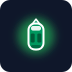
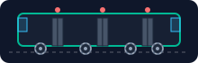
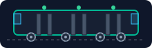
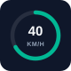

# Tram & Bus Icons and Animations

A visual catalogue of every tram- and bus-related **icon** and **animation** in the
frontend. Each picture below is the actual rendered artwork the app draws; the
animated ones (door pulse, spinning wheels, blinking lights) play in your browser
when you open this page on GitHub.

> Icons are shown on a dark rounded card so the white outlines stay visible. On the
> live map the same art is drawn with a transparent background.

Colour language: tram green `#00985f`, bus blue `#007ac9` / `#0984e3`, trunk-bus
orange `#CA4300`, selection gold `#fdcb6e`, boarding amber `#ffb020`, stopped coral
`#e17055`. Source: [`Map.tsx`](../frontend/src/components/Map.tsx),
[`TramPopup.tsx`](../frontend/src/components/TramPopup.tsx),
[`TramCard.tsx`](../frontend/src/components/TramCard.tsx),
[`lib/routeColors.ts`](../frontend/src/lib/routeColors.ts),
[`lib/lerp.ts`](../frontend/src/lib/lerp.ts).

---

## 1. Map vehicle icons

Every live vehicle is a little top-down carriage (not a bare dot), so its **heading**
reads at a glance — the icon rotates to the reported bearing. A nose nub marks the
front; the body is tinted by the line, with neutral windows and a shadow strip.

| Tram (doors closed) | Tram (doors open) | Bus (doors closed) | Bus (doors open) | Selected |
|:--:|:--:|:--:|:--:|:--:|
|  |  |  |  |  |

When the real doors open (`drst === 1`) the flush side windows swap for **amber door
gaps** (the open variants above). A selected vehicle gets a gold ring.

### Per-line tinting

HSL colours every tram the same mode green, so the app keeps its own palette and
registers one tinted body per line — a line's map colour, badge, and route path all
match. Unlisted lines get a stable hashed colour.

| 1 | 2 | 3 | 4 | 5 | 6 | 6T |
|:--:|:--:|:--:|:--:|:--:|:--:|:--:|
|  |  |  |  |  |  |  |

| 7 | 8 | 9 | 10 | 13 | 15 | (fallback) |
|:--:|:--:|:--:|:--:|:--:|:--:|:--:|
|  |  |  |  |  |  |  |

---

## 2. Map stop-sign icons

From zoom **15.5** the map swaps flat stop dots for sign-on-a-pole symbols,
colour-coded per mode. The gold-bordered variants mark the **selected stop** and a
selected vehicle's **next stop**, and are drawn at every zoom level.

| Tram | Bus | Trunk bus | Tram (selected) | Bus (selected) | Trunk (selected) |
|:--:|:--:|:--:|:--:|:--:|:--:|
|  |  |  |  |  |  |

---

## 3. Map vehicle animations

Every vehicle is a small **stack** of layers. A single `requestAnimationFrame` loop
rewrites each vehicle's properties every frame, so all the states below animate off
one loop with no per-marker timers.

### Motion aura

A coloured glow under each vehicle that grows with speed and is tinted by
acceleration — **green** pulling away, **red** braking, **teal** cruising. It reaches
full size at ordinary city-tram speeds and fades to nothing at a standstill, so a
moving vehicle reads at a glance.

| Accelerating | Cruising | Braking |
|:--:|:--:|:--:|
|  |  |  |

### Stopped glow

A halted vehicle (waiting at a light, stuck in traffic, sitting at a terminus) gets a
**subtle, borderless coral halo** — the positive "I'm stopped" cue once the motion
aura has faded away. It is deliberately understated and soft-edged so it can't be
mistaken for the crisp gold selection ring. There is no separate boarding animation:
the amber door gaps in the doors-open body art already signal boarding.

 

> **Design note:** an earlier version wrapped stopped vehicles in a hard coral ring
> and pulsed an amber ring while boarding. Both were dropped — the ring read too much
> like the selection highlight, and the doors-open icon already conveys boarding.

### Smooth movement

Between the ~1 Hz position snapshots the loop interpolates position and heading so
motion is fluid. Position is **acceleration-shaped**: the marker eases *in* while the
vehicle pulls away from a stop and eases *out* while braking into one (`easeByAccel`
in [`lib/lerp.ts`](../frontend/src/lib/lerp.ts)); heading eases with `smoothstep`.

### Chase / follow camera

Locking onto a vehicle re-centres the camera on its interpolated position every frame
and rotates the map bearing to match its heading, so it stays "up-track". It releases
the instant you drag the map.

---

## 4. Panel vehicle schematic

Selecting a vehicle opens a live 2-D side-on schematic in the Telemetry tab:
mode-accurate door count (**3 door pairs** for trams, **2** for buses), doors that
slide open from the `drst` flag, indicator lights that blink green while boarding, and
wheels that spin at a rate proportional to velocity (all animated below).

| | Moving (doors closed) | Boarding (doors open) |
|:--|:--:|:--:|
| **Tram** |  |  |
| **Bus** |  |  |

- **Wheels** spin only while moving; their rotation period is derived from live speed
  (`3.6 / spd`, clamped), so a faster vehicle spins visibly faster.
- **Doors** slide ±5 px apart when the doors open, eased with a cubic transition.
- **Indicator lights** turn green and blink (0.8 s pulse) while boarding, and show
  static red when the doors are secured.

### Gauges

Below the schematic, two radial dials and a bidirectional bar read the live telemetry.
The dial arcs animate via a stroke-dashoffset transition; the accelerometer bar grows
from the centre and is lit with a matching glow.

| Speedometer | Schedule deviation (late) | Schedule deviation (on-time) |
|:--:|:--:|:--:|
|  |  |  |

| Accelerating | Braking |
|:--:|:--:|
|  |  |

The deviation dial is coloured by delay: red late, blue early, green on-time. The
accelerometer fills its green (right) half while accelerating and its red (left) half
while braking.

---

## 5. Inline glyphs & badges

Trams and buses also appear as small [Lucide](https://lucide.dev) glyphs and coloured
badges throughout the UI:

- **Filter-panel toggles** — a `Train` glyph for the Trams toggle and a `Bus` glyph
  for the Buses toggle, above a line-chip grid tinted by each line's palette colour.
- **Line badges** — the round badge in the popup and info card is filled with the
  line's colour, matching its body and route path on the map.
- **Info-card heading arrow** — a `Navigation` glyph rotated to the vehicle's heading
  *relative to the current map bearing*, tinted green (tram) or blue (bus).
- **Acceleration chevrons** — single/double up or down chevrons chosen from the live
  `acc` value (green accelerating, coral braking), with the exact m/s² in the tooltip.
- **Follow target** — a `Target` glyph that pulses while chase mode is active.
- **Connection dot** — pulses amber while the WebSocket is connecting, steady green
  when connected, red when disconnected.

---

## 6. Colour & telemetry reference

| Colour | Hex | Used by |
|---|---|---|
| Tram green (mode) | `#00985f` | Tram body fallback, tram stop sign, tram stop dots |
| Tram green (panel) | `#00b894` | Schematic body, speedometer arc, boarding light |
| Bus blue (map sign) | `#007ac9` | Bus stop sign, bus/trunk stop dots |
| Bus blue (vehicle) | `#0984e3` | Bus carriage body, bus schematic, bus dials |
| Trunk-bus orange | `#CA4300` | Trunk-bus stop sign |
| Selection gold | `#fdcb6e` | Selected/next-stop signs, selection ring, follow accent |
| Boarding amber | `#ffb020` | Doors-open body gaps, door-pulse ring |
| Stopped coral | `#e17055` | Stopped ring, "Stopped" legend swatch |
| Accelerating green | `#22c55e` / `#34d399` | Motion aura, accelerometer, accel chevrons |
| Braking red | `#ef4444` / `#f87171` | Motion aura, accelerometer, brake chevrons |

| Telemetry field | Meaning | Drives |
|---|---|---|
| `hdg` | Heading (degrees) | Body/arrow rotation, chase-camera bearing |
| `spd` | Speed (m/s) | Aura size, wheel spin period, speedometer |
| `acc` | Acceleration (m/s²) | Aura tint, ease-in/out motion, accelerometer, chevrons |
| `drst` | Door state (`1` = open) | Doors-open body swap, door pulse, sliding doors, blinking lights |
| `spd === 0` \|\| `drst === 1` | Stopped | Coral stopped ring |
| `dl` | Schedule deviation (s) | Delay colour, deviation dial |
| `desi` | Line short name | Per-line body tint, line badges, map label |
| `mode` | `tram` / `bus` | Body / sign / schematic selection, mode colours |

---

*See also:* [.agents/workflows/map-features.md](../.agents/workflows/map-features.md)
for map-layer ordering and filtering conventions, and
[docs/API_REFERENCE.md](API_REFERENCE.md) for the raw HFP telemetry field schemas that
feed these visuals. The icon artwork lives in
[`docs/screenshots/icons/`](screenshots/icons/) and is generated from the exact SVG
definitions in the source files linked above.
