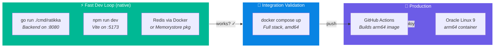
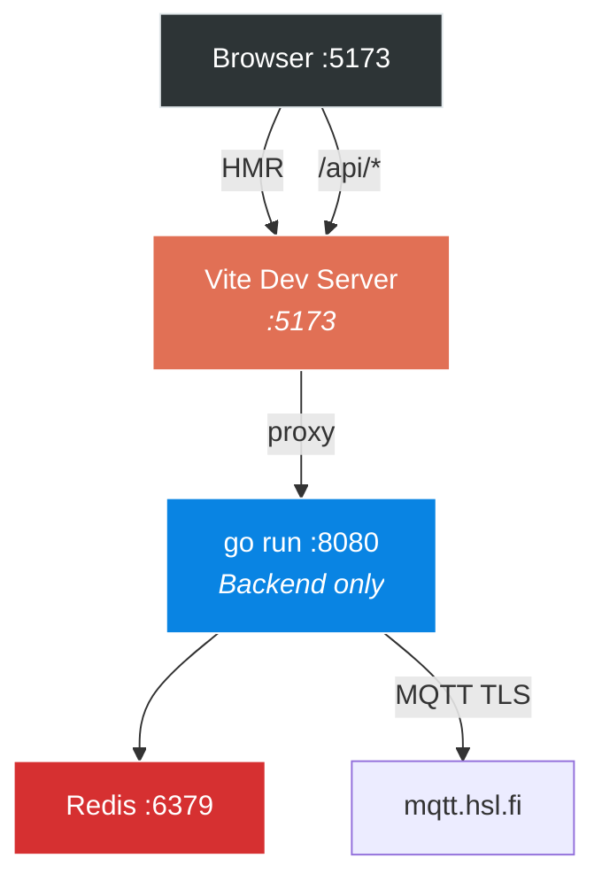
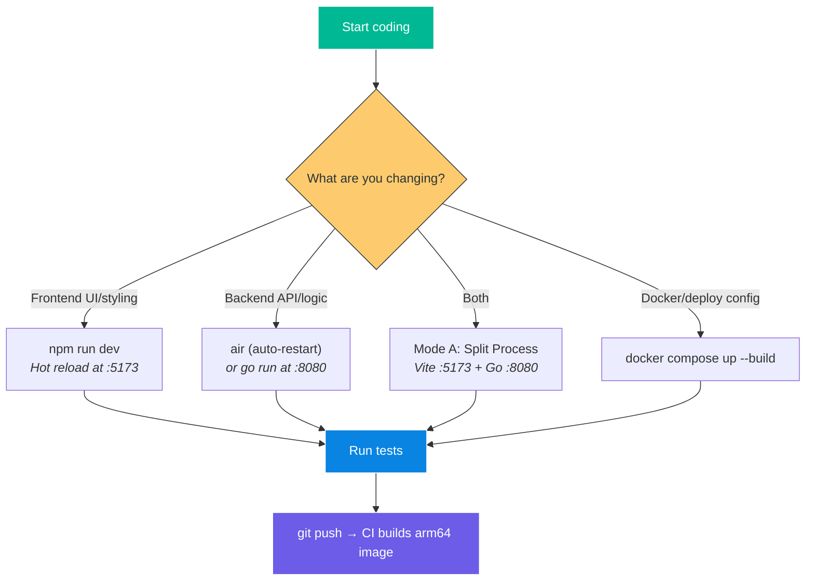

# Local Development & Testing Guide

> Development machine: **Windows 11 (amd64)** — Go 1.25, Node 24, Docker 29  
> Production target: **Oracle Linux 9 (arm64)** — deployed via Docker  
> Last updated: 2026-06-15

---

## Overview

Local development uses **native tools** for speed — no Docker needed during coding. The full Docker stack is only used for integration validation before pushing.



---

## 1. Development Modes

### Mode A — Split Process (Recommended for daily development)

Fastest iteration. Frontend hot-reloads instantly, backend restarts in <1s.



**Terminal 1 — Redis** (one-time, keep running):
```powershell
docker run --rm -p 6379:6379 redis:7-alpine
```

**Terminal 2 — Go backend**:
```powershell
cd c:\Antigravity\ratikka\backend
$env:DIGITRANSIT_API_KEY="your_api_key"
$env:REDIS_URL="redis://localhost:6379"
$env:MQTT_BROKER="tls://mqtt.hsl.fi:8883"
$env:PORT="8080"
go run ./cmd/ratikka
```

**Terminal 3 — Frontend dev server**:
```powershell
cd c:\Antigravity\ratikka\frontend
npm run dev
```

The Vite config proxies `/api/*` requests to the Go backend:

```typescript
// vite.config.ts
export default defineConfig({
  server: {
    proxy: {
      '/api': {
        target: 'http://localhost:8080',
        ws: true,  // WebSocket proxy for /api/v1/stream
      },
    },
  },
});
```

**Open browser at `http://localhost:5173`** — full app with live MQTT data, hot-reloading frontend.

---

### Mode B — Docker Compose (Integration validation)

Tests the full production-like stack on local amd64. Run before pushing.

```powershell
cd c:\Antigravity\ratikka
docker compose up --build
```

Open `http://localhost:80` — tests Caddy → Go backend (with embedded frontend) → Redis → MQTT.

---

### Mode C — Backend Only (API development / debugging)

Skip the frontend entirely — test backend APIs with curl or browser.

```powershell
cd c:\Antigravity\ratikka\backend
$env:DIGITRANSIT_API_KEY="your_api_key"
$env:REDIS_URL="redis://localhost:6379"
$env:MQTT_BROKER="tls://mqtt.hsl.fi:8883"
go run ./cmd/ratikka
```

Test endpoints:
```powershell
# Health check
curl http://localhost:8080/api/v1/health

# Version
curl http://localhost:8080/api/v1/version

# Stop details
curl http://localhost:8080/api/v1/stop/HSL:1203420

# Route details
curl http://localhost:8080/api/v1/route/9

# WebSocket stream (wscat or browser dev tools)
npx wscat -c ws://localhost:8080/api/v1/stream
```

---

## 2. MQTT Testing

The HSL MQTT broker is **public** — it works identically from Windows as it does from the production server. No mock needed.

### Quick CLI test (verify broker connectivity):

```powershell
# Install mqtt.js CLI globally
npm install -g mqtt

# Subscribe to tram or bus positions (Ctrl+C to stop)
mqtt subscribe -h mqtt.hsl.fi -p 8883 -l mqtts -v -t "/hfp/v2/journey/ongoing/vp/tram/#"
# or for buses:
mqtt subscribe -h mqtt.hsl.fi -p 8883 -l mqtts -v -t "/hfp/v2/journey/ongoing/vp/bus/#"
```

You should see JSON payloads streaming in within seconds. If this works, the Go backend will too.

### Go unit test for MQTT parser:

The HFP parser can be tested without a live broker connection by feeding it sample payloads:

```go
// internal/mqtt/ingestion_test.go
func TestParseHFPPayload(t *testing.T) {
    raw := `{"VP":{"desi":"9","lat":60.16985,"long":24.93848,"hdg":145,"spd":8.5,"veh":229,"drst":0,"dl":-15,"route":"HSL:1009"}}`
    pos, err := parseHFPPayload([]byte(raw))
    assert.NoError(t, err)
    assert.Equal(t, 229, pos.VehicleID)
    assert.Equal(t, "9", pos.Line)
    assert.InDelta(t, 60.16985, pos.Lat, 0.0001)
}
```

---

## 3. Redis Testing

### Option A — Docker Redis (recommended)

```powershell
docker run --rm --name ratikka-redis -p 6379:6379 redis:7-alpine
```

Verify:
```powershell
docker exec ratikka-redis redis-cli PING
# → PONG
```

### Option B — In-memory fallback (no Docker needed)

For quick backend iteration, the Go backend can include a `--no-redis` flag that uses an in-memory `sync.Map` instead of Redis. This lets you run the backend with zero dependencies:

```powershell
go run ./cmd/ratikka --no-redis
```

Useful when Redis isn't running and you just want to test MQTT ingestion or API handlers.

---

## 4. Frontend Testing

### MapLibre + Live Data

The Vite dev server connects to the real HSL tile CDN and the local Go backend. No mocks needed — you see real trams on a real map during development.

### Without Backend (static/styling work)

For pure UI iteration, the frontend can load a snapshot JSON fixture instead of connecting to the WebSocket. A `useMockData` flag in development:

```typescript
// hooks/useTramData.ts
const USE_MOCK = import.meta.env.DEV && !import.meta.env.VITE_WS_URL;

if (USE_MOCK) {
  // Load from /fixtures/positions.json
  return mockPositions;
}
```

---

## 5. Testing Matrix

### Unit Tests

| Component | Tool | What's Tested |
|---|---|---|
| HFP parser | `go test` | Payload parsing, field extraction, edge cases |
| Redis cache | `go test` + testcontainers | HSET/HGETALL round-trip |
| WebSocket hub | `go test` | Client subscribe/broadcast/disconnect |
| GraphQL proxy | `go test` + httptest | Request transformation, error handling |
| React components | Vitest + RTL | Rendering, interactions, filter logic |
| Lerp utilities | Vitest | Math correctness |

### Integration Tests

| Test | How | What's Validated |
|---|---|---|
| MQTT → Redis flow | `go test -tags=integration` | Live broker → parsed → stored in Redis |
| Full API stack | `docker compose up` + curl | All endpoints respond, WS streams data |
| Frontend E2E | Browser at `:5173` | Map loads, trams appear, clicks work |

### Pre-Push Checklist

```powershell
# 1. Backend tests pass
cd backend && go test ./... && cd ..

# 2. Frontend builds without errors
cd frontend && npm run build && cd ..

# 3. Docker image builds successfully
docker compose build

# 4. Full stack smoke test
docker compose up -d
# → wait 5s for MQTT to connect
curl http://localhost/api/v1/health
# → {"status":"healthy","mqtt_connected":true,...}
docker compose down
```

---

## 6. Go Development Tips

### Auto-restart on file changes

Use `air` for live-reloading the Go backend during development:

```powershell
go install github.com/air-verse/air@latest

cd c:\Antigravity\ratikka\backend
air
```

Create `.air.toml` in `backend/`:
```toml
[build]
  cmd = "go build -o ./tmp/ratikka.exe ./cmd/ratikka"
  bin = "tmp/ratikka.exe"
  include_ext = ["go"]
  exclude_dir = ["tmp", "frontend"]
```

This watches `.go` files and automatically rebuilds + restarts the backend (~200ms restart).

### Race detection

Run tests with race detector during development:
```powershell
go test -race ./...
```

The WebSocket hub and MQTT ingestion use goroutines heavily — the race detector catches concurrency bugs early.

---

## 7. Cross-Platform Build Validation

The CI builds for `linux/arm64`, but you develop on `windows/amd64`. To validate the cross-compile locally:

```powershell
# Cross-compile for production target (no Docker needed)
cd backend
$env:GOOS="linux"; $env:GOARCH="arm64"
go build -o ratikka-linux-arm64 ./cmd/ratikka

# Verify binary
file ratikka-linux-arm64
# → ELF 64-bit LSB executable, ARM aarch64
```

This confirms the code compiles for arm64. The actual Docker image build is done by GitHub Actions.

### Full Docker arm64 build (slow, only if debugging CI issues):

```powershell
docker buildx build --platform linux/arm64 -t ratikka:test ./backend
```

> [!WARNING]
> ARM64 emulation via QEMU on Windows/amd64 is **slow** (5-10x). Only do this if the CI build is failing and you need to reproduce locally. For normal development, the native amd64 build is functionally identical.

---

## 8. Workflow Summary



| Task | Time to First Feedback |
|---|---|
| Frontend CSS change | **<100ms** (Vite HMR) |
| React component change | **<500ms** (Vite HMR) |
| Go handler change (with `air`) | **~200ms** (recompile) |
| Go handler change (`go run`) | **~1s** (manual restart) |
| Full docker compose rebuild | **~30-60s** |
| Cross-compile arm64 check | **~5s** (just `go build`) |
