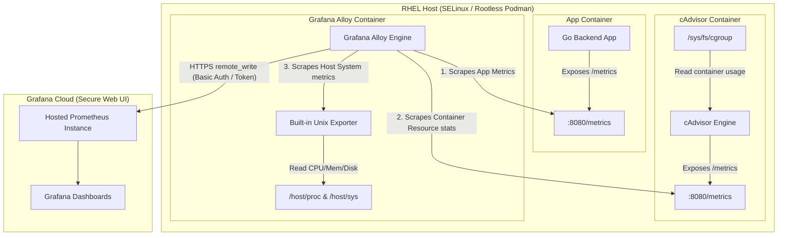

# Monitoring & Telemetry Architecture

This document details the monitoring stack, metrics collection mechanism, and telemetry pipeline configured for the HSL - LIVE application and its host server.

---

## Telemetry Flow Architecture

The monitoring pipeline leverages **Grafana Alloy** as a lightweight, secure agent to collect metrics from the application, containers, and the host OS, forwarding them to your Grafana Cloud hosted Prometheus database.

---

## 1. What is Monitored

Telemetry is divided into three distinct scopes:

### Go Application Metrics
These metrics reflect the internal business logic and ingestion health of the HSL - LIVE Go server:
* `ratikka_active_websocket_clients` (Gauge): The count of active browsers currently streaming live vehicle coordinates. Used to track app usage.
* `ratikka_mqtt_messages_received_total` (Counter Vec, labeled by `route`): The total count of raw position updates received from the HSL MQTT broker. Used to track ingestion load.
* `ratikka_mqtt_parse_errors_total` (Counter): The number of MQTT payloads that failed JSON unmarshaling, indicating upstream data structure drift.

### Container Resource Metrics
Collected by cAdvisor to track resource efficiency and isolation across the container network:
* `container_cpu_usage_seconds_total`: CPU consumption per container (useful for sizing CPU limits).
* `container_memory_working_set_bytes`: Active RAM utilization per container (used to monitor leak behaviors).
* `container_network_receive_bytes_total` / `container_network_transmit_bytes_total`: Network throughput per container.

### Host Server Metrics
Collected by Grafana Alloy's built-in Unix/Node exporter to monitor the physical/VM RHEL host:
* `node_cpu_seconds_total`: CPU usage percentages (idle, user, system, iowait).
* `node_memory_Active_bytes` / `node_memory_MemFree_bytes`: RAM utilization metrics.
* `node_filesystem_free_bytes` / `node_filesystem_size_bytes`: Disk capacity usage.
* `node_network_receive_bytes_total` / `node_network_transmit_bytes_total`: Host network load.

---

## 2. How Metrics are Collected

* **App Telemetry:** The Go backend implements the standard Prometheus client library. Metrics are compiled and served over HTTP at `/metrics` inside the backend container.
* **Host Telemetry:** Grafana Alloy runs a built-in unix exporter. To read host metrics from inside the container without running as root, the RHEL system directories `/proc`, `/sys`, and `/` are mounted as read-only (`:ro`) volumes into the container at `/host/proc`, `/host/sys`, and `/rootfs`.
* **Container Telemetry:** cAdvisor runs alongside the stack, reading container statuses from the system cgroups and volume mounts. Alloy pulls the metrics directly from cAdvisor's `/metrics` path.

---

## 3. Where Metrics are Sent

All collected metrics are pushed via HTTPS to your **Grafana Cloud Prometheus** database endpoint.

* **Security:** Credentials (`GRAFANA_CLOUD_PROMETHEUS_URL`, `GRAFANA_CLOUD_PROMETHEUS_USER`, and `GRAFANA_CLOUD_PROMETHEUS_TOKEN`) are injected into the Grafana Alloy environment variables via the local `.env` file. No authentication tokens or secret credentials are saved in configuration files or committed to Git.
* **Transmission Protocol:** Metrics are sent using Prometheus `remote_write` protocol, which includes local buffering, retry logic, and connection compression.

---

## 4. Grafana APM Dashboard

A comprehensive, production-grade Grafana dashboard configuration is provided at [dashboard.json](../monitoring/grafana/dashboard.json). 

This dashboard is structured to facilitate full Application Performance Monitoring (APM):

* **Overview & Real-Time KPIs**: Real-time stats for active WebSocket clients, current MQTT message ingestion rate, ingestion parser errors rate, and infrastructure load overview.
* **HFP Ingestion & Streaming (Application APM)**: Historical lines/graphs showing websocket connection stability, MQTT ingestion volume breakdown per vehicle route (top 15), and parser error trends.
* **Go Runtime & Process Performance**: APM metrics on backend memory allocation (Heap vs. System Reserved), running goroutines count (crucial to monitor websocket connection cleanup / goroutine leaks), actual CPU core utilization of the Go process, and GC pause duration percentiles.
* **Host System Performance**: RHEL host CPU load by mode (user, system, iowait, idle), total host memory allocation (Used vs. Available), filesystem usage on the root mount, and network bandwidth (Rx/Tx).

### How to Import the Dashboard
1. Log in to your **Grafana Cloud** (or local Grafana) instance.
2. Navigate to **Dashboards** -> **New** -> **Import**.
3. Copy the contents of [dashboard.json](../monitoring/grafana/dashboard.json) and paste it into the "Import via panel json" text area, or click "Upload JSON file" and upload the file.
4. Select your Prometheus datasource when prompted (the dashboard uses a datasource template variable named `${datasource_hsl}`).
5. Click **Import**.

