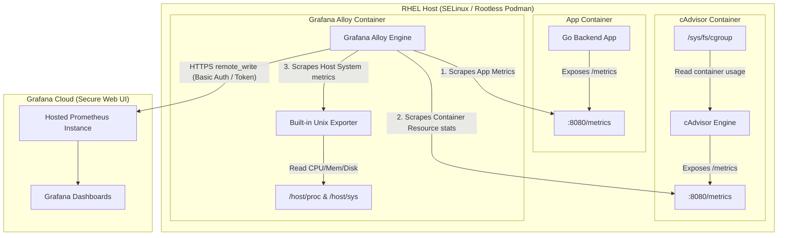
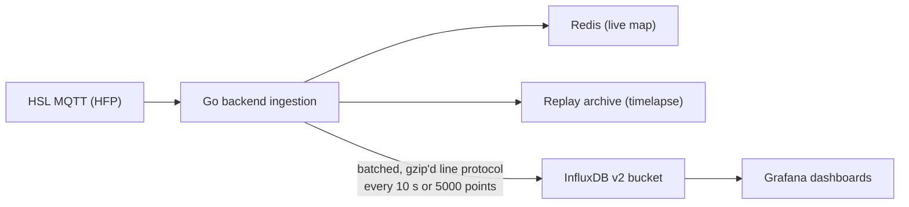

# Monitoring & Telemetry Architecture

This document details the monitoring stack, metrics collection mechanism, and telemetry pipeline configured for the HSL - LIVE application and its host server.

---

## Telemetry Flow Architecture

The monitoring pipeline leverages **Grafana Alloy** as a lightweight, secure agent to collect metrics from the application, containers, and the host OS, forwarding them to your Grafana Cloud hosted Prometheus database.


```mermaid
graph TD
    subgraph Host ["RHEL Host (SELinux / Rootless Podman)"]
        subgraph App ["App Container"]
            GoApp["Go Backend App"]
            GoApp -- "Exposes /metrics" --> GoPort[":8080/metrics"]
        end

        subgraph Cadvisor ["cAdvisor Container"]
            cAdvisorService["cAdvisor Engine"]
            cAdvisorService -- "Exposes /metrics" --> CadvisorPort[":8080/metrics"]
            HostCgroups["/sys/fs/cgroup"] -- "Read container usage" --> cAdvisorService
        end

        subgraph Alloy ["Grafana Alloy Container"]
            AlloyCollector["Grafana Alloy Engine"]
            UnixExporter["Built-in Unix Exporter"]
            
            UnixExporter -- "Read CPU/Mem/Disk" --> HostProc["/host/proc & /host/sys"]
            AlloyCollector -- "1. Scrapes App Metrics" --> GoPort
            AlloyCollector -- "2. Scrapes Container Resource stats" --> CadvisorPort
            AlloyCollector -- "3. Scrapes Host System metrics" --> UnixExporter
        end
    end

    subgraph GrafanaCloud ["Grafana Cloud (Secure Web UI)"]
        AlloyCollector -- "HTTPS remote_write (Basic Auth / Token)" --> PromDB["Hosted Prometheus Instance"]
        PromDB --> Dashboards["Grafana Dashboards"]
    end
```

---

## 1. What is Monitored

Telemetry is divided into three distinct scopes:

### Go Application Metrics
These metrics reflect the internal business logic and ingestion health of the HSL - LIVE Go server:
* `ratikka_active_websocket_clients` (Gauge): The count of active browsers currently streaming live vehicle coordinates. Used to track app usage.
* `ratikka_mqtt_messages_received_total` (Counter Vec, labeled by `route`): The total count of raw position updates received from the HSL MQTT broker. Used to track ingestion load.
* `ratikka_mqtt_parse_errors_total` (Counter): The number of MQTT payloads that failed JSON unmarshaling, indicating upstream data structure drift.
* `ratikka_replay_readings_recorded_total` (Counter Vec, labeled by `mode`): Readings appended to the replay archive. Paired with the ingestion counter above it says whether recording is keeping up with the feed.
* `ratikka_replay_archive_bytes` (Gauge): What the rolling history occupies on disk, refreshed on each retention sweep. **Alert on this rather than on the sweep running**: a sweep that runs and deletes nothing looks perfectly healthy right up until the volume is full. A week of trams should sit near 1.1 GB.
* `ratikka_replay_query_duration_seconds` (Histogram Vec, labeled by `kind`): How long archive reads take, split into `window` (playback) and `timelapse` (bounding-box). The packed layout's whole claim is that a boxed scan of a week stays interactive, and this is where that claim is checked in production.

### Container Resource Metrics
Collected by cAdvisor to track resource efficiency and isolation across the container network:
* `container_cpu_usage_seconds_total`: CPU consumption per container (useful for sizing CPU limits).
* `container_memory_working_set_bytes`: Active RAM utilization per container (used to monitor leak behaviors).
* `container_network_receive_bytes_total` / `container_network_transmit_bytes_total`: Network throughput per container.

### Host Server Metrics
Collected by Grafana Alloy's built-in Unix/Node exporter to monitor the physical/VM RHEL host:
* `node_cpu_seconds_total`: CPU usage percentages (idle, user, system, iowait).
* `node_memory_Active_bytes` / `node_memory_MemFree_bytes`: RAM utilization metrics.
* `node_filesystem_free_bytes` / `node_filesystem_size_bytes`: Disk capacity usage.
* `node_network_receive_bytes_total` / `node_network_transmit_bytes_total`: Host network load.

---

## 2. How Metrics are Collected

* **App Telemetry:** The Go backend implements the standard Prometheus client library. Metrics are compiled and served over HTTP at `/metrics` inside the backend container.
* **Host Telemetry:** Grafana Alloy runs a built-in unix exporter. To read host metrics from inside the container without running as root, the RHEL system directories `/proc`, `/sys`, and `/` are mounted as read-only (`:ro`) volumes into the container at `/host/proc`, `/host/sys`, and `/rootfs`.
* **Container Telemetry:** cAdvisor runs alongside the stack, reading container statuses from the system cgroups and volume mounts. Alloy pulls the metrics directly from cAdvisor's `/metrics` path.

---

## 3. Where Metrics are Sent

All collected metrics are pushed via HTTPS to your **Grafana Cloud Prometheus** database endpoint.

* **Security:** Credentials (`GRAFANA_CLOUD_PROMETHEUS_URL`, `GRAFANA_CLOUD_PROMETHEUS_USER`, and `GRAFANA_CLOUD_PROMETHEUS_TOKEN`) are injected into the Grafana Alloy environment variables via the local `.env` file. No authentication tokens or secret credentials are saved in configuration files or committed to Git.
* **Transmission Protocol:** Metrics are sent using Prometheus `remote_write` protocol, which includes local buffering, retry logic, and connection compression.

---

## 4. Grafana APM Dashboard

A comprehensive, production-grade Grafana dashboard configuration is provided at [dashboard.json](../monitoring/grafana/dashboard.json). 

This dashboard is structured to facilitate full Application Performance Monitoring (APM):

* **Overview & Real-Time KPIs**: Real-time stats for active WebSocket clients, current MQTT message ingestion rate, ingestion parser errors rate, and infrastructure load overview.
* **HFP Ingestion & Streaming (Application APM)**: Historical lines/graphs showing websocket connection stability, MQTT ingestion volume breakdown per vehicle route (top 15), and parser error trends.
* **Go Runtime & Process Performance**: APM metrics on backend memory allocation (Heap vs. System Reserved), running goroutines count (crucial to monitor websocket connection cleanup / goroutine leaks), actual CPU core utilization of the Go process, and GC pause duration percentiles.
* **Host System Performance**: RHEL host CPU load by mode (user, system, iowait, idle), total host memory allocation (Used vs. Available), filesystem usage on the root mount, and network bandwidth (Rx/Tx).

### How to Import the Dashboard
1. Log in to your **Grafana Cloud** (or local Grafana) instance.
2. Navigate to **Dashboards** -> **New** -> **Import**.
3. Copy the contents of [dashboard.json](../monitoring/grafana/dashboard.json) and paste it into the "Import via panel json" text area, or click "Upload JSON file" and upload the file.
4. Select your Prometheus datasource when prompted (the dashboard uses a datasource template variable named `${datasource_hsl}`).
5. Click **Import**.

---

## 5. Per-Vehicle History in InfluxDB

Prometheus answers "how is the service doing"; it cannot answer "what did tram 456 do at 08:14", because a label per vehicle and per second is exactly what Prometheus is built not to hold. So every reading the backend accepts — after HSL's quadruplicate tram messages are dropped, the same readings the timelapse archive records — is also written to an InfluxDB v2 bucket, one point per vehicle per second.


```mermaid
graph LR
    MQTT["HSL MQTT (HFP)"] --> Ingest["Go backend ingestion"]
    Ingest --> Redis["Redis (live map)"]
    Ingest --> Archive["Replay archive (timelapse)"]
    Ingest -- "batched, gzip'd line protocol<br/>every 10 s or 5000 points" --> Influx["InfluxDB v2 bucket"]
    Influx --> Grafana["Grafana dashboards"]
```

The writer never blocks ingestion. Points are queued and sent from their own goroutine; while InfluxDB is unreachable up to 100,000 points (about a quarter of an hour of trams) are held and retried, and beyond that the oldest are dropped. A batch InfluxDB refuses outright — bad token, missing bucket — is dropped rather than retried forever.

### Configuration

Set in `~/ratikka/.env` on the server; the compose file passes them to the backend. Leave `INFLUX_URL` unset to write nothing.

| Variable | Production value |
|---|---|
| `INFLUX_URL` | `http://host.containers.internal:8086` — the swarm-published InfluxDB on the same host, as seen from a rootless podman container |
| `INFLUX_ORG` | the InfluxDB organization |
| `INFLUX_BUCKET` | the bucket (`ratikka` if unset) |
| `INFLUX_TOKEN` | a token with write access to that bucket — a secret, so `.env` only |
| `INFLUX_MODES` | `tram` (default). Buses, metro and trains are ingested only while someone is watching them, so their history would be full of holes |

### Schema: measurement `vehicle_position`

Tags are what dashboards group by, and are kept to identities that stay few. Anything per-journey or per-reading is a field, so the series count stays in the hundreds rather than growing with every trip.

| Tags | |
|---|---|
| `veh` | operator and vehicle number, e.g. `0040-456` |
| `desi` | the line as riders know it, e.g. `4` |
| `route` | the route ID, e.g. `1004` |
| `dir` | `1` or `2` |
| `mode` | `tram` |

| Field | Type | Meaning |
|---|---|---|
| `lat`, `lng` | float | position, WGS84 |
| `speed` | float | m/s (× 3.6 for km/h) |
| `acceleration` | float | m/s² |
| `heading` | int | degrees |
| `delay` | int | seconds behind schedule, **positive is late** (HFP's own `dl` has the opposite sign) |
| `doors_open` | bool | |
| `at_stop` | bool | standing at or in a stop's area |
| `stop` | string | the stop it is at, only while `at_stop` |
| `next_stop` | string | the stop it is heading for |
| `eol` | bool | reached the end of its line |
| `trip_id`, `start` | string | GTFS trip ID and scheduled departure (`HH:MM`) |
| `odometer` | float | metres |
| `occupancy` | int | 0–100; trams always report 0 |
| `operator`, `journey` | int | HFP `oper` and `jrn` |
| `loc_source` | string | `GPS`, `ODO`, `MAN`, `DR`, `N/A` |
| `headway` | int | seconds behind the vehicle ahead on the same line and direction |
| `headway_scheduled` | int | the line's timetabled headway around now |
| `headway_state` | string | `bunched`, `gap`, `regular` |
| `headway_at_least`, `headway_ahead` | bool, string | `headway` is a lower bound; the vehicle ahead |
| `tlp_status`, `tlp_level`, `tlp_request_type`, `tlp_junction` | | the newest traffic-light priority exchange: `requesting` / `granted` / `denied` and the junction asked |

### Example Grafana queries

InfluxQL, through the v1 compatibility API the existing dashboards already use:

```sql
-- Average delay per line
SELECT mean("delay") FROM "<bucket>"."autogen"."vehicle_position"
WHERE $timeFilter GROUP BY time($__interval), "desi"

-- Speed of one tram, km/h
SELECT mean("speed") * 3.6 FROM "<bucket>"."autogen"."vehicle_position"
WHERE "veh" = '0040-456' AND $timeFilter GROUP BY time($__interval)

-- Trams in service
SELECT count(distinct("trip_id")) FROM "<bucket>"."autogen"."vehicle_position"
WHERE $timeFilter GROUP BY time(1m)
```

Flux, for anything InfluxQL cannot express:

```flux
// Share of readings per line that are bunched
from(bucket: "<bucket>")
  |> range(start: v.timeRangeStart, stop: v.timeRangeStop)
  |> filter(fn: (r) => r._measurement == "vehicle_position" and r._field == "headway_state")
  |> group(columns: ["desi"])
  |> map(fn: (r) => ({r with _value: if r._value == "bunched" then 1.0 else 0.0}))
  |> aggregateWindow(every: v.windowPeriod, fn: mean)
```

### Trams dashboard

[`monitoring/grafana/trams-dashboard.json`](../monitoring/grafana/trams-dashboard.json) is a ready-made Grafana dashboard over this measurement. It is generated by [`build_trams_dashboard.py`](../monitoring/grafana/build_trams_dashboard.py), so edit the script and re-run it rather than editing the JSON. Import it from **Dashboards → New → Import**. Grafana asks for the InfluxDB datasource, which must use InfluxQL, and for the bucket name.

It has seven sections:

- **Right now:** trams in service, delays, bunching, a map coloured by delay, and a table of every tram.
- **Punctuality:** delay by line and its spread.
- **Headways:** bunched trams and trams behind a gap, by line, plus actual against timetabled headway.
- **Speed and movement:** running speed, the share of time standing still, and traffic-light priority.
- **Top speeds:** each tram's fastest reading in the time range, and the top speed by line.
- **Selected trams:** speed, delay, headway and distance for the trams picked in the selector.
- **Speed along the route:** speed against distance into the journey, one line per trip of the line and direction picked in *Profile line* and *Direction*. Trips of the same route overlay, so a slow run, or a stop where every tram dwells, sits at the same distance on every line. HFP's odometer counts from each journey's start, which is what makes it a shared axis. A short working that starts mid-route will not line up, and a few stationary points at the terminus carry the previous trip's distance until the tram departs.

**Links into the app.** A tram in the *Fastest trams* table, or any point on a *Selected trams* graph, links to the live map's timelapse at that moment: `https://hsl-live.duckdns.org/?at=<unix seconds or ms>&veh=<tram>`. The map opens history 20 seconds before the moment, picks the tram, and follows it with the camera, whatever line filter the viewer had set. The archive keeps a week (`REPLAY_RETENTION_DAYS`), so a link to anything older opens on the oldest history there is.

**Sharing.** Grafana's public ("shared externally") dashboards do not support template variables, so the generator also writes [`trams-dashboard-shareable.json`](../monitoring/grafana/trams-dashboard-shareable.json). It is the same dashboard showing every line, without the *Selected trams* and *Speed along the route* sections, which depend on the selectors. Share that one.

Two kinds of reading are left out of aggregates, because they are wrong rather than extreme:

- **Delays more than 30 minutes off schedule** are left out of delay averages. These come from trams still signed on to a journey they are not running, which report themselves hours late. A single one moved its line's average by ten minutes on the first afternoon of data.
- **Speeds from readings without a satellite fix** (`loc_source` other than `GPS`) are left out of top speeds. Between fixes a tram dead-reckons, and its estimated speed runs away. One on line 15 "did" 125 km/h for twelve seconds while its odometer said about 50, and dropped to 54 km/h the moment the fix came back.

### Volume

About 80–90 points a second at the daytime peak, a few million a day. Grafana panels over long ranges should always aggregate (`GROUP BY time(...)` / `aggregateWindow`) rather than pull raw points. The writer's own health is in Prometheus: `ratikka_influx_points_written_total`, `ratikka_influx_points_dropped_total{reason}` and `ratikka_influx_write_errors_total`.
