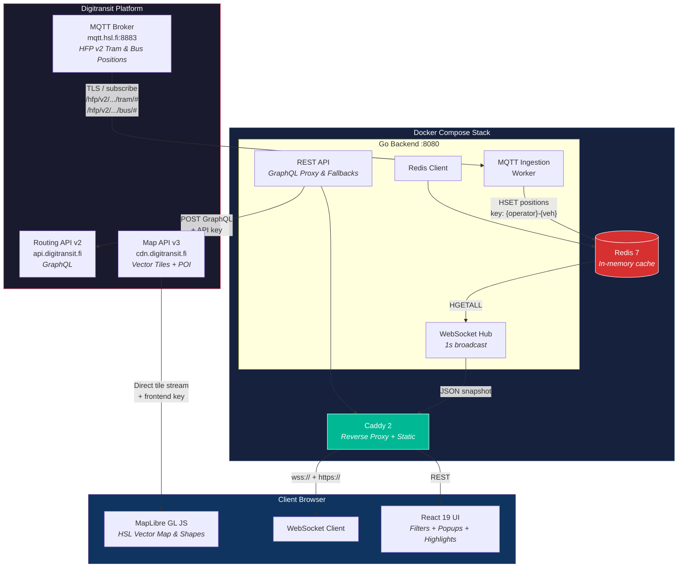
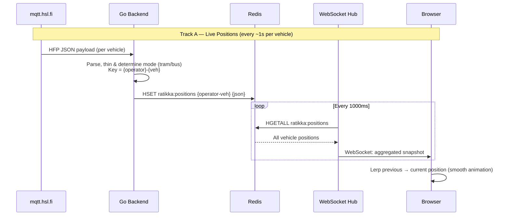
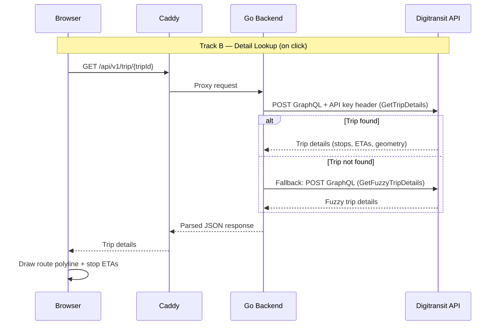
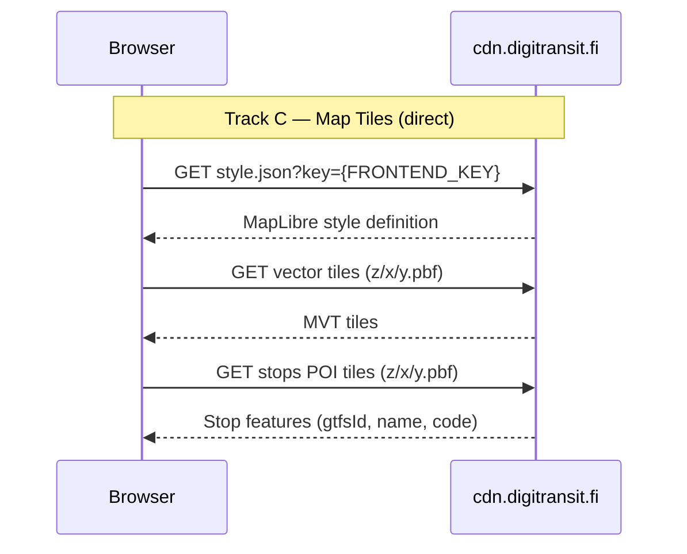
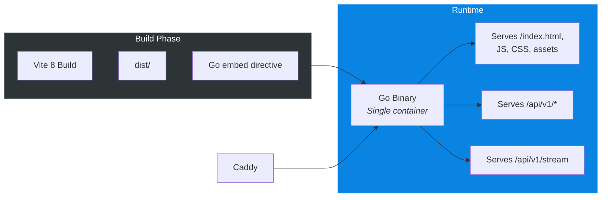
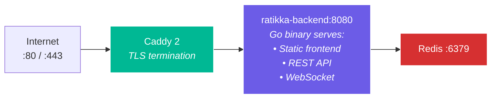
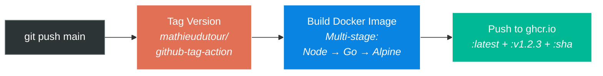

# HSL - LIVE — Real-Time Helsinki Tram & Bus Tracker

## Implementation Plan

> Based on the blueprint in [ratikka.md](file:///g:/My%20Drive/ObsidianVault/Sampsa/ratikka.md).  
> API details: [docs/API_REFERENCE.md](docs/API_REFERENCE.md)  
> Local dev setup: [docs/LOCAL_DEVELOPMENT.md](docs/LOCAL_DEVELOPMENT.md)  
> Last updated: 2026-06-16

---

## 1. Project Overview

A containerized web application that shows **all Helsinki trams and buses on a live map** in real time. Users can click vehicles or stops to see schedules, ETAs, and route details. The architecture is a Go backend that ingests MQTT telemetry from HSL's public broker, caches state in Redis, and pushes updates via WebSocket to a React + MapLibre GL JS frontend. Deployed behind its own Caddy reverse proxy (swappable to nginx).

### Target System

```
Linux instance-20221026-2239 5.15.0-321.202.5.el9uek.aarch64
Oracle Linux 9 (UEK) — aarch64 (ARM64)
```

---

## 2. Feature Checklist

### Core Map Features
- [x] **F1 — Live tram & bus positions on map**: All active Helsinki trams and buses as animated markers on MapLibre GL JS vector map (HSL Map API v3)
- [x] **F2 — Movement indicators**: Each marker shows status (stopped/moving), speed, heading/direction via icon rotation and visual styling
- [x] **F3 — Smooth animation**: Linear interpolation (lerp) over 1-second delay window for smooth marker movement
- [x] **F4 — Line/route labels**: Line designation number (`desi`) displayed on/beside each marker
- [x] **F14 — Distinct vehicle shapes**: Circular markers for trams (`#00985f`) and square markers for buses (`#007ac9` standard, `#CA4300` trunk line) for quick visual scanning

### Interactive Features
- [x] **F5 — Click vehicle → route detail**: Shows full route polyline on map + ETAs for upcoming stops (via Routing API v2)
- [x] **F6 — Click stop → stop detail**: Shows only vehicles that serve this stop + ETAs for next arrivals
- [x] **F7 — Stop layer from HSL POI tiles**: Interactive stop markers from Digitransit POI vector tile endpoint
- [x] **F15 — Highlight stop routes**: Clicking a stop highlights all routes serving it, loading route geometries and stops dynamically
- [x] **F18 — Inline stop telemetry**: Displays the current or next stop details directly inside the top vehicle telemetry card

### Filtering
- [x] **F8 — Line list/filter**: Wide 190px sidebar panel lists active lines in a 3-column layout; toggling shows/hides vehicles
- [x] **F9 — Stop-based filter**: Selecting a stop filters the map to show only vehicles stopping there
- [x] **F16 — Mode filters**: Checkboxes in the sidebar to toggle visibility of the entire tram or bus layer independently

### Infrastructure & Core API
- [x] **F10 — Containerized deployment**: `docker-compose.yml` with Go backend, Redis, Caddy, and built-in frontend
- [x] **F11 — Standalone Caddy proxy**: Own Caddy instance (swappable to nginx or other), not dependent on external proxy
- [x] **F12 — CI/CD versioning**: GitHub Actions with conventional-commit auto-tagging
- [x] **F13 — ARM64 production**: Docker images built for `linux/arm64` targeting Oracle Linux 9
- [x] **F17 — Fuzzy trip lookup fallback**: Backend falls back to `fuzzyTrip` GraphQL queries when specific GTFS trip IDs aren't found in OTP (mitigating date mismatch/schedule drift issues)

---

## 3. Architecture



---

## 4. Data Flow Pipelines







---

## 5. Technical Stack

| Layer | Technology | Version / Notes |
|---|---|---|
| **Backend** | Go | 1.26+ |
| **MQTT Client** | `eclipse/paho.mqtt.golang` | HSL MQTT broker `mqtt.hsl.fi:8883` (TLS) |
| **WebSocket** | `coder/websocket` | Modern, context-aware Go WebSocket lib |
| **HTTP Router** | `net/http` (Go stdlib) | Go 1.22+ enhanced `ServeMux` routing |
| **State Cache** | Redis 7 Alpine | In-memory only, LRU eviction |
| **Redis Client** | `redis/go-redis/v9` | |
| **Frontend** | React 19 + TypeScript | |
| **Build Tool** | Vite 8 | Rolldown-based bundler |
| **Map Library** | MapLibre GL JS 5.x | Stable (v6 still pre-release) |
| **Map Tiles** | Digitransit Map API v3 | HSL vector style + POI stops |
| **Routing Data** | Digitransit Routing API v2 | GraphQL via backend proxy |
| **Reverse Proxy** | Caddy 2 Alpine | Standalone, swappable to nginx |
| **Container** | Docker / Podman | ARM64, `:Z` SELinux labels |
| **CI/CD** | GitHub Actions | `mathieudutour/github-tag-action` |

---

## 6. Frontend Serving Strategy

**Decision: Go backend embeds the built frontend static files.**



**Rationale:**
- **Single container** — simpler deployment, one image to build and push
- **Go's `embed` package** — zero-overhead static file serving at runtime
- **No volume mounting** — frontend is baked into the binary
- **Caddy stays proxy-only** — handles TLS termination and proxies everything to Go; easily replaceable with nginx

The multi-stage Dockerfile:
1. Stage 1: Node.js → builds frontend → produces `dist/`
2. Stage 2: Go → copies `dist/`, compiles binary with `//go:embed`
3. Stage 3: Minimal Alpine → runs the binary

---

## 7. Reverse Proxy Design

Caddy is included as a **standalone** service in this project's `docker-compose.yml`. It is designed to be **swappable** — the Go backend serves everything on `:8080`, so any reverse proxy (nginx, Traefik, etc.) can replace Caddy by just proxying to the backend container.



### Caddyfile

```caddy
{
    email your-email@example.com
}

yourdomain.com {
    reverse_proxy ratikka-backend:8080
    encode gzip zstd
}
```

### Equivalent nginx.conf (for future swap)

```nginx
server {
    listen 80;
    server_name yourdomain.com;

    location / {
        proxy_pass http://ratikka-backend:8080;
        proxy_http_version 1.1;
        proxy_set_header Upgrade $http_upgrade;
        proxy_set_header Connection "upgrade";
        proxy_set_header Host $host;
    }
}
```

---

## 8. Project Structure

```
ratikka/
├── backend/
│   ├── cmd/
│   │   └── ratikka/
│   │       └── main.go                  # Entry point
│   ├── internal/
│   │   ├── mqtt/
│   │   │   └── ingestion.go             # MQTT subscriber + HFP parser
│   │   ├── cache/
│   │   │   └── redis.go                 # Redis state operations
│   │   ├── ws/
│   │   │   └── hub.go                   # WebSocket hub + 1s broadcast loop
│   │   ├── api/
│   │   │   ├── router.go                # HTTP route registration
│   │   │   ├── graphql_proxy.go         # Digitransit GraphQL proxy
│   │   │   ├── handlers.go              # REST handlers (trip, stop, health, version)
│   │   │   └── static.go               # Embedded frontend serving
│   │   └── config/
│   │       └── config.go                # Env-based configuration
│   ├── frontend/                        # ← embedded at build time
│   │   └── dist/                        # Vite build output (gitignored)
│   ├── go.mod
│   ├── go.sum
│   └── Dockerfile                       # Multi-stage: Node → Go → Alpine
├── frontend/
│   ├── src/
│   │   ├── App.tsx
│   │   ├── main.tsx
│   │   ├── components/
│   │   │   ├── Map.tsx                  # MapLibre canvas + layers
│   │   │   ├── TramMarkers.tsx          # Live GeoJSON layer
│   │   │   ├── StopPopup.tsx            # Stop detail popup
│   │   │   ├── TramPopup.tsx            # Tram detail popup
│   │   │   ├── FilterPanel.tsx          # Line/stop filter sidebar
│   │   │   └── VersionBadge.tsx         # App version footer
│   │   ├── hooks/
│   │   │   ├── useWebSocket.ts          # WS connection + reconnect
│   │   │   └── useTramData.ts           # State management for positions
│   │   ├── lib/
│   │   │   ├── api.ts                   # REST client for detail lookups
│   │   │   └── lerp.ts                  # Linear interpolation utilities
│   │   ├── types/
│   │   │   └── index.ts                 # TypeScript interfaces
│   │   └── styles/
│   │       └── index.css                # Global styles
│   ├── index.html
│   ├── vite.config.ts
│   ├── tsconfig.json
│   └── package.json
├── docker-compose.yml
├── Caddyfile
├── docs/
│   └── API_REFERENCE.md                 # ← Separate API documentation
├── .github/
│   └── workflows/
│       └── docker-build.yml
├── .agents/
│   └── workflows/
│       ├── versioning.md
│       └── committing.md
├── .gitignore
├── .dockerignore
├── README.md
└── PLAN.md                              # ← This file
```

---

## 9. Environment Variables

```env
# Backend (server-side only — never exposed)
DIGITRANSIT_API_KEY=your_digitransit_api_key
REDIS_URL=redis://ratikka-cache:6379
MQTT_BROKER=tls://mqtt.hsl.fi:8883
PORT=8080

# Frontend (build-time — embedded in JS bundle)
VITE_DIGITRANSIT_MAP_KEY=your_digitransit_map_key
VITE_WS_URL=/api/v1/stream
VITE_API_BASE=/api/v1
```

> [!WARNING]  
> The `VITE_DIGITRANSIT_MAP_KEY` is visible in browser dev tools. **Enable HTTP Referrer Restrictions** on the Digitransit Developer Portal for this key.

> [!NOTE]  
> Using the same Digitransit API key as [E-Display](file:///c:/Antigravity/E-Display/config.json). Consider creating a separate key for production to isolate rate limits.

---

## 10. Docker Compose

```yaml
services:
  ratikka-caddy:
    image: caddy:2-alpine
    restart: unless-stopped
    ports:
      - "80:80"
      - "443:443"
      - "443:443/udp"
    volumes:
      - ./Caddyfile:/etc/caddy/Caddyfile:ro,Z
      - caddy-data:/data:Z
      - caddy-config:/config:Z
    depends_on:
      - ratikka-backend

  ratikka-backend:
    build: ./backend
    restart: unless-stopped
    environment:
      - DIGITRANSIT_API_KEY=${DIGITRANSIT_API_KEY}
      - REDIS_URL=redis://ratikka-cache:6379
      - MQTT_BROKER=tls://mqtt.hsl.fi:8883
    depends_on:
      - ratikka-cache

  ratikka-cache:
    image: redis:7-alpine
    restart: unless-stopped
    command: redis-server --appendonly no --maxmemory 64mb --maxmemory-policy allkeys-lru

volumes:
  caddy-data:
  caddy-config:
```

> [!TIP]  
> Add `:Z` volume labels on RHEL/SELinux hosts. The compose file above includes them for the Caddyfile mount.

---

## 11. CI/CD



- Conventional commits: `fix:` → patch, `feat:` → minor, `feat!:` → major
- Platform: `linux/arm64` (matching Oracle Linux 9 aarch64 target)
- VERSION / BUILD_DATE / GIT_SHA injected as build-args
- Single Docker image (backend + embedded frontend)

---

## 12. Implementation Phases

### Phase 1 — Backend Foundation
- [ ] Initialize Go module + project structure
- [ ] Environment-based configuration (`config.go`)
- [ ] MQTT ingestion daemon — connect to `mqtt.hsl.fi:8883`, subscribe, parse HFP
- [ ] Redis state storage (`HSET` / `HGETALL`)
- [ ] WebSocket broadcast hub (1s interval aggregated snapshots)
- [ ] Health + version endpoints
- [ ] Multi-stage Dockerfile (Go + Alpine)

### Phase 2 — Frontend Map
- [ ] Scaffold Vite 8 + React 19 + TypeScript project
- [ ] MapLibre GL JS initialization with HSL vector tile style
- [ ] WebSocket hook with auto-reconnect + exponential backoff
- [ ] Live GeoJSON tram layer with lerp animation
- [ ] Tram marker styling (direction arrows, speed coloring, stopped/door-open state)
- [ ] Go `embed` integration — serve frontend from binary

### Phase 3 — Interactive Features
- [ ] GraphQL proxy endpoint in Go backend
- [ ] Click tram → fetch trip details → draw route polyline + stop ETAs
- [ ] Click stop → fetch stop timetable → show upcoming trams
- [ ] Stop POI layer from Digitransit vector tiles
- [ ] Info popups / slide-out panels

### Phase 4 — Filtering & Polish
- [ ] Filter panel UI (line list with toggles)
- [ ] Stop-based filtering
- [ ] Responsive design (mobile-friendly)
- [ ] Dark mode / custom map styling
- [ ] Version badge in UI
- [ ] Loading states and error handling

### Phase 5 — Deployment & CI
- [ ] `docker-compose.yml` + Caddyfile
- [ ] GitHub Actions CI/CD workflow
- [ ] `.agents/workflows/` documentation
- [ ] `.env.example` with all required variables
- [ ] README.md

---

## 13. Resolved Decisions

| Question | Decision |
|---|---|
| Target architecture | **ARM64** (`linux/arm64`) — Oracle Linux 9 UEK aarch64 |
| GitHub repository | Will push later |
| API keys | Same key as E-Display (`631fd3d...`) |
| Frontend serving | **Embedded in Go binary** via `//go:embed` (single container, best practice) |
| Reverse proxy | **Standalone Caddy** in this project's compose stack, swappable to nginx |
