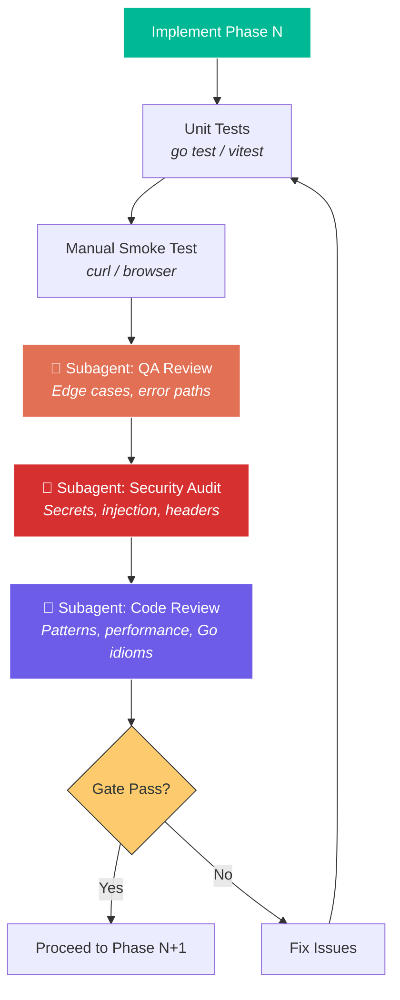
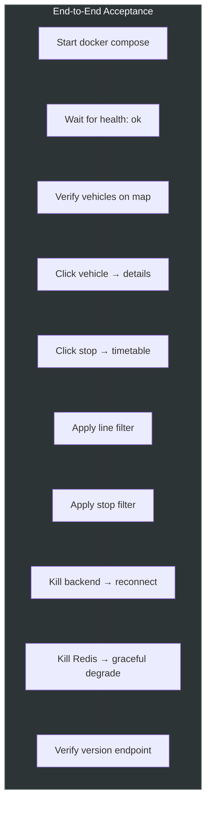

# Verification & Quality Plan

> Testing, security, and code review strategy for each implementation phase.  
> Subagent delegation plan for QA, security audit, and code review tasks.  
> Last updated: 2026-06-15

---

## 1. Verification Philosophy

Every implementation phase has a **quality gate** that must pass before moving to the next phase. Gates are enforced through a combination of automated tests, manual checks, and **subagent-delegated reviews**.



---

## 2. Subagent Delegation Strategy

Three specialized subagent passes run after each phase's implementation:

### 🧪 QA Subagent
**Scope**: Functional correctness, edge cases, error handling  
**Triggers**: After each phase's code is written and unit tests pass  
**Tasks**:
- Verify all error paths are handled (network failures, malformed data, timeouts)
- Check edge cases (no trams online, Redis down, MQTT disconnect/reconnect)
- Validate data flow correctness (MQTT → Redis → WebSocket → UI)
- Review test coverage and suggest missing test cases
- Verify graceful degradation behavior

### 🔒 Security Subagent
**Scope**: Secrets management, injection, headers, authentication  
**Triggers**: After Phase 1 (backend) and Phase 3 (API proxy) — the security-critical phases  
**Tasks**:
- Audit that API keys never leak to frontend or logs
- Validate WebSocket origin checking
- Review GraphQL proxy for injection/abuse vectors
- Check CORS headers and CSP policy
- Verify Docker image security (no root, minimal base, no secrets baked in)
- Scan for hardcoded credentials or secrets in code
- Review rate limiting and resource exhaustion protections

### 📋 Code Review Subagent
**Scope**: Go idioms, React patterns, performance, maintainability  
**Triggers**: After each phase  
**Tasks**:
- Go: proper error handling, context propagation, goroutine lifecycle, resource cleanup
- Go: correct use of `sync` primitives, no data races
- React: hook patterns, memoization, re-render prevention
- General: code organization, naming conventions, documentation
- Performance: identify N+1 queries, unnecessary allocations, WebSocket payload size

---

## 3. Phase-by-Phase Verification

### Phase 1 — Backend Foundation

#### What's Built
- Go project structure, config, MQTT ingestion, Redis cache, WebSocket hub, health/version endpoints

#### Automated Tests

| Test | File | What's Verified |
|---|---|---|
| Config loading | `config/config_test.go` | Env vars parsed, defaults applied, validation |
| HFP parser | `mqtt/ingestion_test.go` | Valid payloads parsed, malformed rejected, all fields extracted |
| Redis round-trip | `cache/redis_test.go` | HSET/HGETALL, TTL expiry, connection failure handling |
| WebSocket hub | `ws/hub_test.go` | Client connect/disconnect, broadcast delivery, concurrent safety |
| Health endpoint | `api/handlers_test.go` | Returns correct status, reports MQTT/Redis connectivity |

#### Manual Smoke Test
```powershell
# Start Redis + backend
docker run --rm -p 6379:6379 redis:7-alpine
go run ./cmd/ratikka

# Verify MQTT is ingesting (wait 5s for first vehicles)
curl http://localhost:8080/api/v1/health
# → {"status":"healthy","mqtt_connected":true,"redis_connected":true,"active_vehicles":>0}

# Verify WebSocket streams data
npx wscat -c ws://localhost:8080/api/v1/stream
# → Should receive JSON snapshots every ~1s with vehicle positions
```

#### Quality Gate Criteria
- [ ] `go test ./...` passes with 0 failures
- [ ] `go test -race ./...` passes (no data races)
- [ ] Health endpoint reports all subsystems connected
- [ ] WebSocket streams real vehicle data within 5 seconds of startup
- [ ] Backend handles Redis down gracefully (logs error, doesn't crash)
- [ ] Backend reconnects to MQTT after disconnect

#### 🤖 Subagent Reviews After Phase 1
1. **QA**: Review error handling paths — MQTT disconnect, Redis timeout, malformed HFP messages
2. **Security**: Audit config for leaked secrets, verify no API key in logs, check MQTT TLS cert validation
3. **Code Review**: Go idioms, goroutine lifecycle, context cancellation, `defer` cleanup

---

### Phase 2 — Frontend Map

#### What's Built
- Vite + React + TypeScript project, MapLibre map, WebSocket hook, live GeoJSON layer, lerp animation, tram markers

#### Automated Tests

| Test | File | What's Verified |
|---|---|---|
| Lerp utilities | `lib/lerp.test.ts` | Interpolation math, edge cases (same point, wrap-around heading) |
| WebSocket hook | `hooks/useWebSocket.test.ts` | Connect, reconnect, message parsing, cleanup on unmount |
| Tram data state | `hooks/useTramData.test.ts` | Position updates, vehicle add/remove, stale vehicle cleanup |
| Map component | `components/Map.test.tsx` | Renders without crash, initializes MapLibre |

#### Manual Smoke Test
```powershell
# Mode A: Split process
# Terminal 1: Redis
docker run --rm -p 6379:6379 redis:7-alpine
# Terminal 2: Go backend
go run ./cmd/ratikka
# Terminal 3: Frontend
cd frontend && npm run dev

# Open http://localhost:5173
# ✓ Map loads with HSL tiles
# ✓ Tram and bus markers appear within 5 seconds
# ✓ Markers move smoothly (not jumping)
# ✓ Markers rotate with heading
# ✓ Stopped vehicles visually distinct from moving ones
# ✓ Line numbers visible on markers
# ✓ Distinct vehicle marker shapes (circular for trams, square for buses)
```

#### Quality Gate Criteria
- [ ] `npm run build` succeeds with 0 errors and 0 TypeScript errors
- [ ] `npm test` passes
- [ ] Map loads and displays HSL vector tiles
- [ ] Vehicles (trams and buses) appear and animate smoothly with correct distinct shapes
- [ ] WebSocket auto-reconnects after backend restart
- [ ] No console errors in browser dev tools
- [ ] Go `embed` serves built frontend at `http://localhost:8080`

#### 🤖 Subagent Reviews After Phase 2
1. **QA**: Test WebSocket reconnection scenarios, verify lerp handles edge cases (heading wrap 359→1°)
2. **Security**: Verify API key only in style URL (not in JS source), check CSP headers
3. **Code Review**: React hook patterns, unnecessary re-renders, MapLibre cleanup on unmount

---

### Phase 3 — Interactive Features

#### What's Built
- GraphQL proxy, click tram → trip details, click stop → timetable, stop POI layer, info popups

#### Automated Tests

| Test | File | What's Verified |
|---|---|---|
| GraphQL proxy | `api/graphql_proxy_test.go` | Request transformation, API key injection, error responses |
| Trip handler | `api/handlers_test.go` | Valid trip ID → parsed response, invalid ID → 404, API error → 502 |
| Stop handler | `api/handlers_test.go` | Valid stop ID → departures, query params parsed |
| API client | `lib/api.test.ts` | Fetch trip/stop, error handling, loading states |

#### Manual Smoke Test
```
# With full stack running:
# ✓ Click a vehicle (tram/bus) → popup shows line, headsign, next stops with ETAs (utilizing fuzzy fallback if needed)
# ✓ Route polyline drawn on map for selected vehicle
# ✓ Click a stop → popup shows upcoming vehicle arrivals and highlights route network paths served by the stop
# ✓ Stop markers visible at zoom level 14+
# ✓ Popup closes when clicking elsewhere
# ✓ Network error shows user-friendly message (not raw error)
```

#### Quality Gate Criteria
- [ ] GraphQL proxy correctly adds API key header
- [ ] Trip details display real-time ETAs with fuzzy resolution fallback working for unmatched GTFS IDs
- [ ] Stop timetable shows correct upcoming arrivals
- [ ] Route network highlighting and route polyline render correctly on map
- [ ] Error states handled gracefully (API down, invalid IDs)
- [ ] No API key visible in browser network tab for proxied requests

#### 🤖 Subagent Reviews After Phase 3 (Security-Critical)
1. **QA**: Test with invalid/missing trip IDs, non-existent routes, stops with no departures, and fuzzy matching scenarios
2. **Security**: **Full security audit** — GraphQL injection, API key exposure, SSRF via proxy, input validation, CORS, rate limiting
3. **Code Review**: HTTP client timeout configuration, response size limits, error propagation

---

### Phase 4 — Filtering & Polish

#### What's Built
- Filter panel, line toggles, stop-based filtering, responsive design, dark mode, version badge, error handling

#### Automated Tests

| Test | File | What's Verified |
|---|---|---|
| FilterPanel | `components/FilterPanel.test.tsx` | Toggle lines, select stops, clear filters |
| Filter logic | `hooks/useTramData.test.ts` | Filter by line, filter by stop, combined filters |

#### Manual Smoke Test
```
# ✓ Filter panel shows all active tram and bus lines in a 3-column layout
# ✓ Toggling a line hides/shows its vehicles on map
# ✓ Checkboxes for showTrams / showBuses correctly toggle entire categories of vehicles
# ✓ Selecting a stop filters to only relevant vehicles and highlights their route networks
# ✓ Clear filter restores all vehicles
# ✓ UI works on mobile viewport (responsive)
# ✓ Version badge shows correct version
# ✓ App recovers gracefully from network errors
```

#### Quality Gate Criteria
- [ ] All filter combinations work correctly (lines, stops, vehicle types)
- [ ] Responsive layout on mobile widths (375px+)
- [ ] Performance: <16ms frame time with 100+ vehicles on map
- [ ] Accessibility: keyboard navigation, ARIA labels on interactive elements
- [ ] No memory leaks (stable heap over 10 min runtime)

#### 🤖 Subagent Reviews After Phase 4
1. **QA**: Test filter edge cases (0 results, all selected, rapid toggling), performance with many vehicles
2. **Code Review**: React memoization, MapLibre layer performance, CSS organization

---

### Phase 5 — Deployment & CI

#### What's Built
- docker-compose.yml, Caddyfile, GitHub Actions CI/CD, .gitignore, README

#### Automated Tests

| Test | What's Verified |
|---|---|
| `docker compose build` | Images build successfully |
| `docker compose up` + health check | Full stack starts and connects |
| CI dry-run (act) | GitHub Actions workflow syntax valid |

#### Manual Smoke Test
```powershell
# Full integration test
docker compose up --build -d
sleep 10

# All services healthy
curl http://localhost/api/v1/health
# → {"status":"healthy","mqtt_connected":true,"redis_connected":true,"active_vehicles":>0}

curl http://localhost/api/v1/version
# → {"version":"dev","build_date":"...","git_sha":"..."}

# Open http://localhost — full app works through Caddy
# ✓ TLS termination works (if domain configured)
# ✓ WebSocket works through Caddy proxy
# ✓ Static assets served correctly
# ✓ Gzip/zstd compression active

docker compose down
```

#### Quality Gate Criteria
- [ ] `docker compose up` starts all 3 services without errors
- [ ] Single `docker compose down` cleanly stops everything
- [ ] Caddy proxies all traffic correctly (static, REST, WebSocket)
- [ ] Health check passes within 15 seconds of startup
- [ ] Version endpoint reflects build-arg values
- [ ] Container runs as non-root user
- [ ] Image size is reasonable (<100MB)

#### 🤖 Subagent Reviews After Phase 5
1. **Security**: **Final security audit** — Docker image security (non-root, no secrets in layers, minimal base), Caddy TLS config, exposed ports, env var handling
2. **Code Review**: Dockerfile best practices, compose networking, CI workflow correctness

---

## 4. End-to-End Acceptance Tests

After all phases pass their gates, a final E2E validation:



---

## 5. Subagent Execution Schedule

| Phase | After Implementation | Subagents Dispatched |
|---|---|---|
| Phase 1 | Backend foundation complete | QA + Security + Code Review |
| Phase 2 | Frontend map working | QA + Code Review |
| Phase 3 | Interactive features done | QA + **Full Security Audit** + Code Review |
| Phase 4 | Filtering & polish done | QA + Code Review |
| Phase 5 | Deployment ready | **Final Security Audit** + Code Review |
| Final | All phases pass | E2E acceptance test |

### Subagent Task Templates

#### QA Subagent Task
```
Review the Ratikka codebase for Phase N quality:
1. Read all source files in backend/internal/ and frontend/src/
2. Identify untested error paths and edge cases
3. Verify error handling is consistent and user-friendly
4. Check for resource leaks (goroutines, connections, listeners)
5. Suggest missing test cases
6. Report findings as a checklist of issues with severity (critical/medium/low)
```

#### Security Subagent Task
```
Perform a security audit of the Ratikka codebase:
1. Scan for hardcoded secrets, API keys, or credentials
2. Verify API keys are never exposed in frontend bundles or logs
3. Review the GraphQL proxy for injection vectors (SSRF, query injection)
4. Check WebSocket origin validation and connection limits
5. Review CORS policy and CSP headers
6. Verify Docker containers run as non-root
7. Check for dependency vulnerabilities
8. Report findings with severity and remediation steps
```

#### Code Review Subagent Task
```
Review the Ratikka codebase for code quality:
1. Go: error handling patterns, context propagation, goroutine safety
2. Go: race conditions (concurrent map access, channel usage)
3. React: hook dependencies, memoization, cleanup on unmount
4. Performance: unnecessary allocations, N+1 patterns, payload sizes
5. Architecture: separation of concerns, testability, naming conventions
6. Report findings as actionable improvement suggestions
```

---

## 6. Continuous Monitoring (Post-Deploy)

After production deployment, ongoing health validation:

| Check | Method | Frequency |
|---|---|---|
| Service health | `curl /api/v1/health` | Every 5 min (cron) |
| MQTT connectivity | Health endpoint `mqtt_connected` field | Included in health |
| Active vehicles | Health endpoint `active_vehicles` > 0 (during operating hours) | Every 15 min |
| WebSocket latency | Client-side timestamp comparison | Real-time in UI |
| Memory/CPU | `docker stats` | On-demand |
| Container uptime | `docker ps` | On-demand |
